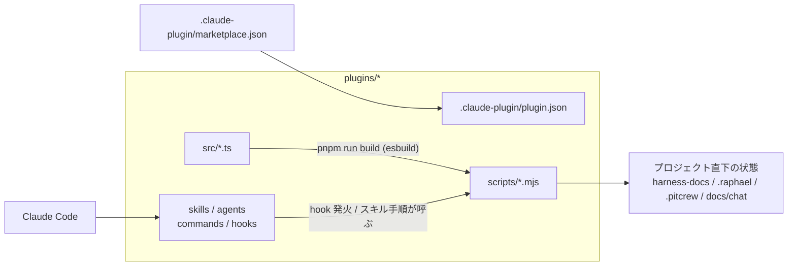
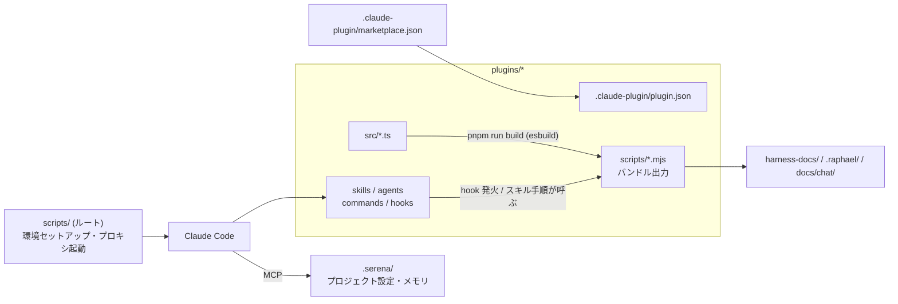
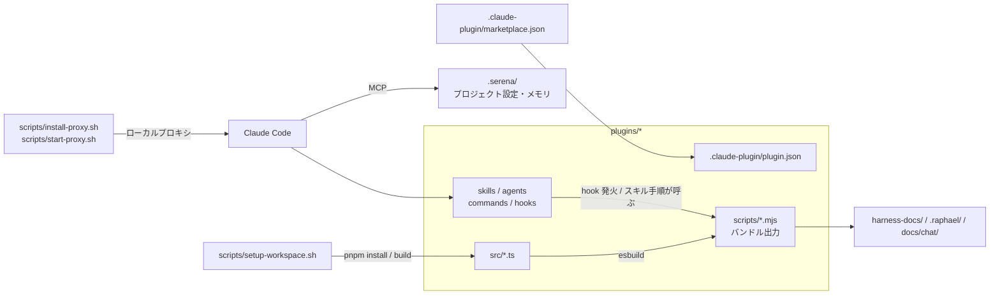
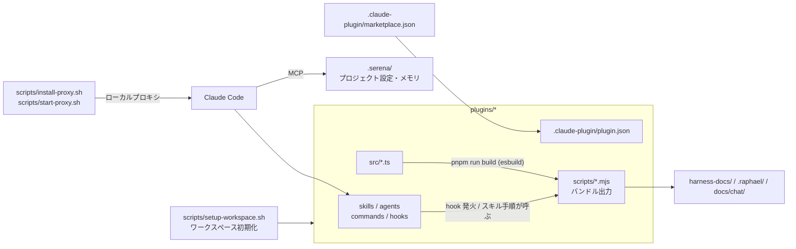

# ARCHITECTURE 概要セクションの構成

- 日付: 2026-08-23
- 参加者: phyllis998
- 成果物: `harness-docs/ARCHITECTURE.md` (構成設計)
- 前提: [sandalphon+metatron 設計完了(2026-08-16)](../../../memory/sandalphon-metatron-design-done.md)、プロジェクト CLAUDE.md

---

## セッション 1: ARCHITECTURE 概要セクションの構成方針確認

# AI

ARCHITECTURE 未作成確認。出力先 `harness-docs/ARCHITECTURE.md`。初回生成で正しい。

`★ Insight ─────────────────────────────────────`
- metatron は文書を **CLI 経由でのみ書き込む**設計。Edit/Write は PreToolUse hook が拒否する。理由は「stage → 承認 → commit」の 2 段階を機械的に強制するため。`stagingId` は単回使用・30 分有効期限・内容ハッシュ照合付き。
- ただし CLI が保証できないのは「人間が実際に diff を見たか」。そこだけは規律(HARD-GATE)で担保する構造。
- `## ドメインマップ` の JSON フェンスは codiel / sandalphon の 4 経路が機械読みする**契約面**。他セクションと違い、書式ミスが他プラグインを壊す。
`─────────────────────────────────────────────────`

次: 事実収集(`scan`)。

13 プラグイン検出。README 記載は 11 → 実体と差分あり。詳細を取る。

材料収集完了。事実を確認した。

`★ Insight ─────────────────────────────────────`
- `scan` は 303KB。うち `tree` 114KB / `files` 99KB。全部読まず `truncation` が全 `false` = 取りこぼし無しを確認してから、必要フィールドだけ抽出した。「事実に無いことをドラフトの根拠にしない」規律は、こう**先に欠損の有無を確認**してから絞る形で守れる。
- 検出: 13 プラグイン。`marketplace.json` は 13 個、ルート README の表も 13 行、`pnpm-workspace.yaml` は 14 パッケージ(`codiel/raguel-mcp` が別 workspace)。ここは一致している。
- `tsconfig.json` の `include` は `plugins/*/src/**` に加え `plugins/codiel/raguel-mcp/src/**` を明示列挙。glob の `*` が 1 セグメントしか食わないため。ドメインマップの glob でも同じ罠があるので、raguel-mcp は明示が要る。
`─────────────────────────────────────────────────`

起草に入る前に 2 点確認。

進め方: 1 セクションずつ、通常日本語。では 1/9 から。

---

## 1/9 `## システム概要` ドラフト

あまつか工房が開発する Claude Code プラグインを配布する pnpm workspace のモノレポである。利用者は Claude Code のユーザーであり、`.claude-plugin/marketplace.json` を通じて 13 個のプラグインを導入する。各プラグインは Claude Code が読む宣言(skills / agents / commands / hooks)と TypeScript ソースを持ち、ソースは esbuild でバンドルして `scripts/` へ出力し git 管理下に置く。Anthropic API を使えないユーザーも全プラグインを使えることを必須要件とし、LLM を要する処理は Claude Code の機構か `claude` CLI のヘッドレス実行に閉じる。



---

### 確認点

**1. 開発ステータスを概要に載せるか。**
README の表は 13 プラグインに「開発中 / リリース / 非推奨」を付けている(リリース済は pitcrew・chat-history の 2 つだけ、revelation は非推奨)。概要はこれに触れていない。載せるか、`## 技術スタック` 以降に回すか、そもそも ARCHITECTURE には書かないか。

**2. 図の `STATE` ノードの粒度。**
`harness-docs / .raphael / .pitcrew / docs/chat` を列挙している。writing-discipline は「載せるか迷ったノードは載せない」「毎セッション注入されるのでノード 1 つが恒常コスト」と定めている。4 つ列挙を残すか、「プロジェクト状態」1 語に畳むか。

**3. 「Anthropic API を使えないユーザーも使える」の置き場。**
これは CLAUDE.md の必須要件。概要の主要技術制約として書いたが、`## 規約` にも同趣旨が入る予定。両方に書くと重複になる — 概要に残して規約から外すか、逆か。

# phyllis998

> 1. 書かない
> 2. .pitcrewは削除予定なので載せなくてよいです(このセッションで削除しても良い)。.serena/ルートのscriptsも載せてください
> 3. CLAUDE.mdから外す

## セッション 2: ARCHITECTURE 概要セクション構成の方針確認・2 回目

# AI

回答 3 点を受けた。2 で確認が要る。

**確認が必要な点:** 「.pitcrew は削除予定」の「削除」が何を指すかで、`## システム概要` の「13 個のプラグイン」以降のドラフト全体が変わります。プラグイン本体を消すのであれば、`marketplace.json`・`pnpm-workspace.yaml`・ルート README・ドメインマップ・保護パスもすべて 12 プラグイン前提になります。また `.pitcrew/` ディレクトリは 842 ファイルあり、削除は取り消せません。

先にここだけ確定させます。

確認事項を反映した。ルート `scripts/` の実体も確認済み — `install-proxy.sh` は CLIProxyAPI を入れて `ANTHROPIC_AUTH_TOKEN` と `CLAUDE_CODE_ENABLE_GATEWAY_MODEL_DISCOVERY=1` を bashrc へ書く。つまり Claude Code 自体がプロキシ経由で動く構成。図の矢印はこれを表す。

---

## 1/9 `## システム概要` ドラフト(改訂)

あまつか工房が開発する Claude Code プラグインを配布する pnpm workspace のモノレポである。利用者は Claude Code のユーザーであり、`.claude-plugin/marketplace.json` を通じて 13 個のプラグインを導入する。各プラグインは Claude Code が読む宣言(skills / agents / commands / hooks)と TypeScript ソースを持ち、ソースは esbuild でバンドルして `scripts/` へ出力し git 管理下に置く。Anthropic API を使えないユーザーも全プラグインを使えることを必須要件とし、LLM を要する処理は Claude Code の機構か `claude` CLI のヘッドレス実行に閉じる。開発環境の用意とローカルプロキシの起動はルートの `scripts/` が担い、コードベース探索は Serena MCP が `.serena/` の設定とメモリを通じて担う。



変更点: `.pitcrew/` を `STATE` から除外。`scripts/ (ルート)` と `.serena/` を追加。開発ステータスは非記載。API 制約は概要に残置(CLAUDE.md 側は後で外す)。

---

### 確認点

**1. 「13 個」という固定値を散文に書くか。**
プラグインを 1 つ追加するたびにこの数が古くなり、`## ドメインマップ`・`## ディレクトリ構成と責務` と揃って更新が要る。数を消して「複数のプラグイン」とするか、数を残して更新対象と割り切るか。

**2. `.serena/memories/` の粒度を他セクションにも書くか。**
実体はプラグイン別に 13 のメモリディレクトリ(`agent_policy/` `codiel/` `metatron/` …)＋横断メモリ(`conventions.md` `file_contract.md` `tech_stack.md` 等)。図には `.serena/` の 1 ノードしか出していない。この内訳を `## ディレクトリ構成と責務` にも書くか、図だけに留めるか。

**3. `SETUP → CC` の矢印の意味。**
「ルート `scripts/` がプロキシを立て、その上で Claude Code が動く」を表している。ただし `setup-workspace.sh` は `pnpm install && pnpm build` だけでプロキシとは無関係。1 ノードに 2 つの役割(依存インストール／プロキシ)が混ざっている。分けるか、このまま「環境セットアップ」で括るか。

`## システム概要` の確認点 3 つへの回答待ち。

1. 散文の「13 個」— 固定値のまま残すか、数を消すか
2. `.serena/memories/` の内訳 — `## ディレクトリ構成と責務` にも書くか、図だけか
3. `SETUP → CC` — 1 ノードに依存インストールとプロキシ起動が混在。分けるか括るか

`## システム概要` の確認点 3 つへの回答待ち。

# phyllis998

> 1. ".claude-plugin/marketplace.json を通じて 13 個のプラグインを導入する" を、"提供するマーケットプレイスを通じて導入する" にしてください
> 2. 内訳は不要です
> 3. 分けてください

## セッション 3: ARCHITECTURE 概要セクション構成の確定・3 回目

# AI

修正 3 点を反映。

---

## 1/9 `## システム概要` ドラフト(確定案)

あまつか工房が開発する Claude Code プラグインを配布する pnpm workspace のモノレポである。利用者は Claude Code のユーザーであり、提供するマーケットプレイスを通じてプラグインを導入する。各プラグインは Claude Code が読む宣言(skills / agents / commands / hooks)と TypeScript ソースを持ち、ソースは esbuild でバンドルして `scripts/` へ出力し git 管理下に置く。Anthropic API を使えないユーザーも全プラグインを使えることを必須要件とし、LLM を要する処理は Claude Code の機構か `claude` CLI のヘッドレス実行に閉じる。開発環境の用意とローカルプロキシの起動はルートの `scripts/` が担い、コードベース探索は Serena MCP が `.serena/` の設定とメモリを通じて担う。



反映内容:
- 散文から `.claude-plugin/marketplace.json` の直接参照と「13 個」を削除 → 「提供するマーケットプレイスを通じて」
- `.serena/memories/` の内訳は非記載(図の 1 ノードのみ)
- `SETUP` を `PROXY`(プロキシ 2 本)と `WS`(setup-workspace.sh)に分割

`★ Insight ─────────────────────────────────────`
- ノードは 8 → 9 に増えた。`writing-discipline.md` は「図は常時注入される。ノードを 1 つ足すたびに毎セッションのコストが増える」と定めており、分割はその分だけ恒常コストを払う判断になる。ここでは「依存インストールとプロキシ起動は別物」という**誤解を防ぐ効果**を優先した形。
- 散文から数を消したことで、プラグイン追加時に `## システム概要` を更新する必要がなくなった。更新が要るのは `## ドメインマップ` と `## ディレクトリ構成と責務` だけになる。metatron の `diff-architecture` が乖離を検出する対象も、その分だけ絞られる。
`─────────────────────────────────────────────────`

---

### 確認点

**1. `PROXY → CC` のラベル「ローカルプロキシ」で意味が通るか。**
実体は「CLIProxyAPI を入れて `ANTHROPIC_AUTH_TOKEN` を bashrc に書き、Claude Code 本体をプロキシ経由で動かす」。ラベル 1 語でこれが読めるか、`ANTHROPIC_AUTH_TOKEN 経由` のように具体化するか。

**2. `WS → SRC` の向き。**
`setup-workspace.sh` は `pnpm install && pnpm build` なので、実際にはビルド(`SRC → OUT`)を起動する。矢印を `WS → SRC` にしているが、`WS → OUT` の方が実態に近い。どちらにするか。

これで `## システム概要` を確定してよければ、`## 技術スタック` へ進みます。

`## システム概要` 確定案の確認点 2 つへの回答待ち。

1. `PROXY → CC` のラベル — 「ローカルプロキシ」のままか、`ANTHROPIC_AUTH_TOKEN 経由` へ具体化するか
2. `WS` の矢印先 — `SRC` か `OUT` か

`## システム概要` 確定案の確認点 2 つへの回答待ち。

1. `PROXY → CC` のラベル — 「ローカルプロキシ」のままか、`ANTHROPIC_AUTH_TOKEN 経由` へ具体化するか
2. `WS` の矢印先 — `SRC` か `OUT` か

# phyllis998

> 1. 主にAI向け文書なので大丈夫かと思います
> 2. setup-workspaceは、orcaエディタのワークスペース初期化用のスクリプトです。

> 1. 主にAI向け文書なので大丈夫かと思います
> 2. setup-workspaceは、orcaエディタのワークスペース初期化用のスクリプトです。今後も処理が増える可能性はあります

## セッション 4: ARCHITECTURE 概要セクション構成の確定・setup-workspace 役割の明確化

# AI

1 は現状維持。2 は「ワークスペース初期化」として PLUGIN 全体を指す形に直した。`pnpm install && pnpm build` は現在の中身であって役割ではないため、ラベルを役割で書き、処理が増えても図が古くならないようにした。

---

## 1/9 `## システム概要` 確定案

あまつか工房が開発する Claude Code プラグインを配布する pnpm workspace のモノレポである。利用者は Claude Code のユーザーであり、提供するマーケットプレイスを通じてプラグインを導入する。各プラグインは Claude Code が読む宣言(skills / agents / commands / hooks)と TypeScript ソースを持ち、ソースは esbuild でバンドルして `scripts/` へ出力し git 管理下に置く。Anthropic API を使えないユーザーも全プラグインを使えることを必須要件とし、LLM を要する処理は Claude Code の機構か `claude` CLI のヘッドレス実行に閉じる。開発環境の用意とローカルプロキシの起動はルートの `scripts/` が担い、コードベース探索は Serena MCP が `.serena/` の設定とメモリを通じて担う。



前回からの変更: `WS` の矢印先を `SRC` から `PLUGIN` へ。ラベルを `pnpm install / build` から `ワークスペース初期化` へ。

これで確定してよければ `## 技術スタック` へ進みます。

`## システム概要` 確定案の可否を待っています。確定であれば `## 技術スタック` へ進みます。

# phyllis998

> 進んでください

## セッション 5: 技術スタック表の構成と版管理方針を確定

# AI

`## システム概要` 確定。`## 技術スタック` の起草前に、表へ書く値を 2 点確認します。

確認で 2 つ事実が出ました。両方ドラフトに影響します。

- **esbuild の `target` が不揃い**: 13 プラグイン中 12 が `node22`、`prompt-smith` だけ `node26`。`engines.node` は `>=26`。
- **ランタイム依存は「唯一」ではない**: `basic-design`(elkjs)と `codiel/raguel-mcp`(sdk・picomatch・yaml・zod)の 2 パッケージ。
- eslint / prettier の設定ファイルは存在しない(唯一の出現は `plugins/metatron/src/lib/scan.ts` の検出パターン文字列)。

---

## 2/9 `## 技術スタック` ドラフト

| 項目 | 採用 | バージョン方針 |
| --- | --- | --- |
| ランタイム | Node.js | `engines.node` は `>=26`。volta で 26.3.1 に固定する |
| パッケージマネージャ | pnpm | volta で 11.8.0 に固定する。`devEngines` が `^11.8.0` を要求し、外れたときは自動取得する。npm / yarn を使わない |
| 言語 | TypeScript ^6.0.3 | `strict` と `noEmit` を有効にする。型検査は `tsc` が担い、実行はバンドル出力が担う |
| モジュール形式 | ESM | ルートと各プラグインの `package.json` に `type: "module"` を置く。CommonJS を使わない |
| バンドラ | esbuild ^0.28.1 | 各プラグインの `build.ts` が呼ぶ。出力は ESM、拡張子は `.mjs` |
| スクリプト実行 | tsx ^4.22.4 | `build.ts` の実行に使う |
| Lint / Format | @biomejs/biome ^2.5.0 | eslint / prettier を追加しない |
| テスト | vitest ^4.1.10 | jest を追加しない |
| 型定義 | @types/node ^26.0.0 | ランタイムの Node と同じメジャーに揃える |
| MCP サーバー | @modelcontextprotocol/sdk ^1.29.0 | `plugins/codiel/raguel-mcp` だけが使う |
| グラフレイアウト | elkjs | `plugins/basic-design` だけが使う |

- 共通の開発依存はルートの `package.json` に置き、プラグインの `package.json` には置かない。
- プラグイン固有のランタイム依存を追加するときは、そのプラグインの `package.json` に置く。

`★ Insight ─────────────────────────────────────`
- `target: "node22"` と `engines.node: ">=26"` の組み合わせは、実は矛盾ではなく**安全側**。esbuild の `target` は「この Node で動く構文まで落とす」下限指定なので、node22 向け出力は node26 でも動く。逆(`node26` 出力を node22 で実行)は壊れる。つまり `prompt-smith` だけが「node22 環境では動かない可能性のある出力」を作っている状態。
- ただしこの下限は `engines.node: ">=26"` が既に node26 未満を弾いているため、実害は現時点で無い。揃えるべきかは「何を下限として宣言したいか」の設計判断になります。
`─────────────────────────────────────────────────`

---

### 確認点

**1. esbuild の `target` をどう書くか。**
現状は 12 プラグインが `node22`、`prompt-smith` だけ `node26`。(a) 表に「`node22` に揃える」と書いて prompt-smith を後で直す、(b) 「`engines.node` の下限 `node26` に揃える」と書いて 12 個を直す、(c) ARCHITECTURE には書かず現状のまま放置、のどれにするか。

**2. 「eslint / prettier を追加しない」「jest を追加しない」を書いてよいか。**
設定ファイルも依存も存在しないという事実はありますが、明文の禁止は CLAUDE.md にありません。禁止として書くか、単に「biome を使う」「vitest を使う」だけに留めるか。

**3. プラグイン固有の依存(elkjs・sdk 等)を表に載せ続けるか。**
プラグインが依存を足すたびにこの表の更新が要ります。表から外し、下の箇条書き 2 行だけを残す選択肢もあります。

`## 技術スタック` の確認点 3 つへの回答待ち。

1. esbuild `target` — (a) node22 に揃える / (b) node26 に揃える / (c) 書かない
2. 「eslint / prettier・jest を追加しない」を禁止として書くか、採用ツールだけ書くか
3. プラグイン固有の依存(elkjs・sdk 等)を表に載せ続けるか、箇条書き 2 行に畳むか

`## 技術スタック` の確認点 3 つへの回答待ち。

1. esbuild `target` — (a) node22 に揃える / (b) node26 に揃える / (c) 書かない
2. 「eslint / prettier・jest を追加しない」を禁止として書くか、採用ツールだけ書くか
3. プラグイン固有の依存(elkjs・sdk 等)を表に載せ続けるか、箇条書き 2 行に畳むか

# phyllis998

> 1. node22に統一したいです。prompt-smithもこのセッションで直します。
> 2. 後述
> 3. 載せない
>
> バージョン方針カラムについては削除したいです。バージョンの表記は採用カラムに書き、なにか補足があればその表の下に箇条書きで書きたいです。
> metatronのARCHITECTURE.example.mdも変更してください

## セッション 6: ARCHITECTURE 概要セクション・技術スタック表の構成を確定

# AI

追加指示を受けました。まず現物を確認します。

書式定義そのものの変更になるため、波及先を確認します。

`scan.ts` が `## 技術スタック` を機械的にパースしている箇所を見つけました。表の構造変更が影響するか確認します。

`diffTechStack` はカラム構造に依存せず、`body.includes()` と inline code 抽出だけで判定していました。表の形を変えても壊れません。ただし別の含意が出てきたので、除外語リストを確認します。

カラム構成を変えても `diffTechStack` は壊れません。ただし確認点 2 に直結する事実が出ました。

`★ Insight ─────────────────────────────────────`
`diffTechStack` は `## 技術スタック` を双方向に突き合わせます。片方向は「package.json の依存が本文に無い → `tech_stack_added`」、逆方向は「本文の **inline code** がパッケージ名の形をしていて依存に無い → `tech_stack_removed`」。

逆方向には除外語リスト `NON_PACKAGE_TOKENS`(約 50 語)がありますが、**`eslint` / `prettier` / `jest` は入っていません**。つまり `` `eslint` `` と inline code で書いた瞬間、`/metatron:update` を叩くたびに

> `## 技術スタック` に書かれた eslint が package.json の依存にありません。

が削除候補として報告され続けます。**「使わない」と書いた語ほど誤検出される**という、この検出方式の構造的な穴です。逆方向が inline code だけを見るのは「散文の中の名前は決定的に取り出せないため」(コメント原文)なので、バッククォートを外せば回避できます。
`─────────────────────────────────────────────────`

---

## 2/9 `## 技術スタック` ドラフト(改訂)

| 区分 | 採用技術 |
| --- | --- |
| ランタイム | Node.js >=26 |
| パッケージマネージャ | pnpm 11.8.0 |
| 言語 | TypeScript ^6.0.3 |
| モジュール形式 | ESM |
| バンドラ | esbuild ^0.28.1 |
| スクリプト実行 | tsx ^4.22.4 |
| Lint / Format | @biomejs/biome ^2.5.0 |
| テスト | vitest ^4.1.10 |
| 型定義 | @types/node ^26.0.0 |

- Node.js と pnpm のバージョンは volta で固定する。Node は 26.3.1、pnpm は 11.8.0 とする。
- `devEngines.packageManager` が pnpm ^11.8.0 を要求し、外れたときは自動で取得する。
- TypeScript は `strict` と `noEmit` を有効にする。型検査は tsc が担い、実行はバンドル出力が担う。
- esbuild の `target` は node22 に揃える。出力は ESM とし、拡張子は `.mjs` とする。
- 共通の開発依存はルートの `package.json` に置く。
- プラグイン固有のランタイム依存は、そのプラグインの `package.json` に置く。

反映済み: バージョン方針カラム削除 / バージョンは採用カラムへ / 補足は表下の箇条書きへ / プラグイン固有の依存は非掲載 / `target` は node22 に統一。

---

### 確認点

**2(再掲・判断材料付き). 「eslint / prettier・jest を追加しない」を書くか。**
- 書くなら **inline code にしない**(バッククォート無しの素のテキスト)。それだけで誤検出は避けられる。
- 併せて metatron 側の `NON_PACKAGE_TOKENS` に 3 語を足す手もある(他プロジェクトでも同じ穴を踏むため)。
- 書かない選択なら、現ドラフトのまま。

---

### 付随タスクの確認

このセッションで発生したものが溜まっています。ARCHITECTURE 生成(残り 7 セクション)を先に終えてからまとめて着手する想定ですが、順序の希望があれば教えてください。

| # | 内容 | 状態 |
| --- | --- | --- |
| 1 | `prompt-smith/build.ts` の `target` を node26 → node22 | 未着手 |
| 2 | metatron `references/architecture-format.md` の技術スタック節をカラム構成変更に追従 | 未着手 |
| 3 | metatron `docs/ARCHITECTURE.example.md` の技術スタック節を同上 | 未着手 |
| 4 | 上記に伴う metatron の `plugin.json` / `package.json` のバージョン上げ | 未着手 |
| 5 | `.pitcrew/` ディレクトリの削除(許可済み) | 未着手 |
| 6 | CLAUDE.md から「Anthropic API を使えないユーザーも使える」制約を外す | 未着手 |
| 7 | (確認点 2 次第) `NON_PACKAGE_TOKENS` に eslint / prettier / jest を追加 | 判断待ち |

なお 2〜4 は metatron の**書式契約**の変更にあたるため、`file-contract-freeze.md` §4 を確認しました。§4 が凍結しているのは**セクション構成(見出し名と順序)と分割アルゴリズム**であり、各節の表カラム構成は含まれません。codiel / sandalphon が読むのは `## ドメインマップ` のみなので、他プラグインへの波及もありません。

`## 技術スタック` の回答待ち。

- 確認点 2: eslint / prettier・jest の禁止を書くか(書くなら inline code にしない)
- 付随タスク 7 件の着手順序(既定: ARCHITECTURE 完成後にまとめて)

`## 技術スタック` の回答待ち。

- 確認点 2: eslint / prettier・jest の禁止を書くか(書くなら inline code にしない)
- 付随タスク 7 件の着手順序(既定: ARCHITECTURE 完成後にまとめて)

# phyllis998

> eslint/pretter/jestの禁止は書きません
> 付随タスクは並行してサブエージェントにオーケストレーションを委譲し、対応させてください

## セッション 7: ARCHITECTURE 概要セクション・技術スタック表の構成を確定

# AI

技術スタック確定。付随タスクを委譲します。まず実行帯を確認。

実行帯: `.claude/agents/` は空 → プラグイン同梱の `agent-policy:*` を使用。

タスク C(CLAUDE.md の制約削除)だけは **`## 規約` セクションの確定後**に回します。CLAUDE.md から外した内容の受け皿が `## 規約` であり、先に外すと受け皿が無い状態が生じるためです。A・B を並行で委譲し、`.pitcrew/` 削除はメインで実行します。

`.pitcrew/` 削除完了。8.8MB / 842 ファイル。`git check-ignore` で追跡外を確認したうえで実行しました。A・B は実行中。

`## レイヤー構造` の起草に入ります。依存方向の禁止事項を推測で書かないため、実態を確認します。

実装層の依存方向について、明文の規律が実際のコードコメントに書かれていました。

`★ Insight ─────────────────────────────────────`
このリポジトリは **DRY を意図的に捨てている**箇所があります。`metatron/src/lib/config.ts`・`codiel/src/hooks/lib.ts`・`sandalphon/src/check-intent-env.ts` の 3 つが、ルート解決とパス解決の**同じ規則を独立に実装**しています。

理由はコメントに明記されていました — 「プラグインは独立して配布され互いのインストールパスを解決できないため、ソースは共有せず同じ規則を実装する」。共有ライブラリにすると、片方のプラグインだけをインストールしたユーザーが壊れます。

その代わり**正本は実装ではなく契約文書**(`harness-docs/design/2026-08-16-file-contract-freeze.md` §3)に置かれ、「契約を変えたら 3 実装を追随させ、契約 §13 の 3 者比較テストを通す」という追随義務とテストで担保されています。コード重複を許す代わりに、仕様の一元化とテストで守る構造です。
`─────────────────────────────────────────────────`

---

## 3/9 `## レイヤー構造` ドラフト

| 層 | 責務 |
| --- | --- |
| 配布宣言 | プラグインの配布単位・名前・バージョンを宣言する(`.claude-plugin/`) |
| 指示 | AI が読んで従う手順を置く(`skills/` `commands/` `agents/`) |
| 参照 | 複数の指示から共有する規律と断片を置く(`references/`) |
| フック | Claude Code のイベントと実行スクリプトを結びつける(`hooks/`) |
| 配布物 | 実行されるバンドル。単発実行は `scripts/`、常駐プロセスは `dist/` に置く |
| 実装 | 配布物の元になる TypeScript ソース(`src/`) |

依存の許される方向:

- 指示層は参照層を読む。
- 指示層とフック層は配布物層を実行する。
- 実装層はビルドを通じて配布物層を生成する。
- 配布宣言層は他のどの層にも依存しない。

禁止される依存方向:

- 実装層は他プラグインの `src/` を import しない。同じ規則が複数のプラグインに要るときは、各プラグインで独立に実装し、正本の契約文書をコメントで示す。
- 配布物層を手で編集しない。実装層を変更し、`pnpm run build` で再生成する。
- 指示層と参照層に、リポジトリルート固有のパスや他プラグインの名前を書かない。プラグイン内の情報だけで完結させる。

---

### 確認点

**1. 6 層は多いか。**
「配布宣言」と「フック」は実体が JSON ファイル 1 個ずつで薄い層です。この 2 つを畳んで 4 層(指示 / 参照 / 配布物 / 実装)にする選択肢もあります。常時注入されるコストを考えると畳む案もありますが、`hooks.json` は挙動への影響が大きいので独立させた形です。

**2. 「独立実装 + 契約文書が正本」の置き場。**
今は禁止事項の 1 行目に書いています。`## 規約` にも依存追加や複製の条件を書く予定なので、どちらか一方に寄せるべきです。レイヤー構造(依存方向の話)に残すか、規約(開発手順の話)へ移すか。

**3. `plugins/codiel/raguel-mcp/` の扱い。**
codiel 内の別 pnpm workspace で、MCP サーバーとして `dist/` に出ます。今は「配布物」層に含めていますが、独立したパッケージであることが表から読めません。層として立てるか、`## ディレクトリ構成と責務` で書くか。

タスク B 完了。タスク A は**ツール不在で未実施**でした。原因を特定したので修正して再委譲します。

`★ Insight ─────────────────────────────────────`
Terra の失敗理由は「Serena 編集ツールが公開されていない」。原因は **MCP サーバー名の食い違い**です。`agent-policy` のエージェント定義は `mcp__plugin_serena_serena__*` を許可ツールに列挙していますが、このセッションで実際に接続されている Serena の名前は `serena`(つまり `mcp__serena__*`)。名前が一致しないため、許可リストにあってもツールが解決されませんでした。

Terra 自身は正しく振る舞っています — 「制約に反して Bash や Edit で Markdown を変更することは避けた」。指示された制約を破らずに停止し、理由を報告した。事前確認 1・2 だけは完了しており、**どちらも「該当なし」**(evals にも src/skills にも 3 カラム前提の記述は無い)なので、書式変更の安全性は確認済みです。
`─────────────────────────────────────────────────`

タスク B の結果: `build.ts` の target 変更・`plugin.json` / `package.json` を 0.3.2-dev へ・再ビルド成功。`scripts/` の差分は**ゼロ**でした(node22 と node26 で出力が変わる構文を prompt-smith が使っていないため)。lint・typecheck 通過。

タスク A を再委譲しました(Edit / Write 許可を明示)。実行中です。

`## レイヤー構造` の確認点 3 つへの回答待ち。

1. 6 層のままか、「配布宣言」「フック」を畳んで 4 層にするか
2. 「独立実装 + 契約文書が正本」の規律 — レイヤー構造に残すか `## 規約` へ移すか
3. `plugins/codiel/raguel-mcp/` — 層として立てるか、`## ディレクトリ構成と責務` で書くか

タスク A 完了報告。報告を検証します。

タスク A 検証完了。指示どおりの内容で入っています。

**付随タスクの状況**

| # | 内容 | 状態 |
| --- | --- | --- |
| 1 | prompt-smith `target` node26 → node22 | 完了(0.3.2-dev、scripts 差分ゼロ) |
| 2 | metatron `architecture-format.md` の技術スタック節 | 完了(3 行に置換) |
| 3 | metatron `ARCHITECTURE.example.md` の技術スタック節 | 完了(2 カラム + 補足 5 行) |
| 4 | metatron バージョン → 0.1.3-dev | 完了(plugin.json / package.json 揃い) |
| 5 | `.pitcrew/` 削除 | 完了(8.8MB / 842 ファイル) |
| 6 | CLAUDE.md から API 制約を外す | `## 規約` 確定後に着手 |
| 7 | `NON_PACKAGE_TOKENS` へ 3 語追加 | 不要(禁止を書かない方針のため) |

lint 341 ファイル通過。`git status` の `M CLAUDE.md` と `?? metatron.config.json` はセッション開始時点から既にあったもので、今回の変更ではありません。`.raphael/antibodies/*` の更新は raphael hook の発火記録による副作用です。

---

`## レイヤー構造` の確認点 3 つへの回答待ち。

1. 6 層のままか、「配布宣言」「フック」を畳んで 4 層にするか
2. 「独立実装 + 契約文書が正本」の規律 — レイヤー構造に残すか `## 規約` へ移すか
3. `plugins/codiel/raguel-mcp/` — 層として立てるか、`## ディレクトリ構成と責務` で書くか

# phyllis998

> 1. 6層でよいです
> 2. 正本の契約文書～がAIが読まない文書に残されていればよいですが、例えば現状の3プラグインのように変えた時は正本を直すなどと書かれてしまったら、プラグインをインストールしたプロジェクト内の存在しない文書を指すことになるのでよくないです。
> 3. 層に立てなくてよいです

> 1. 6層でよいです
> 2. 正本の契約文書～がAIが読まない文書に残されていればよいですが、例えば現状の3プラグインのように変えた時は正本を直すなどとAIへの指示書に書かれてしまったら、プラグインをインストールしたプロジェクト内の存在しない文書を指すことになるのでよくないです。
> 3. 層に立てなくてよいです

## セッション 8: ARCHITECTURE 概要セクション・技術スタック表の構成を確定

# AI

指摘を反映します。併せて、同じ問題が既存のプラグイン同梱文書に無いか確認します。

指摘どおりの違反が**実在しました**。ユーザーの懸念は仮定ではなく現状です。

`★ Insight ─────────────────────────────────────`
`references/` はプラグインに同梱され、インストール先で AI が読む文書です。そこに 4 ファイル、リポジトリルート固有のパスが書かれていました。

| ファイル | 指しているもの |
| --- | --- |
| `metatron/references/architecture-format.md:5` | `harness-docs/design/2026-08-16-file-contract-freeze.md` §4 |
| `metatron/references/gotchas-format.md:5` | 同 §6 |
| `metatron/references/config-schema.md:7-9` | `plugins/metatron/src/lib/config.ts` ほか 2 プラグインの src |
| `sandalphon/references/intent-format.md:5` | 同契約文書 §8・§9 |

いずれも「**この書式を変更したら、同じコミットで次も更新する**」という開発者向けチェックリストです。metatron をインストールしただけのプロジェクトには `harness-docs/` も `plugins/` も存在しないため、そこの AI にとっては**存在しないファイルを直せという指示**になります。

CLAUDE.md の「プラグインに同梱する文書や AI に注入する文章に、リポジトリルート固有の資産や情報を含まず、プラグイン内の情報のみで完結させる」に反しています。皮肉なことに、私がこの `architecture-format.md` を読んで作業を始めた冒頭で、既にこのチェックリストを見ていました。
`─────────────────────────────────────────────────`

---

## 3/9 `## レイヤー構造` 確定案

| 層 | 責務 |
| --- | --- |
| 配布宣言 | プラグインの配布単位・名前・バージョンを宣言する(`.claude-plugin/`) |
| 指示 | AI が読んで従う手順を置く(`skills/` `commands/` `agents/`) |
| 参照 | 複数の指示から共有する規律と断片を置く(`references/`) |
| フック | Claude Code のイベントと実行スクリプトを結びつける(`hooks/`) |
| 配布物 | 実行されるバンドル。単発実行は `scripts/`、常駐プロセスは `dist/` に置く |
| 実装 | 配布物の元になる TypeScript ソース(`src/`) |

依存の許される方向:

- 指示層は参照層を読む。
- 指示層とフック層は配布物層を実行する。
- 実装層はビルドを通じて配布物層を生成する。
- 配布宣言層は他のどの層にも依存しない。

禁止される依存方向:

- 実装層は他プラグインの `src/` を import しない。同じ規則が複数のプラグインに要るときは、各プラグインで独立に実装し、規則を変えたときは同じ規則を持つ全プラグインの実装を追随させる。
- 配布物層を手で編集しない。実装層を変更し、`pnpm run build` で再生成する。
- 指示層と参照層に、リポジトリルート固有のパスや他プラグインの名前を書かない。参照が要る内容は、プラグイン内に閉じた表現へ書き換える。

変更点: 契約文書への参照を削除(2 の指摘を反映) / 6 層維持 / raguel-mcp は層に立てず `## ディレクトリ構成と責務` へ回す / 禁止事項の 3 行目に代替手段を追記。

---

### 確認点

**発見した 4 ファイルの違反をどうするか。**

チェックリスト自体は開発時に必要なものです。消すのではなく移すのが妥当と考えます。

- (a) チェックリスト部分だけを `plugins/<plugin>/docs/` へ移す。`references/` には書式定義本体だけを残す。CLAUDE.md の文書配置方針(「AI が必要なときだけ読む文書 = references」「人間向け = docs」)に沿う。
- (b) `references/` に残し、パス参照だけを消す。追随義務の文面は残すが、どこを直すかは開発者が知っている前提にする。
- (c) 今回は対象外とし、別途 issue として残す。

どれにするか。(a) を推しますが、`references/` から消えることで AI が追随義務に気づかなくなる副作用があります。

`## レイヤー構造` 確定案の可否と、発見した 4 ファイルの違反への対応(a / b / c)の回答待ち。

`## レイヤー構造` 確定案の可否と、発見した 4 ファイルの違反への対応(a / b / c)の回答待ち。

# phyllis998

> (a) で進めてください

> レイヤー構造確定でよいです。違反の対処はaで進めるとし、委譲してください

## セッション 9: ARCHITECTURE 概要セクション・技術スタック表の構成を確定

# AI

レイヤー構造確定。違反対処の委譲前に、移す範囲を確定させます。

移す範囲を確定しました。委譲します。

`## レイヤー構造` 確定。違反対処を委譲しました(実行中)。

---

## 4/9 `## ディレクトリ構成と責務` ドラフト

```
.
├── .claude-plugin/marketplace.json  配布するプラグインの一覧を宣言する
├── harness-docs/                    設計書・実装計画書と ARCHITECTURE・GOTCHAS を置く
├── scripts/                         開発環境のセットアップとローカルプロキシの起動スクリプトを置く(言語不問)
├── docs/                            人間向けの文書と会話記録を置く
└── plugins/<plugin>/
    ├── .claude-plugin/plugin.json   プラグイン名とバージョンを宣言する
    ├── build.ts                     esbuild のバンドル定義を置く
    ├── src/                         TypeScript ソースを置く
    │   └── __test__/                vitest のテストを置く
    ├── scripts/                     単発実行のバンドル出力を置く
    ├── dist/                        常駐プロセスのバンドル出力を置く
    ├── skills/                      AI が読む手順を置く
    ├── commands/                    スラッシュコマンドの定義を置く
    ├── agents/                      サブエージェントの定義を置く
    ├── hooks/hooks.json             Claude Code のイベントと実行スクリプトの対応を置く
    ├── references/                  複数の指示から共有する規律を置く
    ├── docs/                        設計・背景・経緯・不採用案と、開発時のチェックリストを置く
    ├── evals/                       スキルとエージェント定義の評価セットを置く
    └── README.md                    利用者が読まないと使えない情報を置く
```

- `plugins/codiel/raguel-mcp/` は codiel 内の独立した pnpm workspace であり、MCP サーバーとして `dist/` へ出力する。
- `src/__test__/` は対象ソースと同じ階層に置く。

---

### 確認点

**1. ツリーに載せるディレクトリの数。**
`architecture-format.md` は「実装エージェントが置き場を迷うディレクトリに絞る。全ディレクトリを網羅しない」と定めています。今はプラグイン内 13 項目。迷いやすいのは `scripts` / `dist` / `references` / `docs` / `README` / `evals` の 6 つで、`build.ts` と `src` は迷いません。削って 8 項目程度に絞るか、骨格として残すか。

**2. ルート `docs/` の読み取り禁止をここに書くか。**
CLAUDE.md には「`docs/` は読まない」「`docs/chat/**/*.md` は chat-recorder / chat-reader だけが読む」「過去の記録が必要なときは `chat-history:recall` を使う」があります。責務 1 行に収まらないため、`## 保護パス` に回すのが妥当と考えますが、ツリーを見た AI が `docs/` を読みに行く危険があります。ここに 1 行足すか、保護パスに任せるか。

**3. 状態ディレクトリを載せるか。**
`.raphael/`(抗体)、`.serena/`(プロジェクト設定とメモリ)、`.superpowers/`、`private/` はツリーに載せていません。`.raphael/` と `.serena/` は AI が実際に読み書きする対象なので、載せる価値があります。載せるか、`## 保護パス` に任せるか。

`## ディレクトリ構成と責務` の確認点 3 つへの回答待ち。

1. ツリーの項目数 — 13 項目のままか、迷いやすい 6 つ中心に絞るか
2. ルート `docs/` の読み取り禁止 — ここに書くか `## 保護パス` に任せるか
3. `.raphael/` `.serena/` などの状態ディレクトリ — 載せるか載せないか

`## ディレクトリ構成と責務` の確認点 3 つへの回答待ち。

1. ツリーの項目数 — 13 項目のままか、迷いやすい 6 つ中心に絞るか
2. ルート `docs/` の読み取り禁止 — ここに書くか `## 保護パス` に任せるか
3. `.raphael/` `.serena/` などの状態ディレクトリ — 載せるか載せないか

委譲タスク完了。検証します。

違反除去を検証しました。4 ファイルすべてで冒頭が正しく詰まり、grep は空。新規 2 ファイル作成済み。metatron 0.1.4-dev / sandalphon 0.1.2-dev で plugin.json と package.json が揃っています。

**付随タスク: 6 件完了 / 1 件保留**

| # | 内容 | 状態 |
| --- | --- | --- |
| 1 | prompt-smith `target` node22 化 | 完了 |
| 2-4 | metatron 技術スタック書式 + バージョン | 完了 |
| 5 | `.pitcrew/` 削除 | 完了 |
| 8 | 同梱文書のルート固有パス除去(4 ファイル → docs へ移設) | 完了 |
| 6 | CLAUDE.md から API 制約を外す | `## 規約` 確定後 |

---

`## ディレクトリ構成と責務` の確認点 3 つへの回答待ち。

1. ツリーの項目数 — 13 項目のままか、迷いやすい 6 つ中心に絞るか
2. ルート `docs/` の読み取り禁止 — ここに書くか `## 保護パス` に任せるか
3. `.raphael/` `.serena/` などの状態ディレクトリ — 載せるか載せないか

# phyllis998

> 1. 残してください
> 2. 書いてください。ドキュメント運用方針そのものをCLAUDE.mdから移したいです

> 1. 残してください
> 2. 書いてください。ドキュメント運用方針そのものをCLAUDE.mdから移したいです
> 3 .raphaelと.serenaは載せてください

> 1. 残してください
> 2. 書いてください。ドキュメント運用方針そのものをCLAUDE.mdから移したいです
> 3 .raphaelと.serenaは載せてください

## セッション 10: ARCHITECTURE ディレクトリ構成と責務セクション・状態ディレクトリを確定

# AI

`★ Insight ─────────────────────────────────────`
ドキュメント運用方針を CLAUDE.md から ARCHITECTURE へ移すのは、単なる引っ越しではなく**書き込み経路の変更**でもあります。

- CLAUDE.md: 誰でも Edit/Write で書き換えられる。書式検証も承認ゲートも無い。
- ARCHITECTURE: metatron の PreToolUse hook が直接編集を拒否し、`stage-architecture` → diff 全文提示 → 承認 → `commit-architecture` を通らないと書けない。

どちらも毎セッション注入されますが、後者は**規律が勝手に書き換わらない**。規律の置き場としては ARCHITECTURE の方が強い保証がつきます。
`─────────────────────────────────────────────────`

---

## 4/9 `## ディレクトリ構成と責務` 確定案

```
.
├── .claude-plugin/marketplace.json  配布するプラグインの一覧を宣言する
├── harness-docs/                    設計書・実装計画書と ARCHITECTURE・GOTCHAS を置く
├── scripts/                         開発環境のセットアップとローカルプロキシの起動スクリプトを置く(言語不問)
├── docs/                            人間向けの文書と会話記録を置く
├── .raphael/                        raphael の抗体を置く
├── .serena/                         Serena のプロジェクト設定とメモリを置く
└── plugins/<plugin>/
    ├── .claude-plugin/plugin.json   プラグイン名とバージョンを宣言する
    ├── build.ts                     esbuild のバンドル定義を置く
    ├── src/                         TypeScript ソースを置く
    │   └── __test__/                vitest のテストを置く
    ├── scripts/                     単発実行のバンドル出力を置く
    ├── dist/                        常駐プロセスのバンドル出力を置く
    ├── skills/                      AI が読む手順を置く
    ├── commands/                    スラッシュコマンドの定義を置く
    ├── agents/                      サブエージェントの定義を置く
    ├── hooks/hooks.json             Claude Code のイベントと実行スクリプトの対応を置く
    ├── references/                  複数の指示から共有する規律を置く
    ├── docs/                        設計・背景・経緯・不採用案と、開発時のチェックリストを置く
    ├── evals/                       スキルとエージェント定義の評価セットを置く
    └── README.md                    利用者が読まないと使えない情報を置く
```

- `plugins/codiel/raguel-mcp/` は codiel 内の独立した pnpm workspace であり、MCP サーバーとして `dist/` へ出力する。
- `src/__test__/` は対象ソースと同じ階層に置く。
- `docs/` は読まない。
- `docs/chat/**/*.md` は chat-recorder エージェントと chat-reader エージェントだけが読む。
- 過去の記録が必要なときは `chat-history:recall` を使う。
- 前回セッションの再開には `chat-history:resume` を使う。
- 設計書・実装計画書は `harness-docs/` へ出力する。

変更点: `.raphael/` と `.serena/` を追加 / ドキュメント運用方針 5 行を CLAUDE.md から移設 / 13 項目維持。

`.raphael/` と `.serena/` の**変更手段の制約**(CLI 経由でのみ書き換える等)は、重複を避けて `## 保護パス` に書きます。

これに伴い、CLAUDE.md 側の削除対象が 2 箇所になりました。`## 規約` 確定後にまとめて委譲します。

| CLAUDE.md の節 | 移設先 |
| --- | --- |
| `## ドキュメント運用方針`(5 行) | `## ディレクトリ構成と責務` (本セクション) |
| `## プラグイン開発の制約` の API 関連 3 行 | `## システム概要` + `## 規約` |

---

### 確認点

**1. `docs/` の説明とその下の「読まない」が離れている。**
ツリーの `docs/` 行は「人間向けの文書と会話記録を置く」で、読み取り禁止は 3 つ下の箇条書きにあります。ツリー行を「人間向けの文書と会話記録を置く(読まない)」にして近づけるか、このままか。

**2. `harness-docs/` に ARCHITECTURE 自身が含まれる点。**
この ARCHITECTURE.md 自体が `harness-docs/` にあります。ツリー行は「設計書・実装計画書と ARCHITECTURE・GOTCHAS を置く」としましたが、`docs/` と違って読み取り禁止ではありません(設計書は読む)。この差が読めるか、明示が要るか。

`## ディレクトリ構成と責務` 確定案の確認点 2 つへの回答待ち。

1. ツリーの `docs/` 行に「(読まない)」を併記して禁止を近づけるか、離したままか
2. `harness-docs/` は読んでよい点を明示するか、`docs/` との差は文脈で読めるとするか

`## ディレクトリ構成と責務` 確定案の確認点 2 つへの回答待ち。

1. ツリーの `docs/` 行に「(読まない)」を併記して禁止を近づけるか、離したままか
2. `harness-docs/` は読んでよい点を明示するか、`docs/` との差は文脈で読めるとするか

# phyllis998

> 1. このままで
> 2. metatronは、hooksでこのファイルを読むように促しますか？それともこのファイルの全文を注入しますか？意図としてはこのファイルを必ず読むように促したいです。

> 1. このままで
> 2. 明示は不要です。metatronはhooksでこのファイルを読むように促しますか？それともこのファイルの全文を注入しますか？意図としてはこのファイルを必ず読むように促したいです。

# AI

実装を確認します。

# phyllis998

> 進めてください

## セッション 11: ARCHITECTURE ディレクトリ構成と責務セクション・状態ディレクトリを確定

# AI

`## ディレクトリ構成と責務` 確定。質問に答えます。

**metatron は全文を注入します。「読め」と促すのは縮退したときだけです。**

`★ Insight ─────────────────────────────────────`
SessionStart hook が `inject-context.mjs` を実行し、既定では `archMode: "full"` で **ARCHITECTURE 全文をコンテキストへ流し込みます**。読ませるのではなく、載せる方式です。

ただし出力総量に `injection.maxChars`(既定 9000 文字)の予算があり、超えると 7 段階で削ります。削る順序が設計の要点です。

| 段階 | 削るもの |
| --- | --- |
| 1 | GOTCHAS の件数を N → 0 へ |
| 2 | 目次を直近 50 件に制限 |
| 3 | ADR 一覧を全廃 |
| 4 | **ARCHITECTURE を目次 + 各節の要約 1 行へ** |
| 5 | 目次を全廃 |
| 6 | ARCHITECTURE を目次のみへ |
| 最終 | パスの案内だけ |

**ARCHITECTURE 本体は最後まで守られます**(段階 4 まで手を付けない)。そして段階 4 以降になって初めて `全文は <絶対パス> を Read すること` という促しが出ます。CLI 案内だけは何があっても削られません。

つまり「読むよう促す」は、現状では**予算が足りないときのフォールバック**であって、通常経路ではありません。
`─────────────────────────────────────────────────`

意図との差をどう埋めるかは選択肢があります。ただし前提として、**hook の注入文に「必ず読め」と書いても強制力はありません**(SessionStart の additionalContext は指示であって強制ではない)。確実にコンテキストへ載せるという意味では、現状の全文注入の方が保証は強いです。

いま作っているドラフトは 9 セクションで概算 5000〜6000 文字。既定の 9000 文字には収まるため、**現状設定のままなら全文注入されます**。

この点は ARCHITECTURE 完成後に、実測して判断するのが確実です(`node M get architecture` で全文長を測れます)。先に 5/9 へ進みます。

---

## 5/9 `## ドメインマップ` ドラフト(候補提示)

このセクションは codiel の実装ステップのディスパッチ先選択と sandalphon の探索スコープに使われる**機械可読の契約**です。3 案を提示します。**推奨は案 A** です。

### 案 A: 成果物の性質で分ける(推奨)

````
```json metatron:domains
{
  "impl": ["plugins/*/src/**", "plugins/*/build.ts", "plugins/codiel/raguel-mcp/src/**", "plugins/codiel/raguel-mcp/build.ts"],
  "prompt": ["plugins/*/skills/**", "plugins/*/agents/**", "plugins/*/commands/**", "plugins/*/references/**"],
  "bundle": ["plugins/*/scripts/**", "plugins/*/dist/**", "plugins/codiel/raguel-mcp/dist/**"],
  "manifest": [".claude-plugin/**", "plugins/*/.claude-plugin/**", "plugins/*/hooks/**", "plugins/*/package.json", "package.json", "pnpm-workspace.yaml", "tsconfig.json", "biome.json", "vitest.config.ts"],
  "docs": ["harness-docs/**", "docs/**", "plugins/*/docs/**", "plugins/*/README.md", "README.md", "CLAUDE.md"]
}
```
````

推奨理由: このリポジトリで**担当を分ける意味があるのは成果物の種類**だからです。`prompt`(AI 向け指示書)は `prompt-smith` 系スキルを必ず通す規約があり、`impl`(TypeScript)は通常のコーディング、`bundle` は手編集禁止で再生成のみ。この 3 つは作業のやり方がまったく違います。プラグイン単位で分けても、この差は表現できません。

### 案 B: プラグイン単位で分ける

`{"agent-policy": ["plugins/agent-policy/**"], "codiel": [...], ...}` の 13 ドメイン + ワークスペース + 文書。

変更が 1 プラグインに閉じることが多いので直感的ですが、プラグインを足すたびにドメインマップの更新が要ります。また同じプラグイン内の `src/` と `skills/` を区別できません。

### 案 C: `generic` へ縮退

`{"generic": ["**"]}`。ドメイン分割を放棄します。codiel / sandalphon を使わないなら実質これで足ります。

---

### 確認点

**1. どの案にするか。**

**2. 案 A を採る場合、`docs` ドメインに `CLAUDE.md` と `README.md` を含めてよいか。**
どちらもリポジトリルートの重要ファイルで、`docs` 扱いにすると「文書だから軽い」と誤解される恐れがあります。`manifest` へ移すか、`root` のような別ドメインを立てる選択肢もあります。

**3. `.raphael/` `.serena/` `scripts/`(ルート)をどのドメインにも入れていません。**
glob に含まれないパスは「どのドメインにも属さない」ことになります。意図的に外すか、`manifest` あたりに含めるか。

`## ドメインマップ` の確認点 3 つへの回答待ち。

1. 案 A(成果物の性質・推奨) / 案 B(プラグイン単位) / 案 C(generic 縮退)
2. `CLAUDE.md` と `README.md` を `docs` に含めるか、別扱いにするか
3. `.raphael/` `.serena/` ルート `scripts/` をどのドメインにも入れないままにするか

`## ドメインマップ` の確認点 3 つへの回答待ち。

1. 案 A(成果物の性質・推奨) / 案 B(プラグイン単位) / 案 C(generic 縮退)
2. `CLAUDE.md` と `README.md` を `docs` に含めるか、別扱いにするか
3. `.raphael/` `.serena/` ルート `scripts/` をどのドメインにも入れないままにするか

# phyllis998

> 1. 案A
> 2. 含めてよいです
> 3. 含めてください

## セッション 12: ドメインマップの include 対象 3 つを確定

# AI

案 A で確定。3 の含め先を判断して確定案にしました。

`★ Insight ─────────────────────────────────────`
`.raphael/` `.serena/` に独立ドメイン(例: `knowledge`)を立てる案も検討しましたが、**glob の重複**が問題になります。`knowledge` に `harness-docs/ARCHITECTURE.md` を入れると `docs` の `harness-docs/**` と二重に該当し、どちらのドメインとして扱うかが読み手(codiel / sandalphon)の実装依存になります。`architecture-format.md` の検証 4 項目は重複を禁じていないため、**壊れずに曖昧なまま通る**のが厄介です。

ドメインは「ディスパッチ先の選択」に使うものなので、触る頻度が低く専用ツール経由でしか書けない `.raphael/` `.serena/` に独立ドメインを与える実益は薄いと判断し、既存の `docs` に寄せました。
`─────────────────────────────────────────────────`

---

## 5/9 `## ドメインマップ` 確定案

````
```json metatron:domains
{
  "impl": ["plugins/*/src/**", "plugins/*/build.ts", "plugins/codiel/raguel-mcp/src/**", "plugins/codiel/raguel-mcp/build.ts"],
  "prompt": ["plugins/*/skills/**", "plugins/*/agents/**", "plugins/*/commands/**", "plugins/*/references/**"],
  "bundle": ["plugins/*/scripts/**", "plugins/*/dist/**", "plugins/codiel/raguel-mcp/dist/**"],
  "manifest": [".claude-plugin/**", "plugins/*/.claude-plugin/**", "plugins/*/hooks/**", "package.json", "plugins/*/package.json", "pnpm-workspace.yaml", "tsconfig.json", "biome.json", "vitest.config.ts", "scripts/**"],
  "docs": ["harness-docs/**", "docs/**", "plugins/*/docs/**", "plugins/*/README.md", "README.md", "CLAUDE.md", ".raphael/**", ".serena/**"]
}
```
````

- `impl` は TypeScript の実装を指す。
- `prompt` は AI が読む指示書を指す。
- `bundle` は手で編集しない。`impl` を変更して `pnpm run build` で再生成する。
- `manifest` は配布宣言・ワークスペース設定・環境構築スクリプトを指す。
- `docs` は実行されない資産を指す。人間向けの文書、AI 向けの知識、Serena のメモリ、raphael の抗体を含む。

3 の含め先: ルート `scripts/` → `manifest`(環境構築という性質がワークスペース設定に近いため) / `.raphael/` `.serena/` → `docs`。

`plugins/codiel/raguel-mcp/` を `impl` と `bundle` に明示列挙しているのは、glob の `*` が 1 セグメントしか食わず `plugins/*/src/**` では届かないためです(`tsconfig.json` の `include` が同じ理由で明示列挙しています)。

---

### 確認点

**1. `docs` ドメインの守備範囲が広すぎないか。**
人間向け文書・AI の知識・メモリ・抗体を 1 つにまとめました。「文書だから安全」と誤解されると、`.serena/memories/` や `.raphael/antibodies/` を直接編集される恐れがあります。書き込み制約は `## 保護パス` に書く予定ですが、ドメイン名を `assets` などへ変えて「単なる文書ではない」と示す選択肢もあります。

**2. `plugins/*/evals/` がどのドメインにも属していません。**
評価セット(metatron / prompt-smith / sandalphon の 3 プラグインが持つ)です。`impl` に含めるか、`prompt` に含めるか、意図的に外すか。

`## ドメインマップ` 確定案の確認点 2 つへの回答待ち。

1. `docs` ドメインの名前 — このままか、`assets` などへ変えて「単なる文書ではない」と示すか
2. `plugins/*/evals/` — `impl` / `prompt` のどちらに含めるか、外すか

`## ドメインマップ` 確定案の確認点 2 つへの回答待ち。

1. `docs` ドメインの名前 — このままか、`assets` などへ変えて「単なる文書ではない」と示すか
2. `plugins/*/evals/` — `impl` / `prompt` のどちらに含めるか、外すか

# phyllis998

> 1. このままで
> 2. 外します

## セッション 13: ARCHITECTURE: ディレクトリ構成・ドメインマップ・include 判定を確定

# AI

`## ドメインマップ` 確定。`## コマンド定義` の起草前に、evals の実行方法を確認します。

evals は eval セット定義の JSON のみで、**実行コマンドはリポジトリのどこにも書かれていません**(package.json の scripts にも、README にも)。書ける事実がないため、コマンド定義には含めていません。

---

## 6/9 `## コマンド定義` ドラフト

| 種別 | コマンド | 前提 |
| --- | --- | --- |
| build | `pnpm run build` | `pnpm install` が済んでいる |
| lint | `pnpm run lint` | `pnpm install` が済んでいる |
| typecheck | `pnpm run typecheck` | `pnpm install` が済んでいる |
| test | `pnpm run test` | `pnpm install` が済んでいる |

- 初回のセットアップは `bash scripts/setup-workspace.sh` で行う。`pnpm install` と `pnpm run build` をまとめて実行する。
- 単一のプラグインだけをビルドするときは `pnpm --filter <plugin>-scripts build` を使う。
- テストの対象は `plugins/**/__test__/**/*.test.ts` に限る。
- E2E テストは持たない。

---

### 確認点

**1. 「前提」列が 4 行とも同じ。**
`architecture-format.md` は「実行に前提が要るときは、その前提を同じ行に書く」と定めており、それに従うと 4 行同じ文字列が並びます。一方 `writing-discipline.md` は「重複は削る」と定めています。列を消して補足に「いずれも `pnpm install` が済んでいることを前提とする」と 1 行で書く方が短くなりますが、書式の指示からは外れます。どちらを採るか。

**2. lint の自動修正コマンドを載せるか。**
`pnpm run lint` は `biome check .`(検査のみ)です。自動修正は `pnpm exec biome check --write .` になりますが、package.json に script が無く、CLAUDE.md にも記述がありません。実際に使う場面はあるので載せる価値はありますが、「script として定義されていないコマンド」を ARCHITECTURE に書くことになります。

**3. eval の実行方法を調べて載せるか。**
3 プラグイン(metatron / prompt-smith / sandalphon)が計 9 本の eval セットを持ちながら、実行手段が文書化されていません。今回は「書ける事実が無い」として外しましたが、調べて載せるべきなら別途調査します(`claude plugin eval` が該当する可能性が高いものの、確認が要ります)。

`## コマンド定義` の確認点 3 つへの回答待ち。

1. 「前提」列 — 4 行反復のまま(書式準拠)か、列を消して補足 1 行(簡潔さ優先)か
2. lint の自動修正 `pnpm exec biome check --write .` を載せるか
3. eval の実行方法を調査して載せるか、今回は外すか

`## コマンド定義` の確認点 3 つへの回答待ち。

1. 「前提」列 — 4 行反復のまま(書式準拠)か、列を消して補足 1 行(簡潔さ優先)か
2. lint の自動修正 `pnpm exec biome check --write .` を載せるか
3. eval の実行方法を調査して載せるか、今回は外すか

# phyllis998

> 1. 列を消して補足1行
> 2. package.jsonにも記述し、追加してください
> 3. prompt-smith:skill-creatorにすべて書いてあるので不要です1

> 1. 列を消して補足1行
> 2. package.jsonにも記述し、追加してください
> 3. prompt-smith:skill-creatorにすべて書いてあるので不要です

## セッション 14: コマンド定義確定・CLAUDE.md削除方針を決定

# AI

1 と 3 を反映。2 は package.json への追加を委譲します。

## 6/9 `## コマンド定義` 確定案

| 種別 | コマンド |
| --- | --- |
| build | `pnpm run build` |
| lint | `pnpm run lint` |
| lint(自動修正) | `pnpm run lint:fix` |
| typecheck | `pnpm run typecheck` |
| test | `pnpm run test` |

- いずれも `pnpm install` が済んでいることを前提とする。
- 初回のセットアップは `bash scripts/setup-workspace.sh` で行う。`pnpm install` と `pnpm run build` をまとめて実行する。
- 単一のプラグインだけをビルドするときは `pnpm --filter <plugin>-scripts build` を使う。
- テストの対象は `plugins/**/__test__/**/*.test.ts` に限る。
- E2E テストは持たない。

変更点: 前提列を削除して補足 1 行へ / `lint:fix` を追加(package.json への追加を委譲中) / eval は非掲載。

---

なお `lint:fix` の追加で、CLAUDE.md の「環境とコマンド」表(build / lint / typecheck / test の 4 行)と `## コマンド定義` が**内容の重なる二重管理**になります。CLAUDE.md 側を削って ARCHITECTURE に一本化する余地がありますが、これは既に決まっている CLAUDE.md の 2 箇所の移設(ドキュメント運用方針・API 制約)と合わせて、`## 規約` 確定後にまとめて判断するのが整理しやすいと考えます。今は保留にします。

`## コマンド定義` 確定でよければ `## テスト方針` へ進みます。

`lint:fix` は package.json に入りました。

`## コマンド定義` 確定案の可否を待っています。確定であれば `## テスト方針` へ進みます。

`lint:fix` 追加完了。341 ファイルに自動修正の対象は無く、副作用ゼロで動作を確認しました。

`## コマンド定義` 確定案の可否を待っています。確定であれば `## テスト方針` へ進みます。

# phyllis998

> コマンド定義確定でよいです。この内容はCLAUDE.mdから削ります

## セッション 15: テスト方針確定、CLAUDE.md削除内容を決定

# AI

`## コマンド定義` 確定。CLAUDE.md の削除対象が 3 箇所になりました(ドキュメント運用方針 / API 制約 3 行 / 環境とコマンド)。`## 規約` 確定後にまとめて委譲します。

`## テスト方針` の起草前に、配置と命名の実態を確認します。

配置規約に**実態の分裂**が見つかりました。

`★ Insight ─────────────────────────────────────`
テストの置き場が 2 パターンに分かれています。

- **多数派**: 対象ソースと同じディレクトリに `__test__/`。例 `src/hooks/session-start.ts` → `src/hooks/__test__/session-start.test.ts`
- **metatron のみ**: `src/lib/*.ts` のテストを `src/__test__/` へ集約。`src/lib/adr.ts` → `src/__test__/adr.test.ts`(`src/lib/__test__/` は存在しない)

分裂が固定化した理由は `vitest.config.ts` の include が `plugins/**/__test__/**/*.test.ts` と**深さを問わない** glob だからです。どちらに置いても拾われ、テストは通り、CI も緑になる。**壊れないので誰も気づかない**タイプの分裂です。

`## テスト方針` は「新規テストをどこへ足すかが、読んだだけで決まる粒度にする」ことを求めているので、ここで片方に決める必要があります。
`─────────────────────────────────────────────────`

---

## 7/9 `## テスト方針` ドラフト

- ユニットテストは vitest で書く。E2E テストは持たない。
- テストは対象ソースと同じディレクトリの `__test__/` に置く。`src/lib/adr.ts` のテストは `src/lib/__test__/adr.test.ts` とする。
- テストファイル名は `<対象ファイル名>.test.ts` とする。
- 複数のテストから使うヘルパーは `__test__/helpers/` に置き、`.test.ts` を付けない。
- テストから呼ぶユーティリティスクリプトは `src/testing/` に置く。
- 固定データは `src/fixtures/` に置く。
- vitest が拾うのは `plugins/**/__test__/**/*.test.ts` だけである。この外に置いたテストは実行されない。
- 実行環境は node、プロセス分離は forks、タイムアウトは 20 秒とする。

---

### 確認点

**1. 配置規約をどちらにするか。**
- (a) 多数派に合わせる(上のドラフト)。metatron の 9 ファイルは規約から外れた状態で残るか、`src/lib/__test__/` へ移す作業が発生する。
- (b) metatron 方式(`src/__test__/` へ集約)を規約にする。他プラグインの 30 近い `__test__/` を移すことになり、影響が大きい。
- (c) 両方を許す。ただし「読んだだけで決まる」を満たさなくなる。

**2. vitest の設定値(node / forks / 20 秒)を書くか。**
`vitest.config.ts` を読めば分かる情報です。ただしタイムアウト 20 秒は「長いテストを書いてよい上限」として振る舞いに影響するため、書く価値はあります。3 つとも書くか、タイムアウトだけ残すか、全部落とすか。

**3. `src/testing/` と `src/fixtures/` を規約として書くか。**
実例が少なく、`src/testing/` は metatron と gh-utility の 2 プラグイン、`src/fixtures/` は basic-design のみです。少数の実例を規約に昇格させるか、実例が増えるまで書かないか。

`## テスト方針` の確認点 3 つへの回答待ち。

1. 配置規約 — (a) 多数派に合わせる / (b) metatron 方式に統一 / (c) 両方許す
2. vitest の設定値(node / forks / 20 秒)— 3 つ書く / タイムアウトだけ / 書かない
3. `src/testing/` `src/fixtures/` を規約に昇格させるか

`## テスト方針` の確認点 3 つへの回答待ち。

1. 配置規約 — (a) 多数派に合わせる / (b) metatron 方式に統一 / (c) 両方許す
2. vitest の設定値(node / forks / 20 秒)— 3 つ書く / タイムアウトだけ / 書かない
3. `src/testing/` `src/fixtures/` を規約に昇格させるか

# phyllis998

> 1. aで。metatronの9ファイルも移してください
> 2. すべて書いてください
> 3. それらは具体的に何をするものですか？
>
> 追加で、"E2Eテストは持たない"や、テスト対象のファイル記述がコマンド定義と重複しています。どちらかを削りたいですがどちらが良いと思いますか？

## セッション 16: テスト方針・コマンド定義確定、CLAUDE.md削除計画

# AI

3 に答えるため中身を読みます。

3 に答えます。併せて metatron のテスト移動に必要な情報を取ります。

3 に答えます。

`★ Insight ─────────────────────────────────────`
`src/testing/` と `src/fixtures/` は役割がはっきり分かれていました。**前者はテストから「実行される」コード、後者はテストが「読み込む」データ**です。

`src/testing/`(metatron の 3 ファイル)はすべて**子プロセス起動を伴うテストのための資材**で、`__test__/` に置けない理由があります。

| ファイル | 役割 | `__test__/` に置けない理由 |
| --- | --- | --- |
| `run-ts.ts` | TS ソースを tsx 経由で子プロセス実行する。exit code と stdout/stderr の契約を検証するため。Promise 版もあり、同時実行でロックの相互排除を検証 | ヘルパーなので置ける。ただし他 2 つと同じ場所にある方が見つかる |
| `append-gotcha-entry.ts` | 子プロセス側の**エントリポイント**。`append-gotcha` を 5 プロセス同時実行してロックを検証。バリア用ディレクトリで起動タイミングを揃え、tsx の起動時間差で競合が起きずに通ってしまうのを防ぐ | テストファイルではなく、テストから起動される独立スクリプト |
| `fault-config.mjs` | 故障注入。`registerHooks` でモジュール解決層に割り込み、`loadConfig` を必ず例外を投げる実装へ差し替える。「設定読み取り自体が例外で失敗したとき、inject-context は何も出力してはならない」という不変条件の検証用 | **拡張子が `.mjs`**。biome と tsc は `.ts` / `.js` しか見ないため、対象外にする目的で意図的にこの拡張子にしてある |

`src/fixtures/`(basic-design)は `complex-*.spec.json` 4 件で、`import ... with { type: "json" }` で読み込む固定入力。レイアウトの重なり検証とグラフ構築の検証に使います。

**規約として書く価値があります。** 特に `fault-config.mjs` の `.mjs` は「lint 対象外にするため」という非自明な理由があり、知らないと `.ts` に直されて壊れます。
`─────────────────────────────────────────────────`

**重複の解消について: `## テスト方針` に残し、`## コマンド定義` から削るのを推します。**

理由は 2 つあります。

1. **関心の分離**。`architecture-format.md` はコマンド定義に「実行コマンドを表で並べる」ことを、テスト方針に「ユニットテストと E2E の役割分担」「配置規約」を求めています。「E2E を持たない」は役割分担の話、「対象 glob」は配置規約(どこに置けば実行されるか)の話で、どちらもテスト方針の管轄です。
2. **追随点が 1 箇所で済む**。この 2 行はどちらも `vitest.config.ts` を変えたときに同時に古くなります。同じ設定ファイルに紐づく記述は 1 箇所にまとめる方が、更新漏れが起きません。

コマンド定義は「実行できる形のコマンド」の一覧に徹する形になります。

では metatron のテスト移動を委譲します。

## 7/9 `## テスト方針` 確定案

- ユニットテストは vitest で書く。E2E テストは持たない。
- テストは対象ソースと同じディレクトリの `__test__/` に置く。`src/lib/adr.ts` のテストは `src/lib/__test__/adr.test.ts` とする。
- テストファイル名は `<対象ファイル名>.test.ts` とする。複数のモジュールにまたがる統合テストは、入口のあるディレクトリの `__test__/` に置く。
- 複数のテストから使うヘルパーは `__test__/helpers/` に置き、`.test.ts` を付けない。
- 子プロセスとして起動するエントリポイントと故障注入は `src/testing/` に置く。lint と型検査の対象外にするものは拡張子を `.mjs` にする。
- テストが読み込む固定データは `src/fixtures/` に置く。
- vitest が拾うのは `plugins/**/__test__/**/*.test.ts` だけである。この外に置いたテストは実行されない。
- 実行環境は node、プロセス分離は forks、タイムアウトは 20 秒とする。

## 6/9 `## コマンド定義` 修正

重複解消により 2 行を削除します。

| 種別 | コマンド |
| --- | --- |
| build | `pnpm run build` |
| lint | `pnpm run lint` |
| lint(自動修正) | `pnpm run lint:fix` |
| typecheck | `pnpm run typecheck` |
| test | `pnpm run test` |

- いずれも `pnpm install` が済んでいることを前提とする。
- 初回のセットアップは `bash scripts/setup-workspace.sh` で行う。`pnpm install` と `pnpm run build` をまとめて実行する。
- 単一のプラグインだけをビルドするときは `pnpm --filter <plugin>-scripts build` を使う。

~~テストの対象は `plugins/**/__test__/**/*.test.ts` に限る。~~ → テスト方針へ
~~E2E テストは持たない。~~ → テスト方針へ

---

### 確認点

**`cli.test.ts` の扱い。**
これは `../cli/diff.js` `../lib/architecture.js` `../lib/staging.js` を横断する CLI 全体の統合テストで、単一ファイル対応ではありません。`src/cli/__test__/cli.test.ts` へ移すよう委譲しましたが、ファイル名 `cli.test.ts` は `cli/cli.ts` に対応しないため、命名規約からは外れます。

テスト方針のドラフトでは「複数のモジュールにまたがる統合テストは、入口のあるディレクトリの `__test__/` に置く」という一文で例外を明示しました。この扱いでよいか、それとも `main.test.ts` に改名して規約に合わせるか。

`## テスト方針` 確定案の可否と、`cli.test.ts` の扱いへの回答待ち。

- 統合テストの例外を一文で明示する形(ドラフトのまま)か、`main.test.ts` へ改名して規約に合わせるか

メトロンのテスト移動は実行中です。

`## テスト方針` 確定案の可否と、`cli.test.ts` の扱いへの回答待ち。

- 統合テストの例外を一文で明示する形(ドラフトのまま)か、`main.test.ts` へ改名して規約に合わせるか

metatron のテスト移動は実行中です。

# phyllis998

> テスト方針確定でよいです。cli.test.tsはそのままでよいです

## セッション 17: テスト方針・コマンド定義確定、CLAUDE.md削除計画

# AI

`## テスト方針` 確定。`## 保護パス` は hook が実際に何を拒否するかが要になるため、実装を確認します。

`## 保護パス` の材料を確認しました。

`★ Insight ─────────────────────────────────────`
このリポジトリの「保護」には**強度の違う 2 種類**があります。

- **機械的に破れない保護**: `harness-docs/ARCHITECTURE.md` / `GOTCHAS.md`。metatron の PreToolUse hook が `deny` を返すため、Edit / Write / NotebookEdit は**実行前に止まる**。CLI 経由しか道がない。
- **約束としての保護**: `plugins/*/scripts/`(バンドル出力)、`.raphael/antibodies/`、`.serena/memories/`。hook は無く、書こうと思えば書ける。守られるかは規約を読んだかどうかに依存する。

`## 保護パス` の実効性はこの差に左右されます。後者こそ書く価値があり、前者は書かなくても hook が拒否メッセージで CLI を案内します。それでも両方書くのは、**AI が拒否されてから知るのではなく、着手前に知るため**です。
`─────────────────────────────────────────────────`

---

## 8/9 `## 保護パス` ドラフト

### 触らないパス

- `harness-docs/ARCHITECTURE.md` と `harness-docs/GOTCHAS.md` — Edit / Write / NotebookEdit は metatron の hook が拒否する。ARCHITECTURE の更新は `stage-architecture` → `commit-architecture`、ADR は `stage-adr` → `commit-architecture`、GOTCHAS の追記は `append-gotcha`、タグ付けは `tag-gotcha` を使う。
- `plugins/*/scripts/` と `plugins/*/dist/` — バンドル出力。対応する `src/` を変更し、`pnpm run build` で再生成する。
- `.raphael/antibodies/` — 抗体の更新は `plugins/raphael/scripts/update-antibody.mjs` で行う。一覧と詳細の取得は `plugins/raphael/scripts/list-antibodies.mjs` を使う。適用の前に `patch --dry-run` で変更後を確認する。
- `.serena/memories/` — Serena の `write_memory` / `edit_memory` で変更する。
- `pnpm-lock.yaml` — pnpm が生成する。依存を変えるときは `pnpm add` / `pnpm remove` を使う。

### 変更に慎重を要するパス

- `.claude-plugin/marketplace.json` — プラグインを追加または削除するときだけ変更する。変更後、対応する `plugins/<plugin>/.claude-plugin/plugin.json` があることを確認する。
- `plugins/*/.claude-plugin/plugin.json` — プラグインを改修したらバージョンを上げる。`package.json` を持つプラグインは `version` を同じ値に揃える。自動で上げるのはマイナーまでとし、メジャーを上げるときは人間に確認する。
- `plugins/*/hooks/hooks.json` — 全セッションの挙動が変わる。変更後、新しいセッションで発火することを確認する。
- `pnpm-workspace.yaml` — スクリプトを持つプラグインを追加したときに追記する。
- `tsconfig.json` と `biome.json` と `vitest.config.ts` — 全プラグインに影響する。変更後 `pnpm run typecheck` と `pnpm run lint` と `pnpm run test` をすべて通す。
- `CLAUDE.md` — 全セッションに注入される。ARCHITECTURE と内容が重ならないことを確認する。
- `plugins/metatron/references/architecture-format.md` — ARCHITECTURE の書式契約。変更したら `plugins/metatron/docs/format-change-checklist.md` の項目をすべて追随させる。
- `plugins/sandalphon/references/intent-format.md` — intent 文書の書式契約。変更したら `plugins/sandalphon/docs/format-change-checklist.md` の項目をすべて追随させる。

---

### 確認点

**1. 書式契約のファイルを 2 件しか挙げていません。**
`plugins/metatron/references/gotchas-format.md`(GOTCHAS の書式)と `config-schema.md`(3 プラグインが独立実装するパス解決規則)も同じ性質の契約です。特に後者は「変えたら 3 実装を追随させて 3 者比較テストを通す」という重い義務があります。4 件すべて挙げるか、代表 2 件に留めるか。

**2. codiel の `guard-bash` hook は git の force push を常時拒否します。**
`--force` / `-f` / `--force-with-lease` / `--force-if-includes` の 4 つを「いずれも履歴書き換え push であり、保護対象ブランチに対して実行されればリモートの履歴を破壊し得る」として deny します。これはパスではなくコマンドの制約なので `## 規約` の git 運用に書く想定ですが、ここに書くべきものがあれば指摘してください。

**3. 触らない 5 件・慎重 8 件で計 13 件。**
`architecture-format.md` は保護パスに件数の上限を定めていませんが、全文が毎セッション注入されます。減らすなら、どれを落とすか判断が要ります。

`## 保護パス` の確認点 3 つへの回答待ち。

1. 書式契約のファイル — `gotchas-format.md` と `config-schema.md` も加えて 4 件にするか、代表 2 件に留めるか
2. codiel `guard-bash` の force push 拒否 — `## 規約` の git 運用へ回す想定でよいか
3. 計 13 件の分量 — このままか、減らすか

metatron のテスト移動は実行中です。

テスト移動完了報告。検証します。

テスト移動を検証しました。`git mv` で 7 ファイルが `RM`(rename + modify)として追跡され、履歴が保たれています。`guard-docs.test.ts` / `inject-context.test.ts` は `src/__test__/` に残置。metatron 0.1.5-dev。テスト 137 files / 1578 tests で移動前後一致、typecheck・lint・test すべて通過。

これで metatron のテスト配置が他 12 プラグインと同じ規約に揃いました。

---

`## 保護パス` の確認点 3 つへの回答待ち。

1. 書式契約のファイル — `gotchas-format.md` と `config-schema.md` も加えて 4 件にするか、代表 2 件に留めるか
2. codiel `guard-bash` の force push 拒否 — `## 規約` の git 運用へ回す想定でよいか
3. 計 13 件の分量 — このままか、減らすか

`## 保護パス` の確認点 3 つへの回答待ち。

1. 書式契約のファイル — `gotchas-format.md` と `config-schema.md` も加えて 4 件にするか、代表 2 件に留めるか
2. codiel `guard-bash` の force push 拒否 — `## 規約` の git 運用へ回す想定でよいか
3. 計 13 件の分量 — このままか、減らすか

用件は以上です。

# phyllis998

> 1. 4件すべて挙げてください 2. 規約でよいです 3. このままで

## セッション 18: 保護パス定義と設計規約の 3 要件を確定

# AI

`## 保護パス` 確定案。書式契約 4 件をすべて挙げ、force push は `## 規約` へ回しました。

---

## 8/9 `## 保護パス` 確定案

### 触らないパス

- `harness-docs/ARCHITECTURE.md` と `harness-docs/GOTCHAS.md` — Edit / Write / NotebookEdit は metatron の hook が拒否する。ARCHITECTURE の更新は `stage-architecture` → `commit-architecture`、ADR は `stage-adr` → `commit-architecture`、GOTCHAS の追記は `append-gotcha`、タグ付けは `tag-gotcha` を使う。
- `plugins/*/scripts/` と `plugins/*/dist/` — バンドル出力。対応する `src/` を変更し、`pnpm run build` で再生成する。
- `.raphael/antibodies/` — 抗体の更新は `plugins/raphael/scripts/update-antibody.mjs` で行う。一覧と詳細の取得は `plugins/raphael/scripts/list-antibodies.mjs` を使う。適用の前に `patch --dry-run` で変更後を確認する。
- `.serena/memories/` — Serena の `write_memory` / `edit_memory` で変更する。
- `pnpm-lock.yaml` — pnpm が生成する。依存を変えるときは `pnpm add` / `pnpm remove` を使う。

### 変更に慎重を要するパス

- `.claude-plugin/marketplace.json` — プラグインを追加または削除するときだけ変更する。変更後、対応する `plugins/<plugin>/.claude-plugin/plugin.json` があることを確認する。
- `plugins/*/.claude-plugin/plugin.json` — プラグインを改修したらバージョンを上げる。`package.json` を持つプラグインは `version` を同じ値に揃える。自動で上げるのはマイナーまでとし、メジャーを上げるときは人間に確認する。
- `plugins/*/hooks/hooks.json` — 全セッションの挙動が変わる。変更後、新しいセッションで発火することを確認する。
- `pnpm-workspace.yaml` — スクリプトを持つプラグインを追加したときに追記する。
- `tsconfig.json` と `biome.json` と `vitest.config.ts` — 全プラグインに影響する。変更後 `pnpm run typecheck` と `pnpm run lint` と `pnpm run test` をすべて通す。
- `CLAUDE.md` — 全セッションに注入される。ARCHITECTURE と内容が重ならないことを確認する。
- `plugins/metatron/references/architecture-format.md` と `gotchas-format.md` と `config-schema.md` — 書式と規則の契約。変更したら `plugins/metatron/docs/format-change-checklist.md` の該当節の項目をすべて追随させる。`config-schema.md` を変更したときは 3 プラグインの独立実装を追随させ、3 者比較テストを通す。
- `plugins/sandalphon/references/intent-format.md` — intent 文書の書式契約。変更したら `plugins/sandalphon/docs/format-change-checklist.md` の項目をすべて追随させる。

変更点: 書式契約を 2 件 → 4 件(metatron 3 件を 1 項目にまとめ、`config-schema.md` の重い追随義務を明記)。force push は `## 規約` へ。

---

これで確定なら最後の `## 規約` へ進みます。そこでは次の 3 つを扱う予定です。

1. **CLAUDE.md からの移設範囲の確定**。既に決まっている 3 箇所(ドキュメント運用方針 / 環境とコマンド / API 制約)に加え、`## MCP サーバー運用方針`(Serena・Context7 の使い分け)、`## プラグイン開発の制約`、`## プラグインの追加`、`## プラグインのアップデート`、`## 文書配置の運用方針`、`## git の運用` も同じ性質の規律です。どこまで移すか。
2. **`git push --force` 系 4 トークンが hook で拒否される**旨の記載。
3. **Done の条件**(lint / typecheck / test、`scripts/` の差分、バージョンの揃い、README への反映)。

`## 保護パス` 確定案の可否を待っています。確定であれば最後の `## 規約` へ進みます。

# phyllis998

> 保護パス確定でよいです

## セッション 19: 設計規約・CLAUDE.md 移設・Done 条件の実装方針を確定

# AI

`## 保護パス` 確定。最後のセクションです。

`★ Insight ─────────────────────────────────────`
CLAUDE.md の全 11 節を洗い出したところ、**ほぼ全部が ARCHITECTURE のいずれかのセクションに対応**していました。

| CLAUDE.md の節 | 移設先 |
| --- | --- |
| ディレクトリ構造 / プラグインの構成 | `## ディレクトリ構成と責務` |
| 環境とコマンド | `## 技術スタック` + `## コマンド定義` |
| MCP サーバー運用方針(探索・コーディング) | `## 規約` |
| プラグイン開発の制約 | `## システム概要` + `## 規約` + `## レイヤー構造` |
| プラグインの追加 / アップデート | `## 規約` + `## 保護パス` |
| 文書配置の運用方針 | `## 規約` |
| ドキュメント運用方針 | `## ディレクトリ構成と責務` |
| git の運用 | `## 規約` |

全部移すと **CLAUDE.md に残るのは冒頭 1 行だけ**になります。これは判断が要る変更なので、下の確認点に挙げます。
`─────────────────────────────────────────────────`

---

## 9/9 `## 規約` ドラフト

### 探索と編集

- コードベースの探索は Serena のシンボルツールで行う。0 件でも結論にせず Grep で裏を取る。Serena の索引対象外は Grep と Read で読む。
- TypeScript / JavaScript / Markdown の作成と編集は Serena の編集ツールで行う。
- ライブラリ・フレームワーク・CLI・API の仕様、セットアップ手順、コード生成の方法が要るときは Context7 で取る。Web 検索より優先する。
- サブエージェントには Context7 と、Serena の編集を伴わないツールを渡す。Serena の編集ツールを渡すのは実装担当のサブエージェントだけとする。

### プラグイン開発

- Anthropic API のクライアントを追加しない。`ANTHROPIC_API_KEY` を前提にした実装をしない。ユーザーに CLI の直接操作を要求しない。LLM が必要な処理は Claude Code の機構か `claude` CLI のヘッドレス実行で行う。
- プラグインが実行するスクリプトは TypeScript で書く。
- Agents 定義は `prompt-smith:agent-creator` で作る。
- Skills は `prompt-smith:skill-creator` で作る。
- その他の AI 向け指示書は `prompt-smith:prompt-smith` で作る。
- プラグインを追加するときは `.claude-plugin/marketplace.json` に登録し、`plugins/<plugin>/.claude-plugin/plugin.json` を作る。スクリプトを持つプラグインは `pnpm-workspace.yaml` の `packages` に追記する。

### 文書配置

- 利用者が読まないと使えない情報は `plugins/<plugin>/README.md` に置く。
- 設計・背景・根拠・経緯・不採用案は `plugins/<plugin>/docs/` に置く。
- 複数のスキルとエージェントで共有する規律と参照断片は `plugins/<plugin>/references/` に置く。
- 設計書と実装計画書は `harness-docs/` に置く。

### git

- ブランチを切らない。切る必要があると判断したときは git worktree を使う。
- `git push` に `--force` / `-f` / `--force-with-lease` / `--force-if-includes` を付けない。hook が拒否する。履歴を書き換えずに済む方法を取る。

### Done の条件

- `pnpm run lint` と `pnpm run typecheck` と `pnpm run test` が通る。
- `plugins/*/src/` を変更したなら `pnpm run build` を実行し、`plugins/*/scripts/` の差分が同じコミットにある。
- 改修したプラグインの `plugin.json` と `package.json` のバージョンが揃って上がっている。
- プラグインを追加または改修したなら、ルートの `README.md` に反映されている。

重複を削った箇所: CLAUDE.md の「MCP サーバー運用方針」の用途→ツール対応表(5 行)は落とし、「Serena のシンボルツールで探索する」に集約。「同梱文書にルート固有パスを書かない」は `## レイヤー構造` の禁止事項と完全に重複するため規約からは外す。「コミット前に lint/typecheck/test」は Done の条件に集約。

---

### 確認点

**1. CLAUDE.md をどこまで空にするか。**
- (a) **全部移して 1 行だけ残す**。`ARCHITECTURE を参照する` 旨の 1 行。二重管理が完全に消えるが、metatron が動かない環境では何の指示も残らない。
- (b) **最小限を残す**。冒頭のリポジトリ概要 1 段落 + 「詳細は `harness-docs/ARCHITECTURE.md` にある」。metatron 非依存の足場が残る。
- (c) **今回決めた 3 箇所だけ移す**。ドキュメント運用方針 / 環境とコマンド / API 制約。残りは CLAUDE.md に残し、ARCHITECTURE と重複させる。

**(b) を推します。** ARCHITECTURE は metatron の hook 経由でしか注入されないため、hook が失敗した回・metatron を外した場合に完全な無指示になるのは避けたいためです。

**2. 「サブエージェントへのツール付与」の規約をここに書くか。**
CLAUDE.md の「オーケストレーターは実装担当のサブエージェントにのみ Serena の編集ツールを付与する」を移しました。これはコードの規約というよりエージェント運用の話で、`agent-policy` プラグインのスキルが扱う領域と重なります。ARCHITECTURE に置くか、agent-policy に任せるか。

**3. Done の条件に ARCHITECTURE 自体の更新を含めるか。**
アーキテクチャに影響する変更をしたら `/metatron:update` で ARCHITECTURE を追随させる、という条件です。今回のセッションのような変更(テスト配置規約の変更、書式契約の変更)で実際に必要になります。

`## 規約` の確認点 3 つへの回答待ち。

1. CLAUDE.md をどこまで空にするか — (a) 1 行だけ / (b) 概要 + 参照案内(推奨) / (c) 3 箇所だけ移す
2. 「サブエージェントへのツール付与」の規約 — ARCHITECTURE に置くか、agent-policy に任せるか
3. Done の条件に「ARCHITECTURE を `/metatron:update` で追随させる」を含めるか

`## 規約` の確認点 3 つへの回答待ち。

1. CLAUDE.md をどこまで空にするか — (a) 1 行だけ / (b) 概要 + 参照案内(推奨) / (c) 3 箇所だけ移す
2. 「サブエージェントへのツール付与」の規約 — ARCHITECTURE に置くか、agent-policy に任せるか
3. Done の条件に「ARCHITECTURE を `/metatron:update` で追随させる」を含めるか

# phyllis998

> 1. b
> 2. agent-policyに任せます
> 3. 含めます

## セッション 20: 規約確定点 3 項目への回答と実装方針を確定

# AI

`## 規約` 確定案。これで 9 セクションすべてが揃います。

---

## 9/9 `## 規約` 確定案

### 探索と編集

- コードベースの探索は Serena のシンボルツールで行う。0 件でも結論にせず Grep で裏を取る。Serena の索引対象外は Grep と Read で読む。
- TypeScript / JavaScript / Markdown の作成と編集は Serena の編集ツールで行う。
- ライブラリ・フレームワーク・CLI・API の仕様、セットアップ手順、コード生成の方法が要るときは Context7 で取る。Web 検索より優先する。

### プラグイン開発

- Anthropic API のクライアントを追加しない。`ANTHROPIC_API_KEY` を前提にした実装をしない。ユーザーに CLI の直接操作を要求しない。LLM が必要な処理は Claude Code の機構か `claude` CLI のヘッドレス実行で行う。
- プラグインが実行するスクリプトは TypeScript で書く。
- Agents 定義は `prompt-smith:agent-creator` で作る。
- Skills は `prompt-smith:skill-creator` で作る。
- その他の AI 向け指示書は `prompt-smith:prompt-smith` で作る。
- プラグインを追加するときは `.claude-plugin/marketplace.json` に登録し、`plugins/<plugin>/.claude-plugin/plugin.json` を作る。スクリプトを持つプラグインは `pnpm-workspace.yaml` の `packages` に追記する。

### 文書配置

- 利用者が読まないと使えない情報は `plugins/<plugin>/README.md` に置く。
- 設計・背景・根拠・経緯・不採用案は `plugins/<plugin>/docs/` に置く。
- 複数のスキルとエージェントで共有する規律と参照断片は `plugins/<plugin>/references/` に置く。
- 設計書と実装計画書は `harness-docs/` に置く。

### git

- ブランチを切らない。切る必要があると判断したときは git worktree を使う。
- `git push` に `--force` / `-f` / `--force-with-lease` / `--force-if-includes` を付けない。hook が拒否する。履歴を書き換えずに済む方法を取る。

### Done の条件

- `pnpm run lint` と `pnpm run typecheck` と `pnpm run test` が通る。
- `plugins/*/src/` を変更したなら `pnpm run build` を実行し、`plugins/*/scripts/` の差分が同じコミットにある。
- 改修したプラグインの `plugin.json` と `package.json` のバージョンが揃って上がっている。
- プラグインを追加または改修したなら、ルートの `README.md` に反映されている。
- ARCHITECTURE に影響する変更をしたなら、`/metatron:update` で追随させている。

変更点: サブエージェントへのツール付与の 1 行を削除(agent-policy に委ねる) / Done の条件に `/metatron:update` を追加。

---

これで確定なら、9 セクションをまとめて `stage-architecture` に渡し、返ってきた diff を全文提示します。書き込みはその承認の後です。

CLAUDE.md の (b) 案への書き換えは、ARCHITECTURE の書き込みが済んでから委譲します(先に CLAUDE.md を削ると、受け皿がまだ無い状態が生じるため)。

`## 規約` 確定案の可否を待っています。確定であれば 9 セクションを `stage-architecture` に渡し、diff を全文提示します。

# phyllis998

> Doneの条件に、Serenaのメモリ更新も含めてください

# AI

API Error: restore Claude OAuth tool name from streaming response: cannot restore Claude OAuth MCP tool alias "mcp__sjfr7btruauk__serena__read_memory": no unique request-local match

# phyllis998

> 再開してください。今serenaのtoolを呼ぶ必要はありません

## セッション 21: Serena メモリ更新を Done 条件に追加

# AI

`## 規約` の Done の条件に Serena メモリの更新を追加し、9 セクションを確定とします。

追加行: **改修した内容が `.serena/memories/` の記述と食い違うなら、該当メモリを更新している。**

では stage に渡す入力を作ります。

stage 成功。`truncated: false`、警告なし、9 セクションすべて `added`。**diff を全文提示します。**

上記が `harness-docs/ARCHITECTURE.md` に書き込まれる全内容です。205 行、新規作成(`beforeLines: 0`)、警告なし、省略なし(`truncated: false`、上限 1500 行に対し 205 行)。

**この内容で書き込んでよいか、承認をお願いします。**

承認をいただいたら `commit-architecture --staging-id 7320bb87-...` を実行します。stage は 30 分で失効するため、それを超えた場合は stage からやり直します。

書き込み後に残る作業:

1. CLAUDE.md の (b) 案への書き換え(概要 1 段落 + ARCHITECTURE への参照案内を残し、移設済みの節を削除)
2. ルート `README.md` への反映(今回の変更のうち、プラグイン改修分)
3. `.serena/memories/` の更新(metatron のテスト配置変更・書式変更が既存メモリと食い違う可能性)

2 と 3 は、今 ARCHITECTURE に書いた Done の条件そのものです。書き込み後にまとめて委譲します。

diff 全文を提示しました。書き込みの承認をお待ちしています。

- 対象: `harness-docs/ARCHITECTURE.md`(新規作成、205 行)
- stagingId: `7320bb87-7917-4387-8b6e-e40f606bbada`(30 分で失効)

承認の返答をいただいてから `commit-architecture` を実行します。

書き込みの承認をお待ちしています。

- 対象: `harness-docs/ARCHITECTURE.md`(新規作成、205 行)
- stagingId: `7320bb87-7917-4387-8b6e-e40f606bbada`(30 分で失効)

承認の返答をいただいてから `commit-architecture` を実行します。

# phyllis998

> 進めてください

## セッション 22: ARCHITECTURE 書き込み・注入サイズ検証

# AI

承認を受けました。書き込みます。

書き込み完了。14,835 バイト。検証します。

注入の実測で**想定と違う結果**が出ました。確認します。

ARCHITECTURE を書き込みました。ただし**注入の実測で想定と違う結果**が出たので、先に報告します。

`★ Insight ─────────────────────────────────────`
**書いた ARCHITECTURE は全文注入されません。縮退します。**

| 項目 | 値 |
| --- | --- |
| ARCHITECTURE.md | 9,047 文字(14,835 バイト) |
| CLI 案内(削れない) | 690 文字 |
| 合計 | 9,737 文字 |
| 予算 `injection.maxChars` | 9,000 文字 |
| **超過** | **737 文字** |

わずか 737 文字の超過で段階 4 が発動し、`archMode: "outline"`(目次 + 各節の要約 1 行)へ落ちました。実際の注入は 1,364 文字で、代わりに `全文は /home/.../ARCHITECTURE.md を Read すること` という促しが出ています。

先ほど「概算 5000〜6000 文字なので収まる」と見積もりましたが、**実測は 9,047 文字**でした。見積もりが低すぎました。

そして皮肉なことに、これは**あなたが「必ず読むように促したい」と言っていた状態そのもの**です。ただし設計意図としてではなく、予算不足の結果として。
`─────────────────────────────────────────────────`

問題は縮退時の要約の質です。各節の「フェンス外の最初の散文行」を機械的に取るため、こうなります。

```
- レイヤー構造: 依存の許される方向:
- ドメインマップ: `impl` は TypeScript の実装を指す。
- 保護パス: `harness-docs/ARCHITECTURE.md` と `harness-docs/GOTCHAS.md` — Edit / Write / NotebookEdit は metatron の hook が拒否する。
```

`レイヤー構造` の要約は意味をなしていません。表の直後に来る「依存の許される方向:」という見出し的な行を拾っているためです。

**選択肢は 3 つあります。**

| 案 | 内容 | 帰結 |
| --- | --- | --- |
| **A** | このまま(縮退を受け入れる) | 毎セッション 1,364 文字。「Read すること」の促しが常に出る。あなたの当初の意図に合致。ただし要約 1 行の質が低く、読まなかった AI は誤解する |
| **B** | `metatron.config.json` の `injection.maxChars` を 12000 程度へ上げる | 全文 9,737 文字が毎セッション注入される。確実にコンテキストへ載るが、恒常コストが 7 倍 |
| **C** | ARCHITECTURE を 737 文字以上削る | 全文注入に戻る。削る候補は `## 保護パス`(最長)と `## 規約` |

**A を推します。** 理由は 2 つです。第一に、あなたが当初「必ず読むように促したい」と述べた意図と一致します。第二に、9,047 文字を毎セッション注入するのは、9 セクションすべてが常に必要なわけではない以上、割に合いません。

ただし A を採るなら、**縮退時の要約が読めるものになるよう本文を調整する**価値があります。具体的には、各セクションの最初の散文行が「そのセクションの要約」として機能するよう書き換えます(例: `## レイヤー構造` の冒頭に「プラグインは 6 層で構成し、上位層が下位層を呼ぶ。」の 1 行を置く)。

どうしますか。

ARCHITECTURE は書き込み済みです(`harness-docs/ARCHITECTURE.md`、9 セクション、`get domains` の機械読み取りも成功)。

注入の扱いについて回答待ち。

- **A**: 縮退を受け入れる(推奨)。加えて各節の冒頭 1 行を要約として機能するよう調整するか
- **B**: `injection.maxChars` を 12000 へ上げて全文注入
- **C**: ARCHITECTURE を 737 文字以上削って全文注入に戻す

未着手の残作業: CLAUDE.md の (b) 案書き換え / README.md への反映 / `.serena/memories/` の更新。

注入の扱いについて回答待ち。

- **A**: 縮退を受け入れる(推奨)。加えて各節の冒頭 1 行を要約として機能するよう調整するか
- **B**: `injection.maxChars` を 12000 へ上げて全文注入
- **C**: ARCHITECTURE を 737 文字以上削って全文注入に戻す

未着手の残作業: CLAUDE.md の (b) 案書き換え / README.md への反映 / `.serena/memories/` の更新。

# phyllis998

> Aでお願いします。ただし、削れる部分があります。このプロジェクトは、一般的なアプリケーションを構築するものではなく、マーメイド図が不要であると感じました。これを削ると何文字になりますか？

## セッション 23: Mermaid 削除で削減効果を検証、注入戦略を決定

# AI

Mermaid 図は 626 文字(前の空行込みで 628)です。

| 状態 | ARCHITECTURE | + CLI 案内 690 | 予算 9,000 との差 |
| --- | --- | --- | --- |
| 現在 | 9,047 | 9,737 | **+737 超過** |
| Mermaid 削除後 | 8,419 | 9,109 | **+109 超過** |

**削っても 109 文字足りません。** あと一歩のところで縮退したままです。

`★ Insight ─────────────────────────────────────`
109 文字は、箇条書き 1〜2 行分です。つまり **Mermaid 図 + 任意の 1 行**で全文注入に切り替わります。

ただしここで判断が分かれます。9,000 の予算に対して 8,891 まで詰めると**余裕が 109 文字しかない状態**になり、次に ARCHITECTURE へ 1 行足した瞬間にまた縮退します。しかもその縮退は**静かに起こります** — エラーも警告も出ず、注入が目次だけに変わるだけなので、気づくには今回のように実測するしかありません。

ぎりぎりで収める運用は、この「静かに落ちる」性質と相性が悪いと考えます。
`─────────────────────────────────────────────────`

Mermaid 図の要否そのものについては、あなたの判断に同意します。`writing-discipline.md` は「図に載せるのは、知らないと全体像を誤解する要素に限る」と定めていますが、この図が伝えているのは `src → build → scripts` と `hook → scripts` の 2 本で、どちらも `## レイヤー構造` の依存方向に文章で書いてあります。**図が単独で伝えている情報はありません。**

選択肢を整理します。

| 案 | 内容 | 注入 | 余裕 |
| --- | --- | --- | --- |
| **A-1** | Mermaid だけ削る | 縮退のまま(目次+要約) | — |
| **A-2** | Mermaid を削り、各節の冒頭に要約 1 行を追加 | 縮退のまま。**要約の質が上がる** | — |
| **C-1** | Mermaid + 109 文字以上を削る | 全文注入 | 極小(次の 1 行で再縮退) |
| **C-2** | Mermaid を削り、`maxChars` を 10000 へ上げる | 全文注入 | 891 文字 |

当初の意図(「必ず読ませたい」)を踏まえると **A-2 を推します**。Mermaid を削って本文を軽くしつつ、縮退時に出る目次+要約が実際に読めるものになるよう、各節の冒頭 1 行を整えます。注入は 1,300 文字程度に収まり、全文は必要な AI が Read します。

どうしますか。

Mermaid 削除だけでは 109 文字足りず、縮退は解消しません。方針の選択待ちです。

- **A-1**: Mermaid だけ削る(縮退のまま)
- **A-2**: Mermaid を削り、各節の冒頭に要約 1 行を追加(縮退のまま、要約の質が上がる) — 推奨
- **C-1**: Mermaid + 109 文字以上削る(全文注入、余裕ほぼゼロ)
- **C-2**: Mermaid を削り `maxChars` を 10000 へ(全文注入、余裕 891 文字)

# phyllis998

> C-1 にします。削る候補はありますか？

## セッション 24: Mermaid 削除で削減効果を検証、注入戦略を決定

# AI

重複を洗い出しました。**同じ規律が 3〜4 箇所で繰り返されています。**

`★ Insight ─────────────────────────────────────`
「`src/` を変更したら `pnpm run build` で再生成する」という 1 つの規律が、**4 箇所**に書かれていました。

| 場所 | 表現 |
| --- | --- |
| `## レイヤー構造` 禁止事項 | 配布物層を手で編集しない。実装層を変更し、`pnpm run build` で再生成する。 |
| `## ドメインマップ` 補足 | `bundle` は手で編集しない。`impl` を変更して `pnpm run build` で再生成する。 |
| `## 保護パス` 触らないパス | バンドル出力。対応する `src/` を変更し、`pnpm run build` で再生成する。 |
| `## 規約` Done の条件 | `pnpm run build` を実行し、`scripts/` の差分が同じコミットにある。 |

セクションごとに独立して起草したため、同じ規律が各セクションの文脈で再登場しました。`writing-discipline.md` の「重複は削る。同じ内容の言い換えは一方だけを残す」に照らすと削減対象です。ただし**どれか 1 つは残す必要があります** — 全部消すと規律自体が消えます。

保護パスの記述(「どこを触るな」の一覧)と Done の条件(「コミット前に何を確認するか」)は役割が違うので残し、ドメインマップの重複部分だけを削るのが妥当です。
`─────────────────────────────────────────────────`

## 削減候補と内訳

| # | 対象 | 削減 | 理由 |
| --- | --- | ---: | --- |
| — | `## システム概要` の Mermaid 図 | 628 | 図が単独で伝える情報が無い(依存方向は文章にある) |
| A | `## ドメインマップ`「`impl` を変更して `pnpm run build` で再生成する。」 | 38 | 上記の 4 重複のうち 1 つ。「`bundle` は手で編集しない。」は残す |
| B | `## ディレクトリ構成と責務`「設計書・実装計画書は `harness-docs/` へ出力する。」 | 36 | `## 規約` の文書配置と完全重複 |
| C | `## 技術スタック`「型検査は tsc が担い、実行はバンドル出力が担う。」 | 26 | `## レイヤー構造` の層の責務と重複 |
| D | `## 規約`「Serena の索引対象外は Grep と Read で読む。」 | 31 | 直前の「0 件でも結論にせず Grep で裏を取る」に含意される |
| E | `## 技術スタック`「`devEngines.packageManager` が pnpm ^11.8.0 を要求し…」 | 65 | 直前の「pnpm は volta で 11.8.0 に固定する」で足りる。自動取得は package.json の挙動 |
| F | `## ディレクトリ構成と責務`「`src/__test__/` は対象ソースと同じ階層に置く。」 | 34 | `## テスト方針` の配置規約と重複 |

**合計 858 文字削減。必要量 737 に対し余裕 121 文字。**

削減後の見込み: ARCHITECTURE 8,189 文字 + CLI 案内 690 = **8,879 文字**(予算 9,000、残り 121)。

---

余裕 121 文字はやはり薄いので、追加で削るなら次が候補です。

- `## ディレクトリ構成と責務` のツリーから `build.ts` と `src/` の 2 行(約 90 文字)— 置き場を迷わない項目
- `## 保護パス`「`pnpm-lock.yaml` — pnpm が生成する。…」(約 70 文字)— 一般的な慣習で、このリポジトリ固有ではない

**A〜F + Mermaid で進めてよいか、追加削減も含めるか**を指定してください。指定どおりに `stage-architecture` を作り、diff を全文提示します。

削減範囲の指定待ちです。

- **A〜F + Mermaid のみ**(858 文字削減、余裕 121)
- **追加削減も含める**(ツリーの `build.ts` / `src/` 行、`pnpm-lock.yaml` 行 — さらに約 160 文字、余裕 281)

指定をいただいたら `stage-architecture` を作り、diff を全文提示します。

削減範囲の指定待ちです。

- **A〜F + Mermaid のみ**(858 文字削減、余裕 121)
- **追加削減も含める**(ツリーの `build.ts` / `src/` 行、`pnpm-lock.yaml` 行 — さらに約 160 文字、余裕 281)

指定をいただいたら `stage-architecture` を作り、diff を全文提示します。

# phyllis998

> A～F + Mermaid + pnpm-locl.yaml でお願いします

## セッション 25: 削減版の diff 全文で注入戦略確認

# AI

A〜F + Mermaid + `pnpm-lock.yaml` 行を削ります。変更する 6 セクションを stage に渡します。

**先に 1 点指摘します。** `architecture-format.md` の `## システム概要` は「全体アーキテクチャ図を Mermaid で置き、主要コンポーネントとその間のデータ・制御の流れを表す」と**図を必須**にしています。図を削ると書式定義と食い違います。ARCHITECTURE の更新を先に済ませ、書式定義を「図は任意」に変えるかは後で判断しましょう。

stage 成功。205 行 → 183 行、`truncated: false`、警告なし。**diff を全文提示します。**

上記が変更の全内容です。削除 8 箇所のみで、追加はありません(1 行は分割による差し替え表示)。

内訳:
- Mermaid 図(17 行)
- `devEngines.packageManager` の行
- 「型検査は tsc が担い、実行はバンドル出力が担う。」
- 「`src/__test__/` は対象ソースと同じ階層に置く。」
- 「設計書・実装計画書は `harness-docs/` へ出力する。」
- 「`impl` を変更して `pnpm run build` で再生成する。」
- 「`pnpm-lock.yaml` — pnpm が生成する。…」
- 「Serena の索引対象外は Grep と Read で読む。」

**この内容で書き込んでよいか、承認をお願いします。**

承認後に `commit-architecture --staging-id 82ebaedc-...` を実行し、続けて注入サイズを再実測して全文注入に戻ったことを確認します。

diff を全文提示しました。削減版の書き込み承認をお待ちしています。

- 対象: `harness-docs/ARCHITECTURE.md`(205 行 → 183 行、削除のみ 8 箇所)
- stagingId: `82ebaedc-57e9-4f19-ace2-623f573ddfba`(30 分で失効)

# phyllis998

> 進めてください

## セッション 26: 削減版DiffでARCHITECTURE最適化を承認

# AI

書き込み完了。注入が全文に戻ったか実測します。

**全文注入に戻りました。** ARCHITECTURE 8,116 文字 + CLI 案内で計 8,830 文字、予算 9,000 に対し残り 170 文字。9 セクションすべてが注入に含まれることを確認しました。

`★ Insight ─────────────────────────────────────`
**残り 170 文字は薄い**という事実は変わりません。ARCHITECTURE に箇条書きを 2〜3 行足した時点で、また段階 4 へ落ちます。しかもその縮退は警告もエラーも出さず、注入が目次だけに変わるだけです。

実用上の意味はこうです — **今後この ARCHITECTURE に何かを足すときは、同じ分量を削る必要がある**。`/metatron:update` は乖離を検出しますが、注入予算の逼迫は検出しません。定期的に実測するか、`maxChars` に余裕を持たせるかのどちらかが要ります。

これは GOTCHAS に残す価値のある知識です(「ARCHITECTURE は予算 9,000 に対し残り 170 文字。追記時は同量を削る」)。ただし GOTCHAS は「AI が実際にやってしまった失敗」の台帳なので、性質が違います。判断はお任せします。
`─────────────────────────────────────────────────`

## `/metatron:init` 完了報告

**書き込んだファイル**: `/home/hiro0209/amatsuka-kobo/amatsuka-claude-plugins/harness-docs/ARCHITECTURE.md`(13,580 バイト / 8,116 文字 / 183 行)

**確定したセクション**(9 / 9)

| # | セクション | 要点 |
| --- | --- | --- |
| 1 | システム概要 | 散文 1 段落。Mermaid 図は不採用 |
| 2 | 技術スタック | 2 カラム表 + 補足 4 行 |
| 3 | レイヤー構造 | 6 層。依存の許可/禁止方向 |
| 4 | ディレクトリ構成と責務 | ツリー + ドキュメント運用方針 |
| 5 | ドメインマップ | 成果物の性質で 5 分割(impl / prompt / bundle / manifest / docs) |
| 6 | コマンド定義 | build / lint / lint:fix / typecheck / test |
| 7 | テスト方針 | 対象ソースと同階層の `__test__/` |
| 8 | 保護パス | 触らない 4 件 / 慎重 8 件 |
| 9 | 規約 | 探索と編集 / プラグイン開発 / 文書配置 / git / Done の条件 |

**未記入のセクション**: なし。`## ADR 一覧` は初回生成の対象外です(最初の ADR を `stage-adr` で追加するときに節ごと作られます)。

**GOTCHAS**: 未作成。最初のエントリを `append-gotcha` で記録するときに台帳ごと作られます。

**付随して完了した作業**

| 内容 | 結果 |
| --- | --- |
| prompt-smith の esbuild target を node22 へ統一 | 0.3.2-dev |
| metatron の技術スタック書式を 2 カラム化(`references` + `example`) | — |
| プラグイン同梱文書からリポジトリルート固有パスを除去(4 ファイル → `docs/` へ移設) | metatron 0.1.4-dev / sandalphon 0.1.2-dev |
| metatron のテスト 7 ファイルを規約どおりの配置へ移動 | 0.1.5-dev / 1,578 tests 変わらず通過 |
| ルート package.json に `lint:fix` を追加 | — |
| `.pitcrew/` の削除 | 8.8MB / 842 ファイル |

**残っている作業**(いずれも未着手)

1. **CLAUDE.md の (b) 案への書き換え** — 概要 1 段落 + ARCHITECTURE への参照案内を残し、移設済みの節(ディレクトリ構造 / 環境とコマンド / MCP 運用方針 / プラグイン開発の制約 / プラグインの追加・アップデート / 文書配置 / ドキュメント運用方針 / git)を削除
2. **ルート README.md への反映** — 今回のプラグイン改修分
3. **`.serena/memories/` の更新** — テスト配置と書式の変更が既存メモリと食い違う可能性
4. **`architecture-format.md` の Mermaid 必須要件** — 図を「必須」から「任意」へ変えるかの判断

**更新しました(未コミット)。コミットしますか。**

なお 1〜3 は、今回 ARCHITECTURE に書いた Done の条件そのものです。着手を指示いただければ委譲します。

`/metatron:init` は完了しました。`harness-docs/ARCHITECTURE.md` に 9 セクションを書き込み、全文注入されることを実測で確認しています。

回答待ちの項目:

1. **コミットするか**(ARCHITECTURE + 付随した 6 件の変更が未コミット)
2. **残作業 1〜3 に着手するか** — CLAUDE.md の書き換え / README.md への反映 / `.serena/memories/` の更新
3. **`architecture-format.md` の Mermaid 必須要件**を「任意」へ変えるか

回答待ちの項目:

1. **コミットするか**(ARCHITECTURE + 付随した 6 件の変更が未コミット)
2. **残作業 1〜3 に着手するか** — CLAUDE.md の書き換え / README.md への反映 / `.serena/memories/` の更新
3. **`architecture-format.md` の Mermaid 必須要件**を「任意」へ変えるか

# phyllis998

> 1~4お願いします。4は任意に変えてください

> 全て終わり次第コミットしてください

## セッション 27: ARCHITECTURE デザイン確定、規約統合と 4 タスク完了

# AI

1〜4 すべて実行し、完了後にコミットします。まず CLAUDE.md の現物を確認します。

CLAUDE.md を確認して、**記述の誤りを 1 件見つけました**。

`★ Insight ─────────────────────────────────────`
CLAUDE.md のディレクトリ構造(13 行目)に `_types/  Agent・Command・Skill 等の文書型定義` とありますが、**このディレクトリは存在しません**。`scan` のツリー(depth 1)にも `git status` にも現れず、リポジトリルートに `_types` はありません。

CLAUDE.md を (b) 案で書き換えれば、この古い記述も自動的に消えます。
`─────────────────────────────────────────────────`

もう 1 点、(b) 案で CLAUDE.md を削ると**バージョン形式の定義**(`n1.n2.n3`、プレリリースは `-dev`、通常はパッチ・変更が多ければマイナー)が失われます。ARCHITECTURE の保護パスには「自動で上げるのはマイナーまで」しか書いていないため、形式そのものが宙に浮きます。これを ARCHITECTURE 側に追記します(約 55 文字、残り予算 170 → 115)。

1・2・4 を並行で委譲します。

CLAUDE.md の書き換えが完了しました(128 行 → 17 行)。ただし**私の指示で重複を作ってしまいました**。

`★ Insight ─────────────────────────────────────`
CLAUDE.md にバージョン規則を残した結果、ARCHITECTURE の `## 保護パス` と内容が重なりました。

- CLAUDE.md: 「自動で上げるのはマイナーバージョンまでとする。メジャーバージョン(n1)を上げる判断をしたときは、人間に確認する。」
- ARCHITECTURE `## 保護パス`: 「自動で上げるのはマイナーまでとし、メジャーを上げるときは人間に確認する。」

**完全に同じ規律が 2 箇所**にあります。あなたが一貫して避けてきた二重管理そのものです。
`─────────────────────────────────────────────────`

解消案として、ARCHITECTURE 側から重複部分だけを削り、バージョン規則は CLAUDE.md に集約するのが妥当と考えます(形式定義 `n1.n2.n3` / `-dev` は ARCHITECTURE の予算 170 文字では窮屈なため)。ARCHITECTURE 側は約 45 文字減り、予算も回復します。

これは ARCHITECTURE の変更になるので、残るタスクの完了後に**1 回の stage にまとめて** diff を提示します。

現在の状況:

| # | タスク | 状態 |
| --- | --- | --- |
| 1 | CLAUDE.md の最小化 | 完了(128 → 17 行) |
| 2 | README.md への反映 | 実行中 |
| 4 | metatron の Mermaid 任意化 | 実行中 |
| 5 | ARCHITECTURE の重複解消(新規) | 2・4 完了後 |
| 3 | `.serena/memories/` の更新 | 全完了後 |
| — | コミット | 最後 |

2・4 の完了を待ちます。

タスク 1 完了(129 → 17 行、12 節を削除)。2・4 の完了を待っています。

その後にタスク 5(ARCHITECTURE の重複解消)→ タスク 3(`.serena/memories/` 更新)→ コミットの順で進めます。

タスク 2 完了。README は**変更不要**でした。今回の改修はすべて内部実装で、利用者向け説明に影響しません。metatron の既定パスも `config.ts` の `DEFAULT_ARCHITECTURE_PATH = "docs/ARCHITECTURE.md"` と README の記述が一致していることを確認済みです(このリポジトリが `harness-docs/` を使うのは `metatron.config.json` による上書き)。

タスク 4(metatron の Mermaid 任意化)の完了を待っています。

タスク 4 完了(metatron 0.1.6-dev)。変更を検証しつつ、タスク 5 の stage を作ります。

Mermaid 任意化を検証しました。書式定義・example・SKILL の 3 箇所とも「任意」に変わり、SKILL は「図を置くかどうかを含めてウォークスルーで問う」形になっています。metatron 0.1.6-dev。

タスク 5 を stage します。

上記が変更の全内容です。1 行の書き換えのみ、`truncated: false`、警告なし。

削除部分: 「自動で上げるのはマイナーまでとし、メジャーを上げるときは人間に確認する。」(CLAUDE.md の `## バージョン規則` に同じ規律があるため)

**この内容で書き込んでよいか、承認をお願いします。**

承認後、タスク 3(`.serena/memories/` の更新)へ進み、それが済んだらコミットします。

# phyllis998

> ARCHITECTURE.mdとCLAUDE.mdの棲み分けですが、規約の部分をARCHITECTURE.md(とARCHITECTURE.example.md)から削除し、CLAUDE.mdに集約することにしました。
> metatron:initは、最後に各種規約をCLAUDE.mdに書くことを案内して終了としたいです。

## セッション 28: ARCHITECTURE デザイン確定、規約統合と 4 タスク完了

# AI

方針変更を理解しました。影響範囲が広いので、先に 2 点確認します。

進行中の stage(`b913c0c9`)は使わず破棄します。規約削除と保護パスの重複解消をまとめて 1 回の stage にする方が整合的なためです。

まず `stage-architecture` でセクションを**削除**できるかを確認します。

`★ Insight ─────────────────────────────────────`
**`stage-architecture` にセクション削除の機能はありません。** `mode` は `"replaced" | "added"` の 2 種類だけで、`"removed"` が存在しません。CLI は「差し替える見出しを 1 つ以上指定」する設計で、節を消す経路が用意されていません。

これは metatron の設計思想と一貫しています — GOTCHAS は追記のみ、ADR は削除せず `廃止` で残す。ARCHITECTURE のセクションも同じく「消さない」前提です。

つまり **CLI 経由では `## 規約` を消せません**。取れる道は 3 つです。
`─────────────────────────────────────────────────`

| 案 | 方法 | 評価 |
| --- | --- | --- |
| **A** | `## 規約` の本文を「規約は CLAUDE.md にある。」の 1 行に差し替える | CLI だけで完結。節は残るが中身は参照案内のみ。約 1,100 文字が空く |
| **B** | metatron に削除機能を実装する(`stage-architecture` に removed モードを追加) | 設計思想(消さない)に反する。実装・テスト・契約文書の変更を伴う |
| **C** | `harness-docs/ARCHITECTURE.md` を一度削除し、規約なしで作り直す | hook は Edit/Write を拒否するが `rm` は Bash なので通る。ただし乱暴で、あなたが確立した「CLI 経由でのみ書く」規律を自ら破ることになる |

**A を推します。** 節を残しつつ中身を参照案内にすれば、CLI の書式契約(`headings` に `規約` が存在する)とも矛盾せず、他プロジェクトが `## 規約` を使うことも妨げません。

---

確認したい点が 2 つあります。

**1. 書式定義(`architecture-format.md`)の `## 規約` をどうするか。**

- (a) セクション構成表に残し、節の説明を「規約は CLAUDE.md 等のプロジェクト指示書に書く。この節には置かない。」へ変更する
- (b) セクション構成表から削除する。CLI の `ARCHITECTURE_HEADINGS` 定数(`architecture.ts:25` 付近)と `scan.ts` の定数、関連テスト、契約凍結文書 §4-1 の表もすべて追随が要る
- (c) 変えない(このリポジトリの ARCHITECTURE だけ規約を空にする)

(b) は影響が大きく、既に `## 規約` を持つ ARCHITECTURE を `stage-architecture` で更新できなくなります(未知の見出しとして拒否)。

**2. CLAUDE.md へ移す規約の範囲。**

現行 ARCHITECTURE の `## 規約` は 5 グループ(探索と編集 / プラグイン開発 / 文書配置 / git / Done の条件)です。全部を CLAUDE.md へ移してよいか、一部は ARCHITECTURE の他セクションに残すか。

なお `## 保護パス` にも規律性の高い記述(バージョンの揃え方、変更後に通すテスト)が含まれます。これは「パスごとの注意」なので ARCHITECTURE に残すのが自然と考えますが、`## 規約` を CLAUDE.md に寄せるなら境界を決めておく必要があります。

`stage-architecture` にセクション削除機能が無いことが判明したため、方針の確認待ちです。

1. **ARCHITECTURE から規約を消す方法** — A(本文を参照案内 1 行に差し替え・推奨) / B(CLI に削除機能を実装) / C(ファイルを消して作り直す)
2. **`architecture-format.md` の `## 規約`** — (a) 節を残し説明を変更 / (b) セクション構成表から削除(CLI 定数・テスト・契約凍結文書まで追随) / (c) 変えない
3. **CLAUDE.md へ移す範囲** — 規約 5 グループすべてか、一部を ARCHITECTURE に残すか

方針の確認待ちです。

1. **ARCHITECTURE から規約を消す方法** — A(本文を参照案内 1 行に差し替え・推奨) / B(CLI に削除機能を実装) / C(ファイルを消して作り直す)
2. **`architecture-format.md` の `## 規約`** — (a) 節を残し説明を変更 / (b) セクション構成表から削除(CLI 定数・テスト・契約凍結文書まで追随) / (c) 変えない
3. **CLAUDE.md へ移す範囲** — 規約 5 グループすべてか、一部を ARCHITECTURE に残すか

# phyllis998

> 度々の方針転換すみません。規約と保護パスは、"セッションを通して守らせたいこと"に該当するため、.claude/rules/ に入れることにします。
> metatronが扱う文書をrulesにも拡大し、initでrulesの追加も対応することにします。このセッションでは行わないため、引き継ぎ書を作ってください。
> 今回のセッションでは、現行のmetatronにのっとり、ARCHITRECTUREに規約を残すことにします。バージョンの上げ方もARCHITECTUREに入れてください

## セッション 29: ARCHITECTURE デザイン確定、規約統合と 4 タスク完了

# AI

方針を理解しました。今回は現行 metatron に則って ARCHITECTURE に規約を残し、`.claude/rules/` への拡大は引き継ぎ書に落とします。

3 つを並行して進めます。

引き継ぎ書を書きます。

引き継ぎ書を作成しました。ARCHITECTURE のバージョン規則追記を stage します。

上記が変更の全内容です。1 行の書き換えのみ、`truncated: false`、警告なし。

追記部分: 「バージョンは `n1.n2.n3` の形式とし、プレリリースは `-dev` を付ける。通常はパッチ(n3)を上げ、変更が多いときはマイナー(n2)を上げる。」

**この内容で書き込んでよいか、承認をお願いします。**

承認後の残り手順:

1. commit-architecture 実行 → 注入サイズを再実測(予算超過しないか確認)
2. `.serena/memories/` の更新(委譲)
3. 全体をコミット

作成済み: `harness-docs/design/2026-08-24-metatron-rules-expansion.md`(引き継ぎ書)。`.claude/rules/` 拡大の背景・制約・不採用案・設計時に決めることを記載しました。特に「`stage-architecture` にセクション削除機能が無い」「注入予算の残りが 194 文字で、超過しても警告が出ない」の 2 点は、着手時に必ず踏む地雷なので明記しています。

ARCHITECTURE へのバージョン規則追記について、書き込みの承認をお待ちしています。

- 対象: `harness-docs/ARCHITECTURE.md` の `## 保護パス` 1 行
- stagingId: `be950fac-f86b-4fb2-bd2b-523cc18bab8a`(30 分で失効)

承認後、注入サイズの再実測 → `.serena/memories/` の更新 → コミットの順で進めます。

CLAUDE.md からバージョン規則を削除しました(10 行)。

ARCHITECTURE へのバージョン規則追記について、書き込みの承認をお待ちしています。

- 対象: `harness-docs/ARCHITECTURE.md` の `## 保護パス` 1 行
- stagingId: `be950fac-f86b-4fb2-bd2b-523cc18bab8a`(30 分で失効)

承認後、注入サイズの再実測 → `.serena/memories/` の更新 → コミットの順で進めます。

ARCHITECTURE へのバージョン規則追記について、書き込みの承認をお待ちしています。

- 対象: `harness-docs/ARCHITECTURE.md` の `## 保護パス` 1 行
- stagingId: `be950fac-f86b-4fb2-bd2b-523cc18bab8a`

承認後、注入サイズの再実測 → `.serena/memories/` の更新 → コミットの順で進めます。

# phyllis998

> 進めてください
