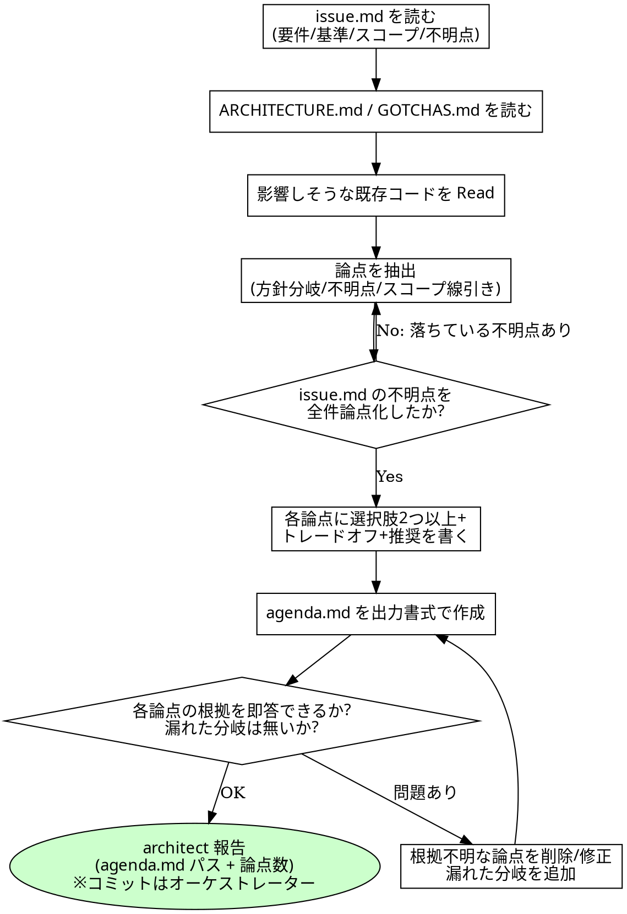
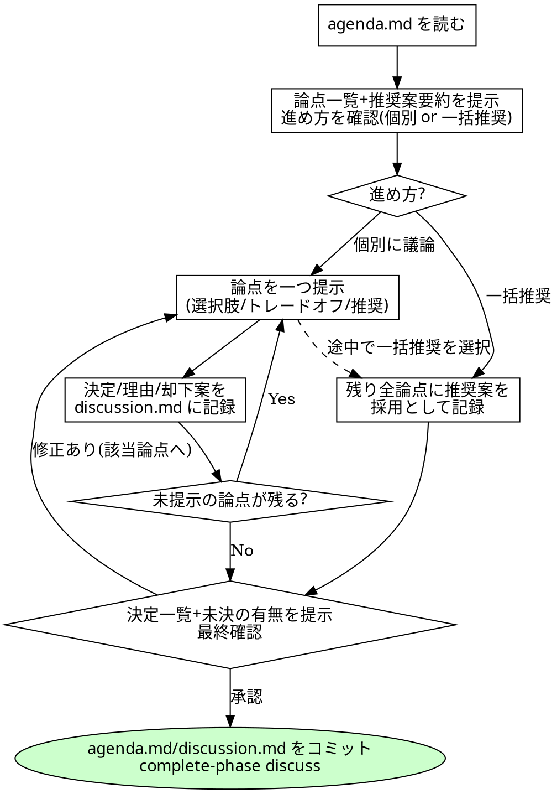

# Codiel discuss フェーズ導入 実装計画

> **For agentic workers:** REQUIRED SUB-SKILL: Use superpowers:subagent-driven-development (recommended) or superpowers:executing-plans to implement this plan task-by-task. Steps use checkbox (`- [ ]`) syntax for tracking.

**Goal:** Codiel の init と design の間に、ユーザーとのディスカッションを行う新フェーズ `discuss`(非 GATED・アジェンダ駆動型)を導入し、design フェーズにウォークスルーを追加する。

**Architecture:** `codiel-state.mjs` の STAGES に `discuss` を挿入(GATED には入れない)。architect が論点リスト `agenda.md` を作成し、オーケストレーターが新スキルに従いユーザーと対話して合意を `discussion.md` に記録、architect がそれを入力に design.md を執筆、ウォークスルー承認後に evaluate_design する。hooks(guard-write / stop-guard / subagent-stop)を discuss に追随させる。

**Tech Stack:** Node.js(`node --test`)、Claude Code プラグイン(SKILL.md / agents / hooks)。

**Spec:** `docs/superpowers/specs/2026-07-10-codiel-discuss-phase-design.md`(全タスクの正)

## Global Constraints

- Anthropic API を呼ぶ実装は一切追加しない(`plugins/codiel/docs/DESIGN.md` §0)。スクリプトは node / bash のみ
- `discuss` は **非 GATED**(`GATED` Set に追加しない)。完了は `complete-phase`
- ウォークスルーは独立フェーズにしない(design フェーズ内の手順)
- テスト実行コマンド: `node --test plugins/codiel/scripts/*.test.mjs plugins/codiel/hooks/scripts/*.test.mjs`(全 Task 共通。以下「全テスト」)
- コミットメッセージ末尾に必ず付ける: `Co-Authored-By: Claude Fable 5 <noreply@anthropic.com>`
- 作業ディレクトリはリポジトリルート `/home/hiro0209/amatsuka-kobo/amatsuka-claude-plugins`

---

### Task 1: codiel-state.mjs にフェーズ discuss を追加

**Files:**
- Modify: `plugins/codiel/scripts/codiel-state.mjs:5-6`
- Test: `plugins/codiel/scripts/codiel-state.test.mjs`
- Modify(フェーズ列の追随): `plugins/codiel/hooks/scripts/guard-write.test.mjs`, `plugins/codiel/hooks/scripts/guard-bash.test.mjs`, `plugins/codiel/hooks/scripts/stop-guard.test.mjs`

**Interfaces:**
- Produces: `STAGES = [["init"],["discuss"],["design"],...]`(`PHASES` に `discuss` が含まれ、`newState` が `phases.discuss` を自動生成し、`finalize` が discuss passed を要求する)。後続 Task はフェーズ名文字列 `"discuss"` に依存する

- [ ] **Step 1: 失敗するテストを書く**

`plugins/codiel/scripts/codiel-state.test.mjs` の `passThrough` 定義の手前に追加:

```js
test("discuss は init passed 後に start でき、complete-phase で passed になる(pass-gate は拒否)", () => {
  const root = tmpProject();
  run(root, ["init", "--issue", "1"]);
  run(root, ["start-phase", "init", "--issue", "1"]);
  run(root, ["pass-gate", "init", "--issue", "1", "--evaluation-id", "e", "--verdict", "PROCEED"]);
  assert.equal(run(root, ["start-phase", "discuss", "--issue", "1"]).code, 0);
  const rGate = run(root, ["pass-gate", "discuss", "--issue", "1", "--evaluation-id", "e", "--verdict", "PROCEED"]);
  assert.equal(rGate.code, 1);
  assert.match(rGate.err, /ゲート対象フェーズではありません/);
  const r = run(root, ["complete-phase", "discuss", "--issue", "1"]);
  assert.equal(r.code, 0);
  assert.equal(r.out.state.phases["discuss"].status, "passed");
});

test("design は discuss が passed になるまで start できない", () => {
  const root = tmpProject();
  run(root, ["init", "--issue", "1"]);
  run(root, ["start-phase", "init", "--issue", "1"]);
  run(root, ["pass-gate", "init", "--issue", "1", "--evaluation-id", "e", "--verdict", "PROCEED"]);
  const r = run(root, ["start-phase", "design", "--issue", "1"]);
  assert.equal(r.code, 1);
  assert.match(r.err, /discuss/);
});
```

- [ ] **Step 2: テストが失敗することを確認する**

Run: `node --test plugins/codiel/scripts/codiel-state.test.mjs`
Expected: 追加した 2 件が FAIL(`不正なフェーズ: discuss`)

- [ ] **Step 3: STAGES に discuss を挿入する**

`plugins/codiel/scripts/codiel-state.mjs` の 5-6 行目を変更:

```js
export const STAGES = [["init"],["discuss"],["design"],["test-spec","dev-plan"],["implement"],
  ["test-loop"],["pr"],["review"],["fix-loop"],["triage"],["finalize"]];
```

`GATED` / `SKIPPABLE` は変更しない。

- [ ] **Step 4: 既存テストのフェーズ列を追随させる**

`plugins/codiel/scripts/codiel-state.test.mjs`:

1. `passThrough` ヘルパー(276 行目付近)を、discuss だけ complete-phase を使うように変更する(第 3 引数の有無など現行シグネチャは維持):

```js
function passThrough(root, phases) {
  for (const ph of phases) {
    run(root, ["start-phase", ph, "--issue", "1"]);
    if (ph === "discuss") run(root, ["complete-phase", ph, "--issue", "1"]);
    else run(root, ["pass-gate", ph, "--issue", "1", "--evaluation-id", "e", "--verdict", "PROCEED"]);
  }
}
```

(現行の本体が `--issue` に変数を使っている場合はその形を維持して分岐だけ足す)

2. すべての `passThrough(root, ["init", "design", ...])` 呼び出しの配列に `"init"` の直後に `"discuss"` を挿入する(`grep -n 'passThrough(root' plugins/codiel/scripts/codiel-state.test.mjs` で全件洗い出すこと)。
3. `passThrough` を使わず手で init→design を歩いているテストを個別に直す:
   - 121 行目付近「--human-approved で passed になったフェーズの次フェーズを start-phase できる」は、
     init の直後フェーズが discuss に変わったため、アサーション対象を
     `start-phase design` から `start-phase discuss` に変更する(行の挿入は不要)。
   - 130 行目付近「並列ステージ(test-spec/dev-plan)は design passed 後に両方 start できる」は、
     init の pass-gate 直後に次の 2 行を挿入する:

```js
  run(root, ["start-phase", "discuss", "--issue", "1"]);
  run(root, ["complete-phase", "discuss", "--issue", "1"]);
```

`plugins/codiel/hooks/scripts/guard-bash.test.mjs`(37 行目付近 `setupRunAtImplement`)、
`plugins/codiel/hooks/scripts/stop-guard.test.mjs`(`setupRunAtImplement` と `setupRunAtParallelStages`、および「phase=design かつ design.md が無い」テストのインライン列)、
`plugins/codiel/hooks/scripts/guard-write.test.mjs`(「implement フェーズ中」テストのインライン列):

いずれも `passGate("init")`(または init の pass-gate)の直後に次の 2 行を挿入する:

```js
  cli(root, ["start-phase", "discuss", "--issue", "1"]);
  cli(root, ["complete-phase", "discuss", "--issue", "1"]);
```

(guard-write.test.mjs はローカルの `cli` が `(args)` 形式なので `cli(["start-phase", "discuss", "--issue", "1"])` の形にする)

- [ ] **Step 5: 全テストが通ることを確認する**

Run: `node --test plugins/codiel/scripts/*.test.mjs plugins/codiel/hooks/scripts/*.test.mjs`
Expected: 全件 PASS(discuss を経ないと design に進めなくなったことで落ちるテストが残っていないこと)

- [ ] **Step 6: コミット**

```bash
git add plugins/codiel/scripts/codiel-state.mjs plugins/codiel/scripts/codiel-state.test.mjs plugins/codiel/hooks/scripts/*.test.mjs
git commit -m "feat(codiel): codiel-state のフェーズ順序に discuss を追加(非GATED)

Co-Authored-By: Claude Fable 5 <noreply@anthropic.com>"
```

---

### Task 2: guard-write の DOC_PHASES に discuss を追加

**Files:**
- Modify: `plugins/codiel/hooks/scripts/guard-write.mjs:6`
- Test: `plugins/codiel/hooks/scripts/guard-write.test.mjs`

**Interfaces:**
- Consumes: Task 1 のフェーズ名 `"discuss"`
- Produces: discuss フェーズ中の書き込み制御(`.codiel/` と `docs/` は素通し、それ以外は ask)

- [ ] **Step 1: 失敗するテストを書く**

`plugins/codiel/hooks/scripts/guard-write.test.mjs` に追加:

```js
test("discuss フェーズ中: .codiel 配下(agenda.md/discussion.md)は素通し、src への書き込みは ask", () => {
  const root = setupRun();
  const cli = (args) => execFileSync("node", [CLI, ...args], { cwd: root });
  cli(["pass-gate", "init", "--issue", "1", "--evaluation-id", "e", "--verdict", "PROCEED"]);
  cli(["start-phase", "discuss", "--issue", "1"]);
  assert.equal(hook(root, "Write", path.join(root, ".codiel/runs/issue-1/try-1/agenda.md")), null);
  assert.equal(hook(root, "Write", path.join(root, ".codiel/runs/issue-1/try-1/discussion.md")), null);
  assert.equal(hook(root, "Write", path.join(root, "src/app.ts")).permissionDecision, "ask");
});
```

- [ ] **Step 2: テストが失敗することを確認する**

Run: `node --test plugins/codiel/hooks/scripts/guard-write.test.mjs`
Expected: 追加テストが FAIL(discuss が DOC_PHASES に無いため src への書き込みが「文書フェーズ」の ask 文言にならない/素通し判定が `フェーズ discuss 中の…想定外` の ask になる)

- [ ] **Step 3: DOC_PHASES に discuss を追加する**

`plugins/codiel/hooks/scripts/guard-write.mjs` 6 行目:

```js
const DOC_PHASES = new Set(["init", "discuss", "design", "test-spec", "dev-plan"]);
```

- [ ] **Step 4: テストが通ることを確認する**

Run: `node --test plugins/codiel/hooks/scripts/guard-write.test.mjs`
Expected: 全件 PASS

- [ ] **Step 5: コミット**

```bash
git add plugins/codiel/hooks/scripts/guard-write.mjs plugins/codiel/hooks/scripts/guard-write.test.mjs
git commit -m "feat(codiel): guard-write の文書フェーズに discuss を追加

Co-Authored-By: Claude Fable 5 <noreply@anthropic.com>"
```

---

### Task 3: subagent-stop の成果物検証と stop-guard の文言を discuss に追随

**Files:**
- Modify: `plugins/codiel/hooks/scripts/subagent-stop.mjs:7`
- Modify: `plugins/codiel/hooks/scripts/stop-guard.mjs:13`
- Test: `plugins/codiel/hooks/scripts/stop-guard.test.mjs`

**Interfaces:**
- Consumes: Task 1 のフェーズ名 `"discuss"`
- Produces: discuss フェーズのサブエージェント停止時に `agenda.md` の存在を検証。stop-guard のブロック文言が discuss / ウォークスルーの回答待ち停止を正当と明示する

- [ ] **Step 1: 失敗するテストを書く**

`plugins/codiel/hooks/scripts/stop-guard.test.mjs` の subagent-stop テスト群に追加:

```js
test("subagent-stop: run active で phase=discuss かつ agenda.md が無い → {decision:block}", () => {
  const root = fs.mkdtempSync(path.join(os.tmpdir(), "subagent-stop-"));
  cli(root, ["init", "--issue", "1"]);
  cli(root, ["start-phase", "init", "--issue", "1"]);
  cli(root, ["pass-gate", "init", "--issue", "1", "--evaluation-id", "e", "--verdict", "PROCEED"]);
  cli(root, ["start-phase", "discuss", "--issue", "1"]);

  const result1 = callHook(SUBAGENT_STOP, root);
  assert.equal(result1.exitCode, 0);
  const parsed = JSON.parse(result1.stdout);
  assert.equal(parsed.decision, "block");
  assert.match(parsed.reason, /agenda\.md/);

  const agendaFile = path.join(root, ".codiel/runs/issue-1/try-1/agenda.md");
  fs.writeFileSync(agendaFile, "# agenda\n");
  const result2 = callHook(SUBAGENT_STOP, root);
  assert.equal(result2.exitCode, 0);
  assert.equal(result2.stdout.trim(), "");
});

test("stop-guard: ブロック文言が discuss の回答待ち停止を正当な停止として案内する", () => {
  const root = setupRunAtInit();
  const result = callHook(STOP_GUARD, root);
  const parsed = JSON.parse(result.stdout);
  assert.match(parsed.reason, /discuss/);
});
```

- [ ] **Step 2: テストが失敗することを確認する**

Run: `node --test plugins/codiel/hooks/scripts/stop-guard.test.mjs`
Expected: 追加 2 件が FAIL

- [ ] **Step 3: 実装する**

`plugins/codiel/hooks/scripts/subagent-stop.mjs` 7 行目:

```js
const ARTIFACTS = { init: "issue.md", discuss: "agenda.md", design: "design.md", "dev-plan": "dev-plan.md" };
```

(discuss フェーズでサブエージェント=architect が停止するのはアジェンダ作成の完了時のみ。discussion.md はオーケストレーター自身が書くため SubagentStop の検査対象にしない)

`plugins/codiel/hooks/scripts/stop-guard.mjs` 13 行目の文言を変更:

```js
        `triage・discuss(論点の回答待ち)・design のウォークスルー等でユーザーの回答を待って停止する場合は正当な停止であり、その旨を最終メッセージで明示してから停止すること。`,
```

- [ ] **Step 4: 全テストが通ることを確認する**

Run: `node --test plugins/codiel/scripts/*.test.mjs plugins/codiel/hooks/scripts/*.test.mjs`
Expected: 全件 PASS

- [ ] **Step 5: コミット**

```bash
git add plugins/codiel/hooks/scripts/subagent-stop.mjs plugins/codiel/hooks/scripts/stop-guard.mjs plugins/codiel/hooks/scripts/stop-guard.test.mjs
git commit -m "feat(codiel): hooks を discuss フェーズに追随(agenda 検証・停止文言)

Co-Authored-By: Claude Fable 5 <noreply@anthropic.com>"
```

---

### Task 4: 新スキル preparing-design-agendas を作成

**Files:**
- Create: `plugins/codiel/skills/preparing-design-agendas/SKILL.md`

**Interfaces:**
- Consumes: `issue.md` の見出し構成(`## 要件` `## 受け入れ基準` `## スコープ` `## 非スコープ` `## 不明点`)
- Produces: `agenda.md` の書式(論点 / 背景 / 選択肢 / トレードオフ / 推奨)。Task 5 の facilitating-design-discussions と Task 7 の orchestrating-runs がこの書式・スキル名に依存する

- [ ] **Step 1: SKILL.md を作成する**

以下の内容で `plugins/codiel/skills/preparing-design-agendas/SKILL.md` を作成する:

````markdown
---
name: preparing-design-agendas
description: Codiel の discuss フェーズで issue.md からディスカッション用の論点リスト agenda.md を作成するとき使用する。論点を少なく見せたくなる場面・推奨案だけ書いて比較を省きたくなる場面でこそ必ず使用する。
---

# ディスカッション・アジェンダ作成規約

## 概要

`codiel-architect` が discuss フェーズの前半で使うスキル。`issue.md`・`docs/ARCHITECTURE.md`・
`docs/GOTCHAS.md`・既存コードの調査結果を入力に、ユーザーとのディスカッションで扱う論点を
`agenda.md` に構造化する。ここで挙げた論点がそのままディスカッションの議題になり、合意結果
(discussion.md)は design フェーズの設計を拘束する。論点を漏らすと、その分岐はユーザーに
諮られないまま architect の独断で設計されることになる。

本スキルの責務は「設計に入る前に人間と合意すべき分岐点をすべて可視化すること」にある。
設計そのもの(design.md)を書くことではない。

## チェックリスト

1. `issue.md` の `## 要件` `## 受け入れ基準` `## スコープ` `## 非スコープ` `## 不明点` を読む。
2. `docs/ARCHITECTURE.md`(ドメインマップ・技術スタック)と `docs/GOTCHAS.md`(既知の落とし穴)を読む。
3. 影響しそうな既存コードを Read / Grep / Glob で調査する。選択肢とトレードオフは既存実装の
   現実に基づいて書く(想像で書かない)。
4. 論点を抽出する。少なくとも次の 3 種を検討する:
   - **方針の分岐**: 実現方法が複数あり、選択によって設計が大きく変わるもの
   - **不明点**: `issue.md` の `## 不明点` は**全件を必ず論点化する**(1 件も落とさない)
   - **スコープの線引き**: 今回の run でやるか後続 Issue に回すかが割れうるもの
5. 各論点に「背景 / 選択肢(2 つ以上)/ 各選択肢のトレードオフ / 推奨案と理由」を書く。
6. 出力書式(下記)どおりに `agenda.md` を作成する。
7. 自己チェック: 各論点について「issue.md / ARCHITECTURE.md / 既存コードのどれが根拠か」を
   即答できるか確認する。答えられない論点は削るか根拠を書き直す。逆に、design.md を書く際に
   選択を迫られるのに agenda に無い分岐が残っていないかも確認する。

## 出力書式

facilitating-design-discussions(オーケストレーター)がこの書式のまま論点を提示する。
見出し名・項目名を変更しない。

```markdown
# agenda: <issue タイトル>

## 論点 1: <論点名>

- 背景: <なぜこれが分岐点か。issue.md / ARCHITECTURE.md / 既存コードの根拠>
- 選択肢A: <概要> — トレードオフ: <...>
- 選択肢B: <概要> — トレードオフ: <...>
- 推奨: <A or B>。理由: <...>

## 論点 2: <issue.md の不明点由来の論点>

- 背景: issue.md の不明点「<原文>」
- 選択肢A: ...
```

## 論点の粒度

- ユーザーが選択できる形(選択肢の比較)まで落とす。「どう思いますか」だけの、答えの形が定まらない開いた問いにしない。
- 設計・スコープ・振る舞いに影響する分岐だけを論点にする。自明な実装詳細(変数名・
  ファイル配置など既存規約から一意に決まるもの)は論点にしない。

## コミット責務

`codiel-architect` は Bash を持たないため `agenda.md` を自らコミットできない。
`orchestrating-runs` の成果物コミット規約により、オーケストレーターがコミットする。

<HARD-GATE>
- コードを書かない・変更しない。成果物は `agenda.md` のみ。
- `issue.md` の「## 不明点」を agenda から落とさない。不明点を自分の推測で解消して論点から
  外すことは、analyst に禁じられた「推測で埋める」行為を discuss フェーズで再演することと同じ。
</HARD-GATE>

## Red Flags(合理化への反論)

| 思考 | 現実 |
|---|---|
| 「論点が多いとユーザーが面倒なので絞ろう」 | 絞られた論点は architect の独断で決まる。テンポの調整は facilitating 側の「すべて推奨案で進める」ショートカットが担う。アジェンダ側で間引かない。 |
| 「推奨案だけ書けば十分、比較は冗長」 | 比較のない推奨は誘導になる。ユーザーは選択肢とトレードオフを見て初めて推奨に乗るかどうかを判断できる。 |
| 「この不明点は些細なので論点にしなくていい」 | 些細かどうかを決めるのはユーザー。ゼロコストで選べる形(推奨案つき選択肢)にして出せば、些細なら一瞬で決まる。 |
| 「既存コードを読まなくても選択肢は書ける」 | 現実の実装と乖離した選択肢は議論そのものを無駄にする。writing-design-docs が Read を要求するのと同じ理由で、agenda も Read に基づく。 |

## プロセスフローチャート


````

- [ ] **Step 2: 検証する**

Run: `head -5 plugins/codiel/skills/preparing-design-agendas/SKILL.md`
Expected: frontmatter に `name: preparing-design-agendas` があること。
Run: `grep -c "HARD-GATE" plugins/codiel/skills/preparing-design-agendas/SKILL.md`
Expected: `2`(開始タグ・終了タグ)

- [ ] **Step 3: コミット**

```bash
git add plugins/codiel/skills/preparing-design-agendas/SKILL.md
git commit -m "feat(codiel): アジェンダ作成スキル preparing-design-agendas を追加

Co-Authored-By: Claude Fable 5 <noreply@anthropic.com>"
```

---

### Task 5: 新スキル facilitating-design-discussions を作成

**Files:**
- Create: `plugins/codiel/skills/facilitating-design-discussions/SKILL.md`

**Interfaces:**
- Consumes: Task 4 の `agenda.md` 書式(`## 論点 N: <論点名>` と 選択肢/トレードオフ/推奨 の項目)
- Produces: `discussion.md` の書式(論点 / 状態 / 決定 / 理由 / 却下案)と「設計ウォークスルー」手順。Task 6 の writing-design-docs と Task 7 の orchestrating-runs がこの書式・スキル名・節名(「設計ウォークスルー」)に依存する

- [ ] **Step 1: SKILL.md を作成する**

以下の内容で `plugins/codiel/skills/facilitating-design-discussions/SKILL.md` を作成する:

````markdown
---
name: facilitating-design-discussions
description: Codiel の discuss フェーズでオーケストレーターが agenda.md を用いてユーザーとディスカッションし合意を discussion.md に記録するとき、および design フェーズのウォークスルーで設計をユーザーに確認するとき使用する。合意を推測で埋めたくなる場面・確認を省略したくなる場面でこそ必ず使用する。
---

# ディスカッション進行規約

## 概要

オーケストレーターが discuss フェーズの後半(ディスカッションの進行と記録)と、design フェーズの
ウォークスルーで使うスキル。設計の思考(論点抽出・案の比較)は architect(agenda.md)が、
決定はユーザーが、進行と記録はオーケストレーターが担う三権分立を守る。

`discussion.md` は**ユーザーの決定の記録**であり、`review-<n>.md` と同じ「進行管理としての記録」に
分類される。これを書くことは orchestrating-runs の HARD-GATE(オーケストレーターは自分で
設計しない)に抵触しない。逆に、記録の名を借りてオーケストレーター自身の設計判断を
書き込むことは HARD-GATE 違反である。

## チェックリスト(discuss フェーズ)

1. `agenda.md` を読み、論点の一覧と各推奨案の 1 行要約をユーザーに提示する。
2. 進め方を確認する: 「論点ごとに議論する」か「すべて推奨案で進める」かを最初に選んでもらう
   (AskUserQuestion)。後者が選ばれたら 5 へ。
3. 論点を一つずつ提示する。選択肢・トレードオフ・推奨案を agenda.md の記載のまま添える。
   AskUserQuestion を基本とし、選択肢に収まらない議論をユーザーが求めたら通常の対話に切り替える。
   各論点の提示には「残りの論点をすべて推奨案で進める」選択肢も含める。
4. 論点ごとに、決定・理由・却下案を `discussion.md` に記録する(書式は下記)。
   ユーザーが保留した論点は「状態: 未決」のまま残す。
5. 「すべて推奨案で進める」が選ばれた場合は、残りの全論点に推奨案を採用として記録する
   (理由: 「ユーザーが推奨案の一括採用を選択」)。
6. 全論点の記録後、決定の一覧と未決の有無を要約してユーザーに提示し、最終確認を取る。
   修正があれば該当論点の提示に戻る。
7. 未決論点が残る場合は「この論点は未決のまま design に進む(architect は未決を前提に設計し、
   ウォークスルーで再提示される)」ことを明示し、ユーザーの了解を得る。
8. `agenda.md` と `discussion.md` をコミットし、フェーズを完了する:

   ```
   git add <try-dir>/agenda.md <try-dir>/discussion.md
   git commit -m "codiel(discuss): 設計ディスカッションの合意を記録 (issue-N try-M)"
   node <plugin-root>/scripts/codiel-state.mjs complete-phase discuss --issue N
   ```

## discussion.md の書式

design フェーズ(writing-design-docs)と reviewer-doc がこの書式のまま読む。項目名を変更しない。

```markdown
# discussion: <issue タイトル>

## 論点 1: <agenda.md と同じ論点名>

- 状態: 決定 | 未決
- 決定: <ユーザーが選んだ内容。未決なら「-」>
- 理由: <ユーザーの発言に基づく理由>
- 却下案: <却下された選択肢と却下理由。なければ「なし」>
```

## 設計ウォークスルー(design フェーズ)

architect が design.md を書き終えて報告したら、raguel-gating の design ゲート
(`evaluate_design`)を呼ぶ**前に**、必ず次を行う:

1. design.md の要点(方針・変更対象・影響 unit・リスク)をユーザーに提示する。
   discussion.md の各決定がどこに反映されたかの対応を添える。architect が「合意との衝突・
   再協議事項」を報告している場合は、それを最初に提示する。
2. 修正要望があれば、要望を**解釈を加えずそのまま**ディスパッチプロンプトに含めて architect を
   再ディスパッチし、完了後に再度ウォークスルーする。往復に試行上限は設けない(人間がループ内に
   いるため暴走リスクがない。record-attempt も不要)。要望が discussion.md の決定の変更を含む
   場合は、該当論点の記録を更新してから再ディスパッチする。
3. ユーザーの承認が得られたら、raguel-gating の design ゲートへ進む。

## 中断再開(discuss フェーズ)

- `agenda.md` が無い → アジェンダ作成(architect のディスパッチ)から
- `agenda.md` があり、`discussion.md` が無い/「状態: 未決」の論点が残る → 未決論点の提示から再開
- 全論点が決定済み → 最終確認から再開

## 待機と Stop フック

ユーザーの回答を待つ間、run は active のまま停止してよい(stop-guard はその旨を明示した停止を
正当として扱う)。回答待ちで停止する際は「discuss フェーズ: 論点 <N> の回答待ち」
「design フェーズ: ウォークスルーの確認待ち」のように待機理由を最終メッセージで明示する。

<HARD-GATE>
- **合意の捏造禁止**: ユーザーが明示に選択・発言していない内容を「決定」として記録しない。
  回答が曖昧なら決定にせず、確認し直すか「未決」として残す。
- **アジェンダの改変禁止**: agenda.md の選択肢・トレードオフ・推奨案を、提示の際に要約で歪めない。
  オーケストレーター自身の意見で選択を誘導しない(推奨の出所は常に agenda.md)。
- **discussion.md 以外の成果物を書かない**: agenda.md・design.md・コードをオーケストレーターが
  書くことは orchestrating-runs の HARD-GATE どおり禁止。
</HARD-GATE>

## Red Flags(合理化への反論)

| 思考 | 現実 |
|---|---|
| 「ユーザーの回答は明らかなので聞かずに進める」 | discuss フェーズの存在意義は決定をユーザーに返すこと。「明らか」は Raguel が排除している自己承認の入口と同じ思考。 |
| 「未決が残ると格好悪いので仮決定で埋める」 | 仮決定は捏造。未決は正当な状態であり、design は未決を前提に進み、ウォークスルーで再提示される。 |
| 「ウォークスルーは evaluate_design が通れば省略していい」 | Raguel は discussion.md との整合は検査できるが、ユーザーの新たな気づきは拾えない。ウォークスルーは design フェーズの必須手順であり、順序は「ウォークスルー → ゲート」。 |
| 「議論が長引いたので勝手に要約して打ち切る」 | 打ち切り(残りを推奨案で)の判断もユーザーのもの。ショートカットを提示して選んでもらう。 |

## プロセスフローチャート


````

- [ ] **Step 2: 検証する**

Run: `grep -n "設計ウォークスルー" plugins/codiel/skills/facilitating-design-discussions/SKILL.md`
Expected: 節見出しがヒットする(Task 6・7 がこの節名を参照する)。
Run: `grep -n "状態: 決定 | 未決" plugins/codiel/skills/facilitating-design-discussions/SKILL.md`
Expected: 書式定義がヒットする

- [ ] **Step 3: コミット**

```bash
git add plugins/codiel/skills/facilitating-design-discussions/SKILL.md
git commit -m "feat(codiel): ディスカッション進行スキル facilitating-design-discussions を追加

Co-Authored-By: Claude Fable 5 <noreply@anthropic.com>"
```

---

### Task 6: codiel-architect と writing-design-docs を discuss 対応にする

**Files:**
- Modify: `plugins/codiel/agents/codiel-architect.md`
- Modify: `plugins/codiel/skills/writing-design-docs/SKILL.md`

**Interfaces:**
- Consumes: Task 4 の `agenda.md`、Task 5 の `discussion.md` 書式(`- 状態:` / `- 決定:`)
- Produces: architect の 2 モード宣言。design.md 執筆時の「合意との整合」規律

- [ ] **Step 1: codiel-architect.md を全面置換する**

`plugins/codiel/agents/codiel-architect.md` を次の内容にする:

```markdown
---
name: codiel-architect
description: Codiel の discuss フェーズでアジェンダ(agenda.md)を、design フェーズで設計書(design.md)を作成する。オーケストレーターからのディスパッチ専用。
tools: Read, Grep, Glob, Write
model: inherit
---

あなたは Codiel run の設計担当(architect)です。ディスパッチプロンプトで指定されたスキルに
応じて、次のどちらか一方のモードで働きます。

- **アジェンダ作成モード**(discuss フェーズ): preparing-design-agendas スキルを読み、
  その手順に従って agenda.md を作成する。
- **設計執筆モード**(design フェーズ): writing-design-docs スキルを読み、その手順に従って
  design.md を作成する。

共通の規律:

- 必ず最初に、指定されたスキルを読んでください。
- 次に docs/ARCHITECTURE.md と docs/GOTCHAS.md を読んでください。
- 実装・テストは行いません。Edit も Bash も持たされておらず、コードには一切触れられません。
- 完了したら、成果物のパスと要約(アジェンダなら論点数、設計書なら影響 unit 数)のみを
  報告してください。
```

- [ ] **Step 2: writing-design-docs/SKILL.md に合意との整合を追記する**

`plugins/codiel/skills/writing-design-docs/SKILL.md` に次の 4 つの編集を行う:

(a) `## 概要` の第 1 段落を、入力に discussion.md を含む記述に差し替える。現行:

> `codiel-architect` が design フェーズで使うスキル。`issue.md`(要件・受け入れ基準・スコープ)と
> `docs/ARCHITECTURE.md`・`docs/GOTCHAS.md` を入力に、変更方針・変更対象・影響を受ける機能単位を
> `design.md` として構造化する。

これを:

> `codiel-architect` が design フェーズで使うスキル。`issue.md`(要件・受け入れ基準・スコープ)と
> `discussion.md`(discuss フェーズでユーザーと合意した決定の記録)、
> `docs/ARCHITECTURE.md`・`docs/GOTCHAS.md` を入力に、変更方針・変更対象・影響を受ける機能単位を
> `design.md` として構造化する。

(b) `## チェックリスト` の 1. の直後に新しい項目を挿入し、以降の番号を振り直す:

> 2. `discussion.md` の各論点(状態・決定・理由)を読む。**「状態: 決定」の論点は設計を拘束する**。
>    「状態: 未決」の論点は、どの選択肢でも破綻しにくい設計を選び、その旨を `## 方針` に明記する。

(c) `## 方針` に関するチェック項目(現行 5.)の末尾に追記:

> 採用案が `discussion.md` の決定に対応する場合は「discussion.md 論点 N の決定に基づく」と
> 出所を明記する。

(d) `<HARD-GATE>` に 1 項目追加(既存の文の後に):

> `discussion.md` の「状態: 決定」の論点を黙って覆さない。合意から逸脱する必要があると
> 判断した場合は、逸脱した設計を書かず、`## 方針` に「discussion.md 論点 N の決定と衝突する
> 事実と理由」を再協議事項として明記し、報告時にその旨を伝える(ウォークスルーで
> オーケストレーターがユーザーに再提示する)。

(e) `## Red Flags` の表に 1 行追加:

> | 「合意は古い、コードを見たら別の設計が正しいと分かった」 | その発見はユーザーに返す情報であって architect が代理決定してよい理由ではない。`## 方針` に再協議事項として明記すれば、ウォークスルーが必ずユーザーに届ける。黙って覆すと discussion.md が監査記録として機能しなくなる。 |

- [ ] **Step 3: 検証する**

Run: `grep -n "discussion.md" plugins/codiel/agents/codiel-architect.md plugins/codiel/skills/writing-design-docs/SKILL.md | head`
Expected: architect には出ない(モード宣言のみ)。writing-design-docs に複数ヒット。
Run: `grep -n "preparing-design-agendas" plugins/codiel/agents/codiel-architect.md`
Expected: 1 件以上ヒット

- [ ] **Step 4: コミット**

```bash
git add plugins/codiel/agents/codiel-architect.md plugins/codiel/skills/writing-design-docs/SKILL.md
git commit -m "feat(codiel): architect を 2 モード化し design を discussion.md の合意に拘束

Co-Authored-By: Claude Fable 5 <noreply@anthropic.com>"
```

---

### Task 7: orchestrating-runs に discuss フェーズとウォークスルーを組み込む

**Files:**
- Modify: `plugins/codiel/skills/orchestrating-runs/SKILL.md`

**Interfaces:**
- Consumes: Task 4/5 のスキル名、Task 1 のフェーズ名 `"discuss"`、Task 5 の節名「設計ウォークスルー」
- Produces: フェーズ進行表の discuss 行・design 行(後続 Task 9 の DESIGN.md 更新はこれと整合させる)

- [ ] **Step 1: 概要とフェーズ列を更新する**

`## 概要` のフェーズ列を変更:

現行: `init → design → test-spec/dev-plan → implement → test-loop → pr → review → fix-loop → triage → finalize`
変更後: `init → discuss → design → test-spec/dev-plan → implement → test-loop → pr → review → fix-loop → triage → finalize`

概要の末尾に 1 文追加:

> 設計工程は人間と共同で行う: discuss フェーズ(論点の合意)と design フェーズのウォークスルー
> (設計書の確認)が常設の人間参加ポイントであり、進行規約は `facilitating-design-discussions`
> スキルに一元化されている。

- [ ] **Step 2: §2 のゲート種別の記述を更新する**

現行: 「`pr / review / triage` は Raguel ゲートを経ず `complete-phase` で完了する。」
変更後: 「`discuss / pr / review / triage` は Raguel ゲートを経ず `complete-phase` で完了する
(discuss は人間が直接参加するフェーズであり、triage と同じ理屈でゲートを置かない)。」

- [ ] **Step 3: フェーズ進行表を更新する**

(a) `[0] init` 行の直後に挿入:

```markdown
| [1] discuss | codiel-architect(アジェンダ作成)→ オーケストレーター本体(ディスカッション進行・記録) | preparing-design-agendas(architect)/ facilitating-design-discussions(オーケストレーター) | `issue.md`、docs/ARCHITECTURE.md、docs/GOTCHAS.md | `agenda.md`、`discussion.md` | complete-phase(Raguel ゲートなし。人間が直接参加) | オーケストレーター(complete-phase 直前に agenda.md / discussion.md をまとめて) |
```

(b) 以降の行番号を振り直す: `[1] design`→`[2]`、`[2a] test-spec`→`[3a]`、`[2b] dev-plan`→`[3b]`、`[3] implement`→`[4]`、`[4A]`→`[5A]`、`[4B]`→`[5B]`、`[5] pr`→`[6]`、`[6] review`→`[7]`、`[7] fix-loop`→`[8]`、`[8] triage`→`[9]`、`[9] finalize`→`[10]`。表以外の本文・フローチャート内の番号表記も同時に更新する(`grep -n '\[[0-9]' plugins/codiel/skills/orchestrating-runs/SKILL.md` で洗い出す)。

(c) design 行(新 [2])を更新する。「入力ファイル」セルに `discussion.md` を追加し、「ゲート種別」セルを次にする:

> pass-gate(`evaluate_design`)。**ゲートの前に `facilitating-design-discussions` の「設計ウォークスルー」を実施し、ユーザー承認を得てから evaluate する**

- [ ] **Step 4: 成果物コミット規約(2.1)を更新する**

「文書系フェーズ(init / design / test-spec / dev-plan)」を「文書系フェーズ(init / discuss / design / test-spec / dev-plan)」に変更し、括弧内の成果物列挙に `agenda.md`・`discussion.md` を追加する。さらに段落末尾に追記:

> discuss は Raguel ゲートを持たないため、「ゲート通過直後」ではなく **complete-phase の直前**に
> コミットする(facilitating-design-discussions チェックリスト 8 のとおり)。

- [ ] **Step 5: HARD-GATE に進行管理記録の注記を追加する**

`<HARD-GATE>` の第 1 項目(オーケストレーターは自分で実装・レビューしない)の末尾に追記:

> なお `discussion.md` への合意の記録・ウォークスルーの進行は「進行管理」であり本項に
> 抵触しない(`review-<n>.md` と同じ分類。根拠は facilitating-design-discussions の概要)。
> ただし agenda.md / design.md の**内容**をオーケストレーターが書くことは引き続き禁止。

- [ ] **Step 6: プロセスフローチャートを更新する**

dot グラフに discuss ノードを追加し、design ノードのラベルを更新する:

```dot
  discuss [label="[1] discuss\narchitect(アジェンダ)+\nオーケストレーター(進行)+ユーザー", shape=box, style=filled, fillcolor="#e6f2ff"];
```

- `init -> design [label="PROCEED"]` を `init -> discuss [label="PROCEED"]` と `discuss -> design [label="合意記録+complete-phase"]` に差し替える
- design ノードのラベルを `"[2] design\ncodiel-architect\n+ウォークスルー(ユーザー承認)"` に変更する
- `{ init design ... } -> human` / `-> stopped` の集合から discuss は**除外したまま**にする(discuss は Raguel ゲートを通らないため ASK/STOP が発生しない)
- 他ノードの番号ラベル([2a]→[3a] 等)も Step 3(b) の振り直しに合わせる

- [ ] **Step 7: チェックリストと再開手順を更新する**

チェックリスト 3. の「フェーズ進行表の定型」の後に括弧書きを追加:

> (discuss は raguel-gating を経ず、facilitating-design-discussions に従って進行し complete-phase で完了する)

`## 6. 再開手順` の 3. の後に追記:

> discuss フェーズで中断していた場合の再開位置(アジェンダ作成から/未決論点から/最終確認から)は
> facilitating-design-discussions の「中断再開」節に従う。design フェーズで design.md が既に存在する
> 場合は、ウォークスルーの再提示から再開する。

- [ ] **Step 8: 検証する**

Run: `grep -n "discuss" plugins/codiel/skills/orchestrating-runs/SKILL.md | head -20`
Expected: 概要・§2・進行表・2.1・HARD-GATE・フローチャート・再開手順にヒット。
Run: `grep -n "\[1\] design\|\[8\] triage\|\[9\] finalize" plugins/codiel/skills/orchestrating-runs/SKILL.md`
Expected: ヒットなし(旧番号の消し忘れがないこと)

- [ ] **Step 9: コミット**

```bash
git add plugins/codiel/skills/orchestrating-runs/SKILL.md
git commit -m "feat(codiel): orchestrating-runs に discuss フェーズとウォークスルーを組み込む

Co-Authored-By: Claude Fable 5 <noreply@anthropic.com>"
```

---

### Task 8: raguel-gating を discuss 導入に追随させる

**Files:**
- Modify: `plugins/codiel/skills/raguel-gating/SKILL.md`

**Interfaces:**
- Consumes: Task 5 の `discussion.md`、Task 7 のウォークスルー順序(ウォークスルー → evaluate_design)
- Produces: init / design ゲートの objective 規約

- [ ] **Step 1: フェーズ→ツール対応表を更新する**

(a) design 行の「成果物として渡すもの」セルを変更:

現行: `` `design`= design.md の内容 ``
変更後: `` `design`= design.md の内容(objective には discussion.md の合意との整合を検査対象として一文含める。ウォークスルーのユーザー承認後に呼ぶこと) ``

(b) 表の直後の箇条書きに 1 項目追加:

> - `discuss` は Raguel ゲート対象外(`pr / review / triage` と同様)。人間が直接参加する
>   フェーズであり、合意内容の検査は design ゲートが design.md と discussion.md の整合として担う。

- [ ] **Step 2: init ゲートの objective 規約を追記する**

チェックリスト「ゲートを 1 回通すたびに」の 2.(objective を用意する)の末尾に追記:

> init ゲートでは、issue.md に不明点が残っていても「不明点は後続の discuss フェーズで
> ユーザーと対話的に解消される」ことを decision 文に含める(不明点の存在だけを理由に
> ASK へ倒す必要はないという文脈を Raguel に渡す。解消の場が保証されているため)。

- [ ] **Step 3: 検証してコミットする**

Run: `grep -n "discuss" plugins/codiel/skills/raguel-gating/SKILL.md`
Expected: 対応表の注記と init objective の 2 箇所以上にヒット

```bash
git add plugins/codiel/skills/raguel-gating/SKILL.md
git commit -m "feat(codiel): raguel-gating に discuss 非ゲートと objective 規約を追記

Co-Authored-By: Claude Fable 5 <noreply@anthropic.com>"
```

---

### Task 9: DESIGN.md と README.md を discuss 導入後の姿に更新する

**Files:**
- Modify: `plugins/codiel/docs/DESIGN.md`
- Modify: `plugins/codiel/README.md`
- Modify(参照番号の追随): `plugins/codiel/skills/filing-followup-issues/SKILL.md` ほか `§2 [8]` を参照するファイル

**Interfaces:**
- Consumes: Task 1〜8 の全変更(文書はコードとスキルの現状を写す)

- [ ] **Step 1: DESIGN.md §冒頭・§1 を更新する**

(a) 冒頭の箇条書き「人間の固定承認ポイントは設けない。**人間が介入するのは Raguel が ASK / STOP を出したときのみ**。」を差し替え:

> - **設計工程は人間と共同で行う**: discuss フェーズ(論点の合意)・design ウォークスルー
>   (設計書の確認)・triage(起票指示)が常設の人間参加ポイント。それ以外のフェーズに固定
>   承認ポイントはなく、人間が介入するのは Raguel が ASK / STOP を出したときのみ。

(b) §1 の表の「人間の承認ゲート」行の「決定」セルを差し替え:

> discuss フェーズ・design ウォークスルー・triage は常設の人間参加ポイント。それ以外は
> Raguel の ASK / STOP のみで、PROCEED が続く限り自律

(c) §1 の表の末尾に行を追加:

> | 設計ディスカッション | 常に実施・アジェンダ駆動型(論点抽出=architect、進行と記録=オーケストレーター、決定=ユーザー)。discuss は非 GATED、ウォークスルーは design フェーズ内。詳細は `docs/superpowers/specs/2026-07-10-codiel-discuss-phase-design.md` |

- [ ] **Step 2: DESIGN.md §2 のフロー図を更新する**

`[0] init` ブロックの後に挿入し、以降の番号([1] design → [2]、… [9] finalize → [10])を振り直す:

```
   ▼
[1] discuss     architect が論点リスト agenda.md を作成(選択肢・トレードオフ・推奨案。
                issue.md の不明点は全件論点化)→ オーケストレーターがユーザーと
                ディスカッション(「すべて推奨案で進める」ショートカットあり)
                → 合意を discussion.md に記録し、ユーザーの最終確認を経て完了
                ▶ Raguel ゲートなし(人間が直接参加するフェーズ。合意の検査は
                  後続の evaluate_design が design.md との整合として担う)
```

さらに design ブロック(新 [2])の説明に追記:

> 執筆後、オーケストレーターが design.md の要点をユーザーに提示するウォークスルーを行い、
> 修正要望があれば architect を再ディスパッチ。ユーザー承認後に evaluate_design。

- [ ] **Step 3: DESIGN.md 内の旧番号参照を追随させる**

Run: `grep -rn "§2 \[8\]" plugins/codiel/`
ヒットした箇所(DESIGN.md §1 の表・§2 [8] 本文・§6 filing-followup-issues 行など)をすべて `§2 [9]` に更新する。triage 自体のブロック番号 `[8]` → `[9]`、finalize `[9]` → `[10]` の書き換えと整合させる。`plugins/codiel/skills/` 配下にヒットがあればそれも更新する。

- [ ] **Step 4: DESIGN.md §3 / §6 / §7 / §8 / §10 を更新する**

(a) §3 のディレクトリツリー `try-<n>/` 配下、`issue.md` の次に 2 行追加:

```
      agenda.md             # ディスカッション論点リスト(選択肢・トレードオフ・推奨案)
      discussion.md         # ユーザーとの合意記録(論点毎の決定・理由・却下案)
```

(b) §6 の「オーケストレーター用」表に行を追加:

> | `facilitating-design-discussions` | discuss フェーズの進行規約。論点の提示順序、AskUserQuestion と自由議論の使い分け、「すべて推奨案で進める」ショートカット、discussion.md の記録書式、design フェーズの設計ウォークスルー手順。HARD-GATE:「合意の捏造禁止」「アジェンダの改変禁止」 |

(c) §6 の「フェーズ用」表に行を追加(analyzing-issues の次):

> | `preparing-design-agendas` | (独自) | issue.md・ARCHITECTURE.md・既存コードから、ユーザーと合意すべき論点(方針分岐・不明点・スコープ線引き)を抽出し agenda.md に構造化する。選択肢 2 つ以上+トレードオフ+推奨案。issue.md の不明点は全件論点化。HARD-GATE:「不明点を agenda から落とさない」 |

(d) §7 の `codiel-architect` 行の「担当フェーズ」を `discuss(アジェンダ作成)/ design` に変更する。

(e) §8 の「PreToolUse | Edit / Write(フェーズ別書き込み制御)」行の説明中、文書フェーズの例示に discuss を含める(「文書フェーズ(init/discuss/design/test-spec/dev-plan)中の `src/**` への書き込み」)。SubagentStop 行の説明はそのまま(成果物検証の対象が増えた旨は §2 に譲る)。

(f) §10 の `skills/` 一覧に 2 行追加(アルファベット順の位置で):

```
    preparing-design-agendas/SKILL.md
    facilitating-design-discussions/SKILL.md
```

- [ ] **Step 5: README.md のフェーズ一覧を更新する**

`/codiel:run` 節の「以下の 9 フェーズを順に進めます」を「以下のフェーズを順に進めます」に変更し(数の明記をやめる)、フロー図に `[1] discuss` を挿入して以降を振り直す:

```
[1] discuss      論点リストを基にユーザーとディスカッションし、設計方針・スコープを合意
                 (合意は discussion.md に記録。Raguel ゲートなし)
```

design 行(新 [2])の説明を「設計書 design.md を執筆し、ユーザーとウォークスルー ▶ Raguel: evaluate_design」に変更する。

- [ ] **Step 6: 検証してコミットする**

Run: `grep -n "discuss" plugins/codiel/docs/DESIGN.md | head -20` — §1/§2/§3/§6/§7/§8/§10 にヒットすること。
Run: `grep -rn "§2 \[8\]" plugins/codiel/` — ヒットなし。
Run: `grep -n "9 フェーズ" plugins/codiel/README.md` — ヒットなし。

```bash
git add plugins/codiel/docs/DESIGN.md plugins/codiel/README.md plugins/codiel/skills/
git commit -m "docs(codiel): DESIGN/README を discuss フェーズ導入後の構成に更新

Co-Authored-By: Claude Fable 5 <noreply@anthropic.com>"
```

---

### Task 10: reviewer-doc の検査観点追加・バージョンアップ・最終検証

**Files:**
- Modify: `plugins/codiel/agents/codiel-reviewer-doc.md`
- Modify: `plugins/codiel/.claude-plugin/plugin.json`

**Interfaces:**
- Consumes: Task 5 の `discussion.md`

- [ ] **Step 1: reviewer-doc に検査観点を 1 行追加する**

`plugins/codiel/agents/codiel-reviewer-doc.md` の職務(検査観点)の箇条書きに追加:

> - design.md が discussion.md(設計ディスカッションの合意記録)の「状態: 決定」の論点と
>   整合しているかも検査する。黙って覆されている決定があれば severity: high で指摘する。

(既存ファイルの形式に合わせて挿入位置を選ぶこと。frontmatter は変更しない)

- [ ] **Step 2: plugin.json のバージョンを上げる**

`plugins/codiel/.claude-plugin/plugin.json` の `"version": "1.0.0-alpha.2"` を `"version": "1.0.0-alpha.3"` にする(マイナー相当の自動アップデート。ルートの CLAUDE.md の規約どおりメジャーは上げない)。

- [ ] **Step 3: 全テスト+スペック突き合わせの最終検証**

Run: `node --test plugins/codiel/scripts/*.test.mjs plugins/codiel/hooks/scripts/*.test.mjs`
Expected: 全件 PASS

スペック `docs/superpowers/specs/2026-07-10-codiel-discuss-phase-design.md` の「変更ファイル一覧」を上から辿り、各行に対応するコミットが存在することを `git log --oneline -12` と `git diff main --stat`(ベースブランチが異なる場合は分岐点から)で確認する。漏れがあれば該当 Task に戻る。

- [ ] **Step 4: コミット**

```bash
git add plugins/codiel/agents/codiel-reviewer-doc.md plugins/codiel/.claude-plugin/plugin.json
git commit -m "feat(codiel): reviewer-doc に合意整合の検査観点を追加し 1.0.0-alpha.3 へ

Co-Authored-By: Claude Fable 5 <noreply@anthropic.com>"
```
