# Codiel スキルのプロセスフローチャート

各スキルの手順を dot 形式で図示したもの。SKILL.md 本文から分離して集約している。
図の正は各 SKILL.md のチェックリストであり、手順を変更したときはチェックリストを直してから図を追随させる。

## analyzing-issues

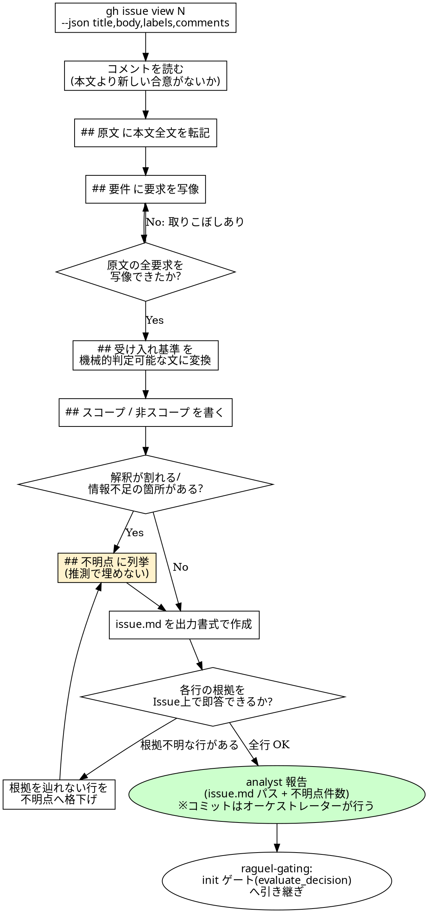
```dot
digraph analyzing_issues {
  rankdir=TB;
  node [fontname="sans-serif"];

  fetch [label="gh issue view N\n--json title,body,labels,comments", shape=box];
  read_comments [label="コメントを読む\n(本文より新しい合意がないか)", shape=box];
  raw [label="## 原文 に本文全文を転記", shape=box];
  extract [label="## 要件 に要求を写像", shape=box];
  check_map [label="原文の全要求を\n写像できたか?", shape=diamond];
  criteria [label="## 受け入れ基準 を\n機械的判定可能な文に変換", shape=box];
  scope [label="## スコープ / 非スコープ を書く", shape=box];
  ambiguous [label="解釈が割れる/\n情報不足の箇所がある?", shape=diamond];
  unknown [label="## 不明点 に列挙\n(推測で埋めない)", shape=box, style=filled, fillcolor="#fff2cc"];
  write [label="issue.md を出力書式で作成", shape=box];
  selfcheck [label="各行の根拠を\nIssue上で即答できるか?", shape=diamond];
  demote [label="根拠を辿れない行を\n不明点へ格下げ", shape=box];
  done [label="analyst 報告\n(issue.md パス + 不明点件数)\n※コミットはオーケストレーターが行う", shape=ellipse, style=filled, fillcolor="#ccffcc"];
  gate [label="raguel-gating:\ninit ゲート(evaluate_decision)\nへ引き継ぎ", shape=ellipse];

  fetch -> read_comments -> raw -> extract -> check_map;
  check_map -> extract [label="No: 取りこぼしあり"];
  check_map -> criteria [label="Yes"];
  criteria -> scope -> ambiguous;
  ambiguous -> unknown [label="Yes"];
  ambiguous -> write [label="No"];
  unknown -> write;
  write -> selfcheck;
  selfcheck -> demote [label="根拠不明な行がある"];
  demote -> unknown;
  selfcheck -> done [label="全行 OK"];
  done -> gate;
}
```

## preparing-design-agendas

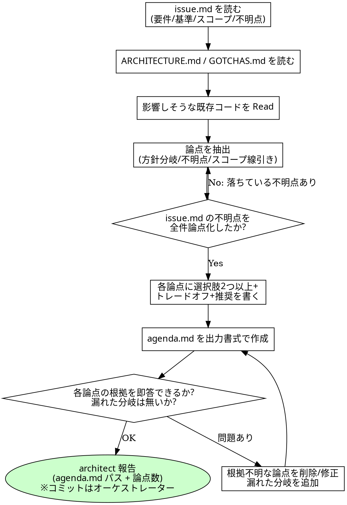
```dot
digraph preparing_design_agendas {
  rankdir=TB;
  node [fontname="sans-serif"];

  read_issue [label="issue.md を読む\n(要件/基準/スコープ/不明点)", shape=box];
  read_docs [label="ARCHITECTURE.md / GOTCHAS.md を読む", shape=box];
  read_code [label="影響しそうな既存コードを Read", shape=box];
  extract [label="論点を抽出\n(方針分岐/不明点/スコープ線引き)", shape=box];
  unknowns [label="issue.md の不明点を\n全件論点化したか?", shape=diamond];
  options [label="各論点に選択肢2つ以上+\nトレードオフ+推奨を書く", shape=box];
  write [label="agenda.md を出力書式で作成", shape=box];
  selfcheck [label="各論点の根拠を即答できるか?\n漏れた分岐は無いか?", shape=diamond];
  fix [label="根拠不明な論点を削除/修正\n漏れた分岐を追加", shape=box];
  done [label="architect 報告\n(agenda.md パス + 論点数)\n※コミットはオーケストレーター", shape=ellipse, style=filled, fillcolor="#ccffcc"];

  read_issue -> read_docs -> read_code -> extract -> unknowns;
  unknowns -> extract [label="No: 落ちている不明点あり"];
  unknowns -> options [label="Yes"];
  options -> write -> selfcheck;
  selfcheck -> fix [label="問題あり"];
  fix -> write;
  selfcheck -> done [label="OK"];
}
```

## facilitating-design-discussions

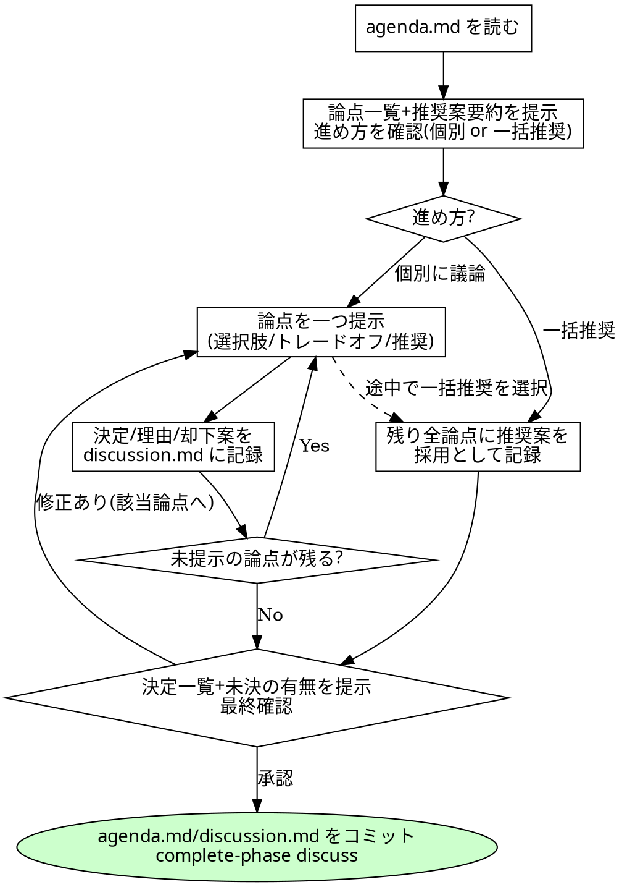
```dot
digraph facilitating_design_discussions {
  rankdir=TB;
  node [fontname="sans-serif"];

  read [label="agenda.md を読む", shape=box];
  overview [label="論点一覧+推奨案要約を提示\n進め方を確認(個別 or 一括推奨)", shape=box];
  mode [label="進め方?", shape=diamond];
  present [label="論点を一つ提示\n(選択肢/トレードオフ/推奨)", shape=box];
  record [label="決定/理由/却下案を\ndiscussion.md に記録", shape=box];
  more [label="未提示の論点が残る?", shape=diamond];
  bulk [label="残り全論点に推奨案を\n採用として記録", shape=box];
  confirm [label="決定一覧+未決の有無を提示\n最終確認", shape=diamond];
  commit [label="agenda.md/discussion.md をコミット\ncomplete-phase discuss", shape=ellipse, style=filled, fillcolor="#ccffcc"];

  read -> overview -> mode;
  mode -> present [label="個別に議論"];
  mode -> bulk [label="一括推奨"];
  present -> record -> more;
  more -> present [label="Yes"];
  more -> confirm [label="No"];
  present -> bulk [label="途中で一括推奨を選択", style=dashed];
  bulk -> confirm;
  confirm -> present [label="修正あり(該当論点へ)"];
  confirm -> commit [label="承認"];
}
```

## writing-design-docs

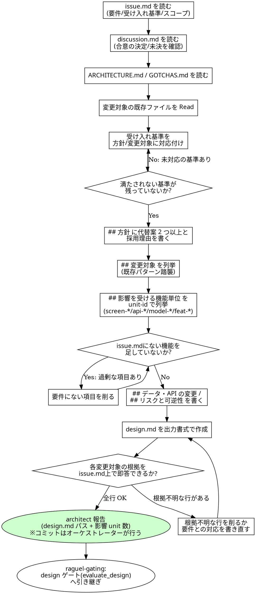
```dot
digraph writing_design_docs {
  rankdir=TB;
  node [fontname="sans-serif"];

  read_issue [label="issue.md を読む\n(要件/受け入れ基準/スコープ)", shape=box];
  read_discussion [label="discussion.md を読む\n(合意の決定/未決を確認)", shape=box];
  read_docs [label="ARCHITECTURE.md / GOTCHAS.md を読む", shape=box];
  read_existing [label="変更対象の既存ファイルを Read", shape=box];
  map_criteria [label="受け入れ基準を\n方針/変更対象に対応付け", shape=box];
  check_criteria [label="満たされない基準が\n残っていないか?", shape=diamond];
  alternatives [label="## 方針 に代替案 2 つ以上と\n採用理由を書く", shape=box];
  targets [label="## 変更対象 を列挙\n(既存パターン踏襲)", shape=box];
  units [label="## 影響を受ける機能単位 を\nunit-id で列挙\n(screen-*/api-*/model-*/feat-*)", shape=box];
  yagni [label="issue.mdにない機能を\n足していないか?", shape=diamond];
  trim [label="要件にない項目を削る", shape=box];
  risk [label="## データ・API の変更 /\n## リスクと可逆性 を書く", shape=box];
  write [label="design.md を出力書式で作成", shape=box];
  selfcheck [label="各変更対象の根拠を\nissue.md上で即答できるか?", shape=diamond];
  demote [label="根拠不明な行を削るか\n要件との対応を書き直す", shape=box];
  done [label="architect 報告\n(design.md パス + 影響 unit 数)\n※コミットはオーケストレーターが行う", shape=ellipse, style=filled, fillcolor="#ccffcc"];
  gate [label="raguel-gating:\ndesign ゲート(evaluate_design)\nへ引き継ぎ", shape=ellipse];

  read_issue -> read_discussion -> read_docs -> read_existing -> map_criteria -> check_criteria;
  check_criteria -> map_criteria [label="No: 未対応の基準あり"];
  check_criteria -> alternatives [label="Yes"];
  alternatives -> targets -> units -> yagni;
  yagni -> trim [label="Yes: 過剰な項目あり"];
  trim -> yagni;
  yagni -> risk [label="No"];
  risk -> write -> selfcheck;
  selfcheck -> demote [label="根拠不明な行がある"];
  demote -> write;
  selfcheck -> done [label="全行 OK"];
  done -> gate;
}
```

## writing-test-specs

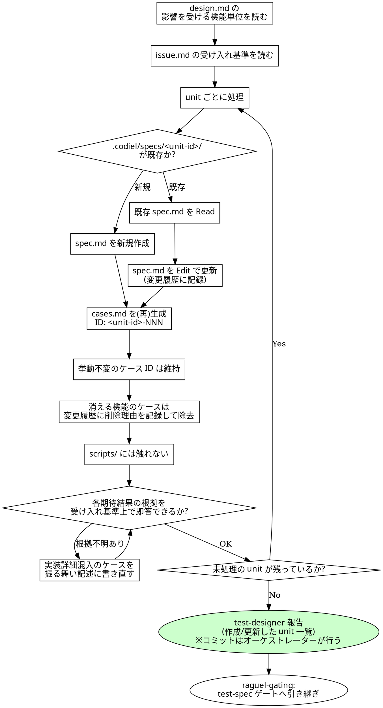
```dot
digraph writing_test_specs {
  rankdir=TB;
  node [fontname="sans-serif"];

  read_design [label="design.md の\n影響を受ける機能単位を読む", shape=box];
  read_criteria [label="issue.md の受け入れ基準を読む", shape=box];
  for_each_unit [label="unit ごとに処理", shape=box];
  exists [label=".codiel/specs/<unit-id>/\nが既存か?", shape=diamond];
  create_spec [label="spec.md を新規作成", shape=box];
  read_spec [label="既存 spec.md を Read", shape=box];
  update_spec [label="spec.md を Edit で更新\n(変更履歴に記録)", shape=box];
  gen_cases [label="cases.md を(再)生成\nID: <unit-id>-NNN", shape=box];
  keep_id [label="挙動不変のケース ID は維持", shape=box];
  removed [label="消える機能のケースは\n変更履歴に削除理由を記録して除去", shape=box];
  no_scripts [label="scripts/ には触れない", shape=box];
  selfcheck [label="各期待結果の根拠を\n受け入れ基準上で即答できるか?", shape=diamond];
  fix [label="実装詳細混入のケースを\n振る舞い記述に書き直す", shape=box];
  more_units [label="未処理の unit が残っているか?", shape=diamond];
  done [label="test-designer 報告\n(作成/更新した unit 一覧)\n※コミットはオーケストレーターが行う", shape=ellipse, style=filled, fillcolor="#ccffcc"];
  gate [label="raguel-gating:\ntest-spec ゲートへ引き継ぎ", shape=ellipse];

  read_design -> read_criteria -> for_each_unit -> exists;
  exists -> create_spec [label="新規"];
  exists -> read_spec [label="既存"];
  read_spec -> update_spec;
  create_spec -> gen_cases;
  update_spec -> gen_cases;
  gen_cases -> keep_id -> removed -> no_scripts -> selfcheck;
  selfcheck -> fix [label="根拠不明あり"];
  fix -> selfcheck;
  selfcheck -> more_units [label="OK"];
  more_units -> for_each_unit [label="Yes"];
  more_units -> done [label="No"];
  done -> gate;
}
```

## writing-dev-plans

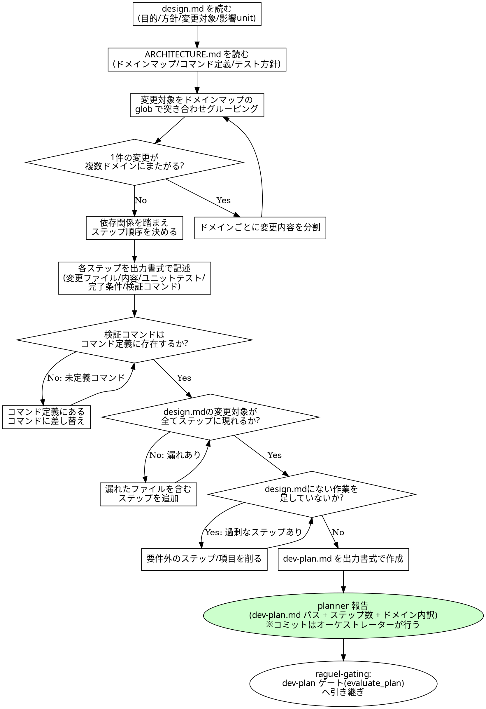
```dot
digraph writing_dev_plans {
  rankdir=TB;
  node [fontname="sans-serif"];

  read_design [label="design.md を読む\n(目的/方針/変更対象/影響unit)", shape=box];
  read_arch [label="ARCHITECTURE.md を読む\n(ドメインマップ/コマンド定義/テスト方針)", shape=box];
  group [label="変更対象をドメインマップの\nglob で突き合わせグルーピング", shape=box];
  split_check [label="1件の変更が\n複数ドメインにまたがる?", shape=diamond];
  split [label="ドメインごとに変更内容を分割", shape=box];
  order [label="依存関係を踏まえ\nステップ順序を決める", shape=box];
  write_steps [label="各ステップを出力書式で記述\n(変更ファイル/内容/ユニットテスト/\n完了条件/検証コマンド)", shape=box];
  check_commands [label="検証コマンドは\nコマンド定義に存在するか?", shape=diamond];
  fix_commands [label="コマンド定義にある\nコマンドに差し替え", shape=box];
  coverage [label="design.mdの変更対象が\n全てステップに現れるか?", shape=diamond];
  add_step [label="漏れたファイルを含む\nステップを追加", shape=box];
  yagni [label="design.mdにない作業を\n足していないか?", shape=diamond];
  trim [label="要件外のステップ/項目を削る", shape=box];
  write [label="dev-plan.md を出力書式で作成", shape=box];
  done [label="planner 報告\n(dev-plan.md パス + ステップ数 + ドメイン内訳)\n※コミットはオーケストレーターが行う", shape=ellipse, style=filled, fillcolor="#ccffcc"];
  gate [label="raguel-gating:\ndev-plan ゲート(evaluate_plan)\nへ引き継ぎ", shape=ellipse];

  read_design -> read_arch -> group -> split_check;
  split_check -> split [label="Yes"];
  split -> group;
  split_check -> order [label="No"];
  order -> write_steps -> check_commands;
  check_commands -> fix_commands [label="No: 未定義コマンド"];
  fix_commands -> check_commands;
  check_commands -> coverage [label="Yes"];
  coverage -> add_step [label="No: 漏れあり"];
  add_step -> coverage;
  coverage -> yagni [label="Yes"];
  yagni -> trim [label="Yes: 過剰なステップあり"];
  trim -> yagni;
  yagni -> write [label="No"];
  write -> done -> gate;
}
```

## implementing

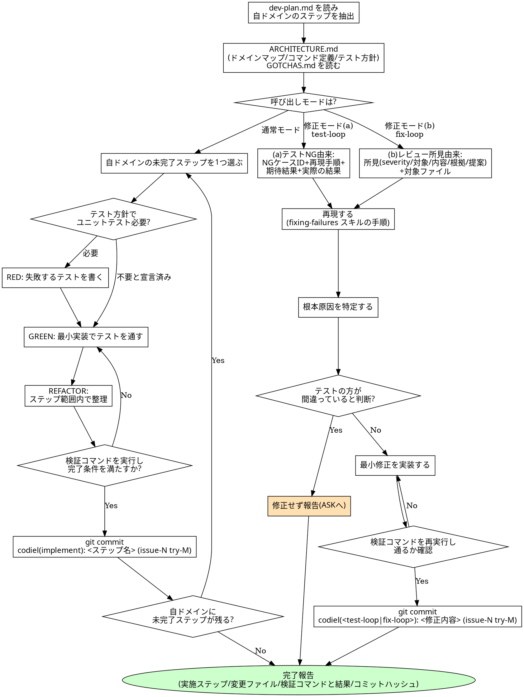
```dot
digraph implementing {
  rankdir=TB;
  node [fontname="sans-serif"];

  read_plan [label="dev-plan.md を読み\n自ドメインのステップを抽出", shape=box];
  read_arch [label="ARCHITECTURE.md\n(ドメインマップ/コマンド定義/テスト方針)\nGOTCHAS.md を読む", shape=box];
  mode [label="呼び出しモードは?", shape=diamond];

  next_step [label="自ドメインの未完了ステップを1つ選ぶ", shape=box];
  need_test [label="テスト方針で\nユニットテスト必要?", shape=diamond];
  red [label="RED: 失敗するテストを書く", shape=box];
  green [label="GREEN: 最小実装でテストを通す", shape=box];
  refactor [label="REFACTOR:\nステップ範囲内で整理", shape=box];
  verify [label="検証コマンドを実行し\n完了条件を満たすか?", shape=diamond];
  commit_step [label="git commit\ncodiel(implement): <ステップ名> (issue-N try-M)", shape=box];
  more_steps [label="自ドメインに\n未完了ステップが残る?", shape=diamond];

  receive_a [label="(a)テストNG由来:\nNGケースID+再現手順+\n期待結果+実際の結果", shape=box];
  receive_b [label="(b)レビュー所見由来:\n所見(severity/対象/内容/根拠/提案)\n+対象ファイル", shape=box];
  reproduce [label="再現する\n(fixing-failures スキルの手順)", shape=box];
  root_cause [label="根本原因を特定する", shape=box];
  spec_wrong [label="テストの方が\n間違っていると判断?", shape=diamond];
  escalate [label="修正せず報告(ASKへ)", shape=box, style=filled, fillcolor="#ffe0b3"];
  minimal_fix [label="最小修正を実装する", shape=box];
  verify_fix [label="検証コマンドを再実行し\n通るか確認", shape=diamond];
  commit_fix [label="git commit\ncodiel(<test-loop|fix-loop>): <修正内容> (issue-N try-M)", shape=box];

  report [label="完了報告\n(実施ステップ/変更ファイル/検証コマンドと結果/コミットハッシュ)", shape=ellipse, style=filled, fillcolor="#ccffcc"];

  read_plan -> read_arch -> mode;
  mode -> next_step [label="通常モード"];
  mode -> receive_a [label="修正モード(a)\ntest-loop"];
  mode -> receive_b [label="修正モード(b)\nfix-loop"];

  next_step -> need_test;
  need_test -> red [label="必要"];
  need_test -> green [label="不要と宣言済み"];
  red -> green -> refactor -> verify;
  verify -> green [label="No"];
  verify -> commit_step [label="Yes"];
  commit_step -> more_steps;
  more_steps -> next_step [label="Yes"];
  more_steps -> report [label="No"];

  receive_a -> reproduce;
  receive_b -> reproduce;
  reproduce -> root_cause -> spec_wrong;
  spec_wrong -> escalate [label="Yes"];
  spec_wrong -> minimal_fix [label="No"];
  minimal_fix -> verify_fix;
  verify_fix -> minimal_fix [label="No"];
  verify_fix -> commit_fix [label="Yes"];
  commit_fix -> report;
  escalate -> report;
}
```

## scripting-tests

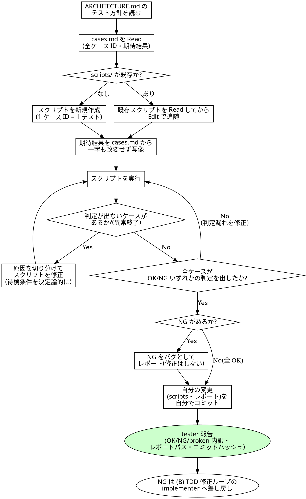
```dot
digraph scripting_tests {
  rankdir=TB;
  node [fontname="sans-serif"];

  read_arch [label="ARCHITECTURE.md の\nテスト方針を読む", shape=box];
  read_cases [label="cases.md を Read\n(全ケース ID・期待結果)", shape=box];
  exists [label="scripts/ が既存か?", shape=diamond];
  create [label="スクリプトを新規作成\n(1 ケース ID = 1 テスト)", shape=box];
  update [label="既存スクリプトを Read してから\nEdit で追随", shape=box];
  map_expect [label="期待結果を cases.md から\n一字も改変せず写像", shape=box];
  run [label="スクリプトを実行", shape=box];
  broken [label="判定が出ないケースが\nあるか?(異常終了)", shape=diamond];
  fix_script [label="原因を切り分けて\nスクリプトを修正\n(待機条件を決定論的に)", shape=box];
  all_judged [label="全ケースが\nOK/NG いずれかの判定を出したか?", shape=diamond];
  ng_found [label="NG があるか?", shape=diamond];
  report_ng [label="NG をバグとして\nレポート(修正はしない)", shape=box];
  commit [label="自分の変更\n(scripts・レポート)を\n自分でコミット", shape=box];
  done [label="tester 報告\n(OK/NG/broken 内訳・\nレポートパス・コミットハッシュ)", shape=ellipse, style=filled, fillcolor="#ccffcc"];
  handoff [label="NG は (B) TDD 修正ループの\nimplementer へ差し戻し", shape=ellipse];

  read_arch -> read_cases -> exists;
  exists -> create [label="なし"];
  exists -> update [label="あり"];
  create -> map_expect;
  update -> map_expect;
  map_expect -> run -> broken;
  broken -> fix_script [label="Yes"];
  fix_script -> run;
  broken -> all_judged [label="No"];
  all_judged -> run [label="No\n(判定漏れを修正)"];
  all_judged -> ng_found [label="Yes"];
  ng_found -> report_ng [label="Yes"];
  ng_found -> commit [label="No(全 OK)"];
  report_ng -> commit;
  commit -> done -> handoff;
}
```

## running-regression-tests

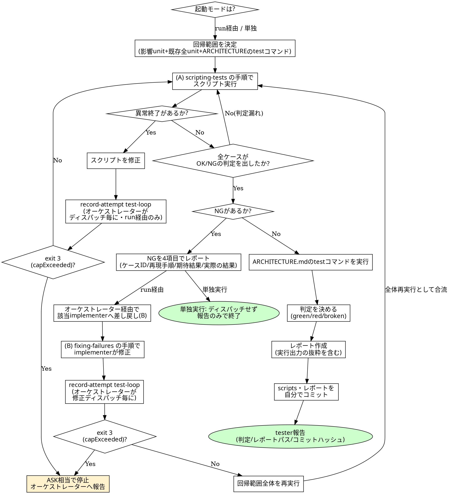
```dot
digraph running_regression_tests {
  rankdir=TB;
  node [fontname="sans-serif"];

  mode [label="起動モードは?", shape=diamond];
  scope [label="回帰範囲を決定\n(影響unit+既存全unit+ARCHITECTUREのtestコマンド)", shape=box];
  loop_a [label="(A) scripting-tests の手順で\nスクリプト実行", shape=box];
  broken [label="異常終了があるか?", shape=diamond];
  fix_script [label="スクリプトを修正", shape=box];
  record_a [label="record-attempt test-loop\n(オーケストレーターが\nディスパッチ毎に・run経由のみ)", shape=box];
  cap_a [label="exit 3\n(capExceeded)?", shape=diamond];
  ask_stop [label="ASK相当で停止\nオーケストレーターへ報告", shape=box, style=filled, fillcolor="#fff2cc"];
  all_judged [label="全ケースが\nOK/NGの判定を出したか?", shape=diamond];
  ng_found [label="NGがあるか?", shape=diamond];
  report_ng [label="NGを4項目でレポート\n(ケースID/再現手順/期待結果/実際の結果)", shape=box];
  standalone_end [label="単独実行: ディスパッチせず\n報告のみで終了", shape=ellipse, style=filled, fillcolor="#ccffcc"];
  handoff [label="オーケストレーター経由で\n該当implementerへ差し戻し(B)", shape=box];
  loop_b [label="(B) fixing-failures の手順で\nimplementerが修正", shape=box];
  record_b [label="record-attempt test-loop\n(オーケストレーターが\n修正ディスパッチ毎に)", shape=box];
  cap_b [label="exit 3\n(capExceeded)?", shape=diamond];
  rerun_all [label="回帰範囲全体を再実行", shape=box];
  unit_test [label="ARCHITECTURE.mdのtestコマンドを実行", shape=box];
  verdict [label="判定を決める\n(green/red/broken)", shape=box];
  report [label="レポート作成\n(実行出力の抜粋を含む)", shape=box];
  commit [label="scripts・レポートを\n自分でコミット", shape=box];
  done [label="tester報告\n(判定/レポートパス/コミットハッシュ)", shape=ellipse, style=filled, fillcolor="#ccffcc"];

  mode -> scope [label="run経由 / 単独"];
  scope -> loop_a -> broken;
  broken -> fix_script [label="Yes"];
  fix_script -> record_a;
  record_a -> cap_a;
  cap_a -> ask_stop [label="Yes"];
  cap_a -> loop_a [label="No"];
  broken -> all_judged [label="No"];
  all_judged -> loop_a [label="No(判定漏れ)"];
  all_judged -> ng_found [label="Yes"];
  ng_found -> unit_test [label="No"];
  ng_found -> report_ng [label="Yes"];
  report_ng -> standalone_end [label="単独実行"];
  report_ng -> handoff [label="run経由"];
  handoff -> loop_b -> record_b -> cap_b;
  cap_b -> ask_stop [label="Yes"];
  cap_b -> rerun_all [label="No"];
  rerun_all -> loop_a [label="全体再実行として合流"];
  unit_test -> verdict -> report -> commit -> done;
}
```

## fixing-failures

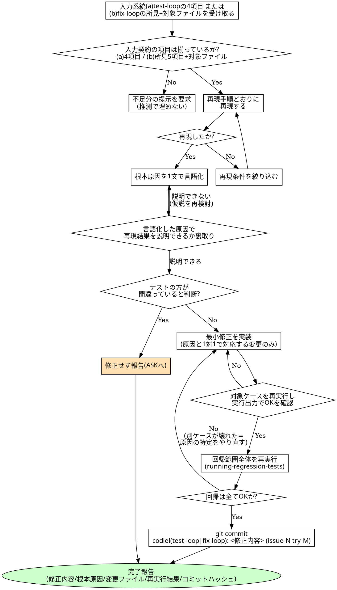
```dot
digraph fixing_failures {
  rankdir=TB;
  node [fontname="sans-serif"];

  receive [label="入力系統(a)test-loopの4項目 または\n(b)fix-loopの所見+対象ファイルを受け取る", shape=box];
  complete_input [label="入力契約の項目は揃っているか?\n(a)4項目 / (b)所見5項目+対象ファイル", shape=diamond];
  request_more [label="不足分の提示を要求\n(推測で埋めない)", shape=box];

  reproduce [label="再現手順どおりに\n再現する", shape=box];
  reproduced [label="再現したか?", shape=diamond];
  narrow [label="再現条件を絞り込む", shape=box];

  hypothesize [label="根本原因を1文で言語化", shape=box];
  verify_cause [label="言語化した原因で\n再現結果を説明できるか裏取り", shape=diamond];

  spec_wrong [label="テストの方が\n間違っていると判断?", shape=diamond];
  escalate [label="修正せず報告(ASKへ)", shape=box, style=filled, fillcolor="#ffe0b3"];

  minimal_fix [label="最小修正を実装\n(原因と1対1で対応する変更のみ)", shape=box];
  verify_target [label="対象ケースを再実行し\n実行出力でOKを確認", shape=diamond];
  regress_all [label="回帰範囲全体を再実行\n(running-regression-tests)", shape=box];
  regress_ok [label="回帰は全てOKか?", shape=diamond];

  commit [label="git commit\ncodiel(test-loop|fix-loop): <修正内容> (issue-N try-M)", shape=box];
  report [label="完了報告\n(修正内容/根本原因/変更ファイル/再実行結果/コミットハッシュ)", shape=ellipse, style=filled, fillcolor="#ccffcc"];

  receive -> complete_input;
  complete_input -> request_more [label="No"];
  complete_input -> reproduce [label="Yes"];

  reproduce -> reproduced;
  reproduced -> narrow [label="No"];
  narrow -> reproduce;
  reproduced -> hypothesize [label="Yes"];

  hypothesize -> verify_cause;
  verify_cause -> hypothesize [label="説明できない\n(仮説を再検討)"];
  verify_cause -> spec_wrong [label="説明できる"];

  spec_wrong -> escalate [label="Yes"];
  spec_wrong -> minimal_fix [label="No"];

  minimal_fix -> verify_target;
  verify_target -> minimal_fix [label="No"];
  verify_target -> regress_all [label="Yes"];

  regress_all -> regress_ok;
  regress_ok -> minimal_fix [label="No\n(別ケースが壊れた=\n原因の特定をやり直す)"];
  regress_ok -> commit [label="Yes"];

  commit -> report;
  escalate -> report;
}
```

## reviewing-diffs

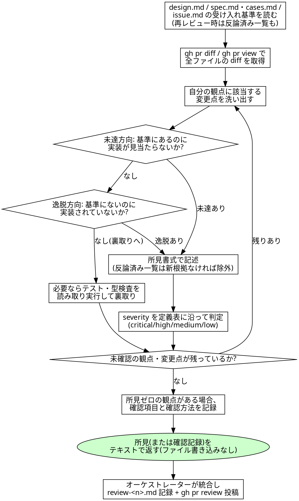
```dot
digraph reviewing_diffs {
  rankdir=TB;
  node [fontname="sans-serif"];

  read_docs [label="design.md / spec.md・cases.md /\nissue.md の受け入れ基準を読む\n(再レビュー時は反論済み一覧も)", shape=box];
  get_diff [label="gh pr diff / gh pr view で\n全ファイルの diff を取得", shape=box];
  scope [label="自分の観点に該当する\n変更点を洗い出す", shape=box];
  check_missing [label="未達方向: 基準にあるのに\n実装が見当たらないか?", shape=diamond];
  check_deviation [label="逸脱方向: 基準にないのに\n実装されていないか?", shape=diamond];
  verify [label="必要ならテスト・型検査を\n読み取り実行して裏取り", shape=box];
  classify [label="severity を定義表に沿って判定\n(critical/high/medium/low)", shape=box];
  write_finding [label="所見書式で記述\n(反論済み一覧は新根拠なければ除外)", shape=box];
  more [label="未確認の観点・変更点が残っているか?", shape=diamond];
  zero_findings [label="所見ゼロの観点がある場合、\n確認項目と確認方法を記録", shape=box];
  report [label="所見(または確認記録)を\nテキストで返す(ファイル書き込みなし)", shape=ellipse, style=filled, fillcolor="#ccffcc"];
  orchestrator [label="オーケストレーターが統合し\nreview-<n>.md 記録 + gh pr review 投稿", shape=box];

  read_docs -> get_diff -> scope -> check_missing;
  check_missing -> write_finding [label="未達あり"];
  check_missing -> check_deviation [label="なし"];
  check_deviation -> write_finding [label="逸脱あり"];
  check_deviation -> verify [label="なし(裏取りへ)"];
  write_finding -> classify -> more;
  verify -> more;
  more -> scope [label="残りあり"];
  more -> zero_findings [label="なし"];
  zero_findings -> report;
  report -> orchestrator;
}
```

## fixing-review-findings

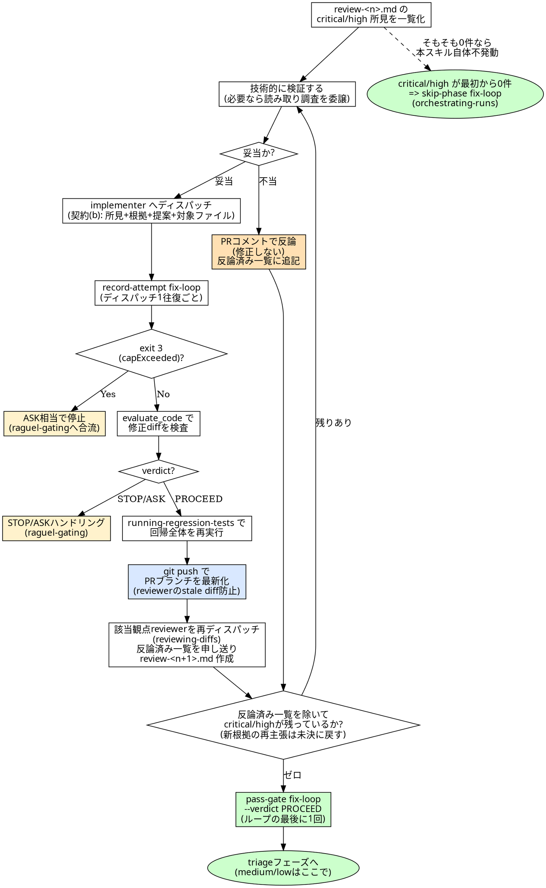
```dot
digraph fixing_review_findings {
  rankdir=TB;
  node [fontname="sans-serif"];

  findings [label="review-<n>.md の\ncritical/high 所見を一覧化", shape=box];
  verify [label="技術的に検証する\n(必要なら読み取り調査を委譲)", shape=box];
  valid [label="妥当か?", shape=diamond];
  dispatch [label="implementer へディスパッチ\n(契約(b): 所見+根拠+提案+対象ファイル)", shape=box];
  rebut [label="PRコメントで反論\n(修正しない)\n反論済み一覧に追記", shape=box, style=filled, fillcolor="#ffe0b3"];
  record_attempt [label="record-attempt fix-loop\n(ディスパッチ1往復ごと)", shape=box];
  cap [label="exit 3\n(capExceeded)?", shape=diamond];
  ask [label="ASK相当で停止\n(raguel-gatingへ合流)", shape=box, style=filled, fillcolor="#fff2cc"];
  evaluate [label="evaluate_code で\n修正diffを検査", shape=box];
  verdict [label="verdict?", shape=diamond];
  stop_ask [label="STOP/ASKハンドリング\n(raguel-gating)", shape=box, style=filled, fillcolor="#fff2cc"];
  regress [label="running-regression-tests で\n回帰全体を再実行", shape=box];
  push [label="git push で\nPRブランチを最新化\n(reviewerのstale diff防止)", shape=box, style=filled, fillcolor="#d9e8ff"];
  rereview [label="該当観点reviewerを再ディスパッチ\n(reviewing-diffs)\n反論済み一覧を申し送り\nreview-<n+1>.md 作成", shape=box];
  remaining [label="反論済み一覧を除いて\ncritical/highが残っているか?\n(新根拠の再主張は未決に戻す)", shape=diamond];
  passgate [label="pass-gate fix-loop\n--verdict PROCEED\n(ループの最後に1回)", shape=box, style=filled, fillcolor="#ccffcc"];
  triage [label="triageフェーズへ\n(medium/lowはここで)", shape=ellipse, style=filled, fillcolor="#ccffcc"];
  skip [label="critical/high が最初から0件\n=> skip-phase fix-loop\n(orchestrating-runs)", shape=ellipse, style=filled, fillcolor="#ccffcc"];

  findings -> verify -> valid;
  valid -> dispatch [label="妥当"];
  valid -> rebut [label="不当"];
  dispatch -> record_attempt;
  record_attempt -> cap;
  cap -> ask [label="Yes"];
  cap -> evaluate [label="No"];
  evaluate -> verdict;
  verdict -> stop_ask [label="STOP/ASK"];
  verdict -> regress [label="PROCEED"];
  regress -> push -> rereview -> remaining;
  remaining -> verify [label="残りあり"];
  remaining -> passgate [label="ゼロ"];
  rebut -> remaining;
  passgate -> triage;

  findings -> skip [style=dashed, label="そもそも0件なら\n本スキル自体不発動"];
}
```

## filing-followup-issues

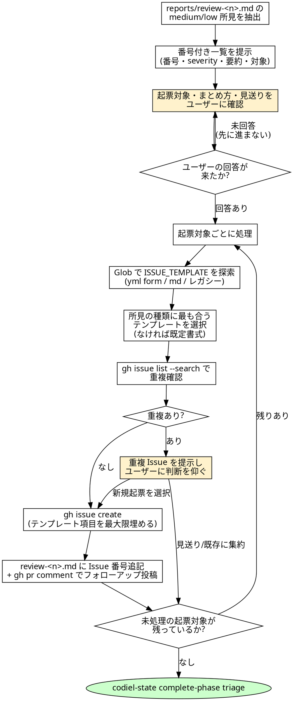
```dot
digraph filing_followup_issues {
  rankdir=TB;
  node [fontname="sans-serif"];

  read_report [label="reports/review-<n>.md の\nmedium/low 所見を抽出", shape=box];
  list [label="番号付き一覧を提示\n(番号・severity・要約・対象)", shape=box];
  ask_user [label="起票対象・まとめ方・見送りを\nユーザーに確認", shape=box, style=filled, fillcolor="#fff2cc"];
  wait [label="ユーザーの回答が\n来たか?", shape=diamond];
  for_each [label="起票対象ごとに処理", shape=box];
  find_template [label="Glob で ISSUE_TEMPLATE を探索\n(yml form / md / レガシー)", shape=box];
  select_template [label="所見の種類に最も合う\nテンプレートを選択\n(なければ既定書式)", shape=box];
  dup_check [label="gh issue list --search で\n重複確認", shape=box];
  dup_found [label="重複あり?", shape=diamond];
  ask_dup [label="重複 Issue を提示し\nユーザーに判断を仰ぐ", shape=box, style=filled, fillcolor="#fff2cc"];
  create [label="gh issue create\n(テンプレート項目を最大限埋める)", shape=box];
  record [label="review-<n>.md に Issue 番号追記\n+ gh pr comment でフォローアップ投稿", shape=box];
  more [label="未処理の起票対象が\n残っているか?", shape=diamond];
  complete [label="codiel-state complete-phase triage", shape=ellipse, style=filled, fillcolor="#ccffcc"];

  read_report -> list -> ask_user -> wait;
  wait -> ask_user [label="未回答\n(先に進まない)"];
  wait -> for_each [label="回答あり"];
  for_each -> find_template -> select_template -> dup_check -> dup_found;
  dup_found -> ask_dup [label="あり"];
  dup_found -> create [label="なし"];
  ask_dup -> create [label="新規起票を選択"];
  ask_dup -> more [label="見送り/既存に集約"];
  create -> record -> more;
  more -> for_each [label="残りあり"];
  more -> complete [label="なし"];
}
```

## recording-gotchas

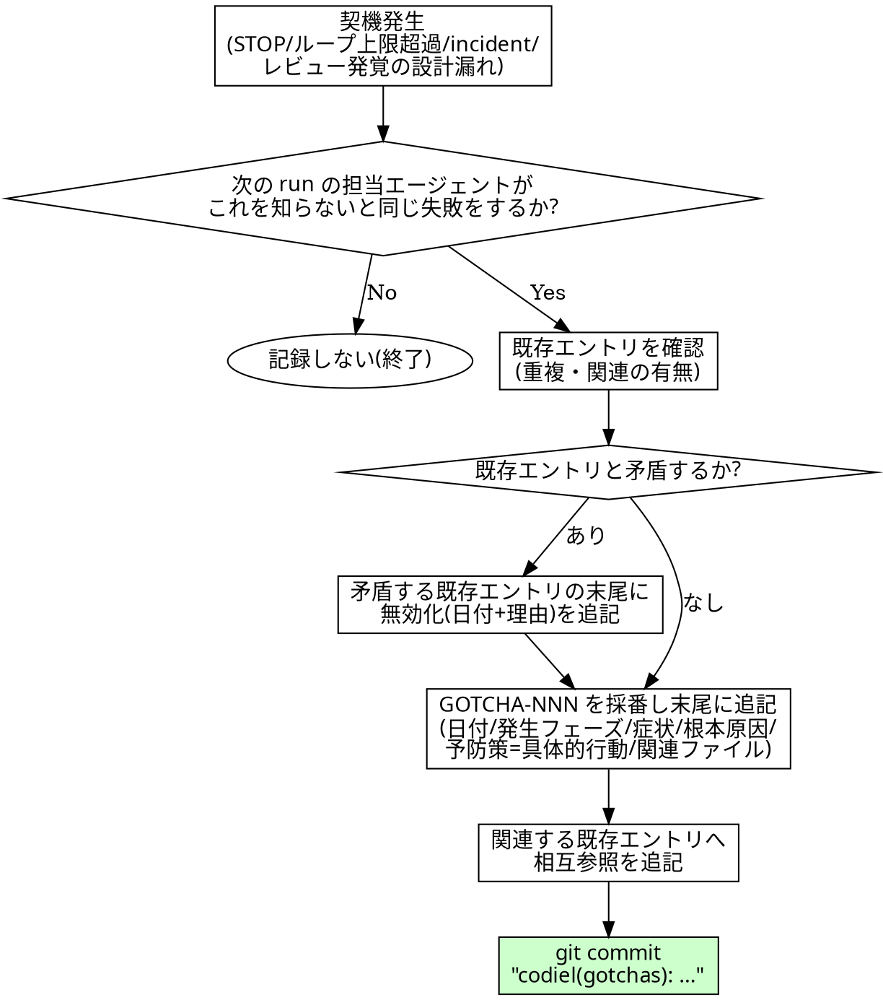
```dot
digraph recording_gotchas {
  rankdir=TB;
  node [fontname="sans-serif"];

  trigger [label="契機発生\n(STOP/ループ上限超過/incident/\nレビュー発覚の設計漏れ)", shape=box];
  judge [label="次の run の担当エージェントが\nこれを知らないと同じ失敗をするか?", shape=diamond];
  skip [label="記録しない(終了)", shape=ellipse];
  read_existing [label="既存エントリを確認\n(重複・関連の有無)", shape=box];
  conflict [label="既存エントリと矛盾するか?", shape=diamond];
  invalidate [label="矛盾する既存エントリの末尾に\n無効化(日付+理由)を追記", shape=box];
  write_entry [label="GOTCHA-NNN を採番し末尾に追記\n(日付/発生フェーズ/症状/根本原因/\n予防策=具体的行動/関連ファイル)", shape=box];
  cross_ref [label="関連する既存エントリへ\n相互参照を追記", shape=box];
  commit [label="git commit\n\"codiel(gotchas): ...\"", shape=box, style=filled, fillcolor="#ccffcc"];

  trigger -> judge;
  judge -> skip [label="No"];
  judge -> read_existing [label="Yes"];
  read_existing -> conflict;
  conflict -> invalidate [label="あり"];
  conflict -> write_entry [label="なし"];
  invalidate -> write_entry;
  write_entry -> cross_ref -> commit;
}
```

## raguel-gating

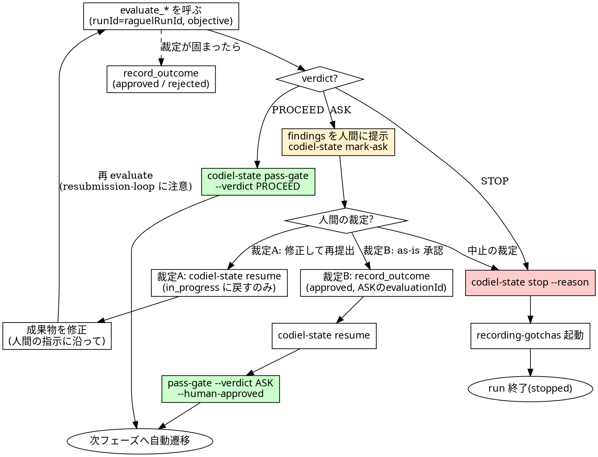
```dot
digraph raguel_gate {
  rankdir=TB;
  node [fontname="sans-serif"];

  evaluate [label="evaluate_* を呼ぶ\n(runId=raguelRunId, objective)", shape=box];
  verdict [label="verdict?", shape=diamond];

  proceed [label="codiel-state pass-gate\n--verdict PROCEED", shape=box, style=filled, fillcolor="#ccffcc"];
  next [label="次フェーズへ自動遷移", shape=ellipse];

  ask [label="findings を人間に提示\ncodiel-state mark-ask", shape=box, style=filled, fillcolor="#fff2cc"];
  human [label="人間の裁定?", shape=diamond];

  resume_a [label="裁定A: codiel-state resume\n(in_progress に戻すのみ)", shape=box];
  refix [label="成果物を修正\n(人間の指示に沿って)", shape=box];
  record_a [label="record_outcome\n(approved / rejected)", shape=box];

  record_ha [label="裁定B: record_outcome\n(approved, ASKのevaluationId)", shape=box];
  resume_b [label="codiel-state resume", shape=box];
  pass_gate_ha [label="pass-gate --verdict ASK\n--human-approved", shape=box, style=filled, fillcolor="#ccffcc"];

  stop_run [label="codiel-state stop --reason", shape=box, style=filled, fillcolor="#ffcccc"];
  gotchas [label="recording-gotchas 起動", shape=box];
  stopped [label="run 終了(stopped)", shape=ellipse];

  evaluate -> verdict;
  verdict -> proceed [label="PROCEED"];
  verdict -> ask [label="ASK"];
  verdict -> stop_run [label="STOP"];

  proceed -> next;

  ask -> human;
  human -> resume_a [label="裁定A: 修正して再提出"];
  human -> record_ha [label="裁定B: as-is 承認"];
  human -> stop_run [label="中止の裁定"];

  resume_a -> refix;
  refix -> evaluate [label="再 evaluate\n(resubmission-loop に注意)"];
  evaluate -> record_a [style=dashed, label="裁定が固まったら"];

  record_ha -> resume_b;
  resume_b -> pass_gate_ha;
  pass_gate_ha -> next;

  stop_run -> gotchas;
  gotchas -> stopped;
}
```

## orchestrating-runs

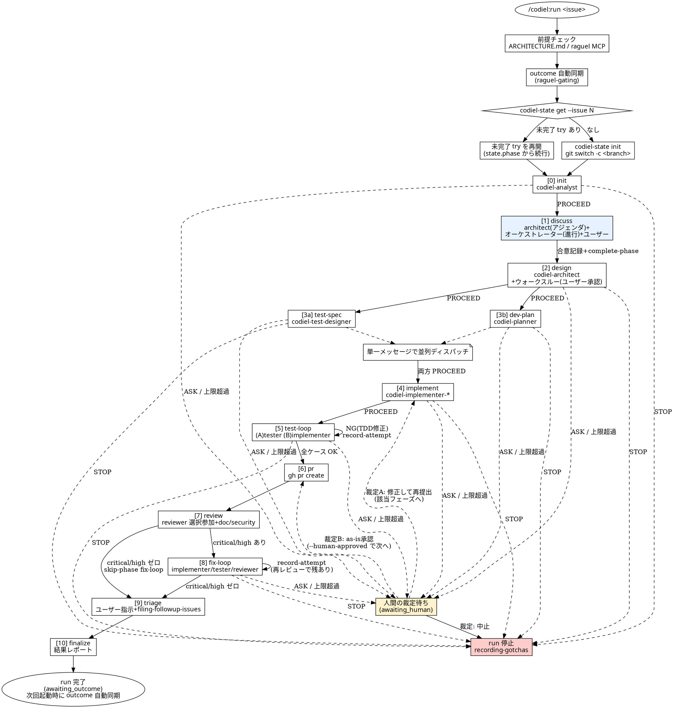
```dot
digraph codiel_run {
  rankdir=TB;
  node [fontname="sans-serif"];

  start [label="/codiel:run <issue>", shape=ellipse];
  precheck [label="前提チェック\nARCHITECTURE.md / raguel MCP", shape=box];
  sync [label="outcome 自動同期\n(raguel-gating)", shape=box];
  resolve [label="codiel-state get --issue N", shape=diamond];
  resume [label="未完了 try を再開\n(state.phase から続行)", shape=box];
  init_run [label="codiel-state init\ngit switch -c <branch>", shape=box];

  init [label="[0] init\ncodiel-analyst", shape=box];
  discuss [label="[1] discuss\narchitect(アジェンダ)+\nオーケストレーター(進行)+ユーザー", shape=box, style=filled, fillcolor="#e6f2ff"];
  design [label="[2] design\ncodiel-architect\n+ウォークスルー(ユーザー承認)", shape=box];
  testspec [label="[3a] test-spec\ncodiel-test-designer", shape=box];
  devplan [label="[3b] dev-plan\ncodiel-planner", shape=box];
  parallel [label="単一メッセージで並列ディスパッチ", shape=note];
  implement [label="[4] implement\ncodiel-implementer-*", shape=box];
  testloop [label="[5] test-loop\n(A)tester (B)implementer", shape=box];
  pr [label="[6] pr\ngh pr create", shape=box];
  review [label="[7] review\nreviewer 選択参加+doc/security", shape=box];
  fixloop [label="[8] fix-loop\nimplementer/tester/reviewer", shape=box];
  triage [label="[9] triage\nユーザー指示+filing-followup-issues", shape=box];
  finalize [label="[10] finalize\n結果レポート", shape=box];

  human [label="人間の裁定待ち\n(awaiting_human)", shape=box, style=filled, fillcolor="#fff2cc"];
  stopped [label="run 停止\nrecording-gotchas", shape=box, style=filled, fillcolor="#ffcccc"];
  outcome [label="run 完了\n(awaiting_outcome)\n次回起動時に outcome 自動同期", shape=ellipse];

  start -> precheck -> sync -> resolve;
  resolve -> resume [label="未完了 try あり"];
  resolve -> init_run [label="なし"];
  resume -> init;
  init_run -> init;

  init -> discuss [label="PROCEED"];
  discuss -> design [label="合意記録+complete-phase"];
  design -> testspec [label="PROCEED"];
  design -> devplan [label="PROCEED"];
  testspec -> parallel [style=dashed];
  devplan -> parallel [style=dashed];
  parallel -> implement [label="両方 PROCEED"];
  implement -> testloop [label="PROCEED"];
  testloop -> testloop [label="NG(TDD修正)\nrecord-attempt"];
  testloop -> pr [label="全ケース OK"];
  pr -> review;
  review -> fixloop [label="critical/high あり"];
  review -> triage [label="critical/high ゼロ\nskip-phase fix-loop"];
  fixloop -> fixloop [label="record-attempt\n(再レビューで残あり)"];
  fixloop -> triage [label="critical/high ゼロ"];
  triage -> finalize;
  finalize -> outcome;

  { init design testspec devplan implement testloop fixloop } -> human [label="ASK / 上限超過", style=dashed];
  { init design testspec devplan implement testloop fixloop } -> stopped [label="STOP", style=dashed];
  human -> stopped [label="裁定: 中止"];
  human -> implement [label="裁定A: 修正して再提出\n(該当フェーズへ)", style=dashed];
  human -> pr [label="裁定B: as-is承認\n(--human-approved で次へ)", style=dashed];
}
```
