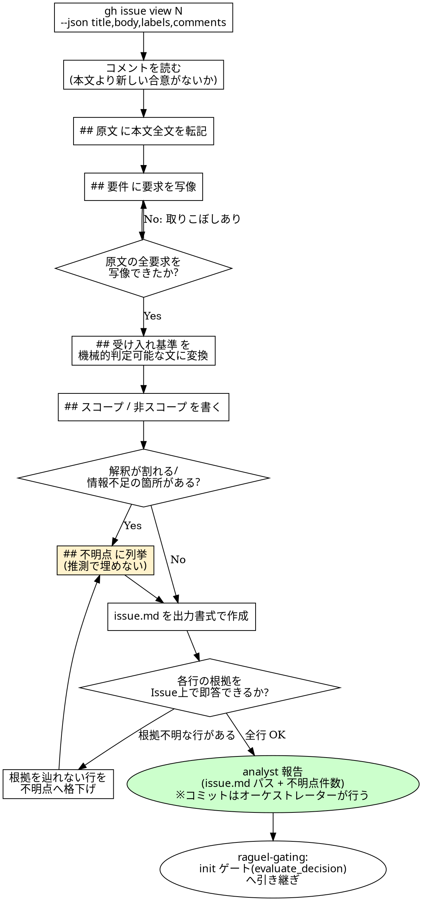

# Issue 分析規約

## 概要

`codiel-analyst` が init フェーズで使うスキル。`gh issue view` で Issue 本文とコメントを取得し、
要件・受け入れ基準・スコープ/非スコープ・不明点に構造化して `issue.md` を作成する。

`issue.md` は design / test-spec / dev-plan / implement / review など**後続フェーズの全サブエージェントが
入力として読む唯一の Issue スナップショット**であり、`raguel-gating` の init ゲート(`evaluate_decision`)
が「この解釈・スコープで進む」という判断の根拠にする文書でもある。ここで要件を取り違えたり曖昧さを
握り潰したりすると、その誤りは後続フェーズすべてに伝播し、design 以降で作り直しになる。
本スキルの責務は「Issue に書かれていること」と「書かれていないこと」を正確に切り分け、
後者を一切推測で埋めずに不明点として可視化することにある。

## チェックリスト

1. `gh issue view N --json title,body,labels,comments` で本文とコメントを取得する。
   **コメントは必ず読む**。本文より新しい仕様変更・合意はコメントに書かれていることが多く、
   本文だけを見ると古い要求のまま分析してしまう。
2. 本文全文を加工せずに「## 原文」へ書き写す(要約しない。後で人間が原文と要件抽出結果を
   突き合わせられる状態を保つ)。
3. 本文・コメントの要求を一つずつ「## 要件」の箇条書きに写像する。写像できない要求を
   取りこぼしていないか、原文と要件リストを見比べて確認する。
4. 各要件について、検証可能な受け入れ基準を「## 受け入れ基準」に書く(「受け入れ基準の
   変換」参照)。曖昧な言い回しのまま書き写さない。
5. 「## スコープ」「## 非スコープ」を書く。非スコープは Issue に明記がなくても、要件から
   自然に境界線が引ける範囲は書いてよい(発明ではなく境界の明示)。ただし境界の**根拠**は
   常に Issue 側にあること。
6. 解釈が割れる箇所・情報が不足している箇所を「## 不明点」に列挙する。埋めずに残す。
7. 出力書式(下記)どおりに `issue.md` を作成する。
8. 自己チェック: 要件・受け入れ基準・スコープの各行について「これは Issue のどの記述が
   根拠か」を即答できるか確認する。答えられない行は不明点に格下げする。

## 出力書式

後続フェーズ全員が読む書式。見出し名・順序を変更せず、以下をそのまま使う。

```markdown
# Issue #N: <title>

## 原文

<gh issue view の本文全文>

## 要件

- <本文・コメントから抽出した要求 1>
- <要求 2>

## 受け入れ基準

- <機械的に判定可能な基準 1>
- <基準 2>

## スコープ

- <今回の変更に含まれる範囲>

## 非スコープ

- <今回は扱わない範囲>

## 不明点

- <推測せず残した疑問点 1>
```

## 受け入れ基準の変換

受け入れ基準は「人が読んで雰囲気で合否を判断する文」ではなく、**実装者・テスト設計者・
レビューアーが後から機械的に YES/NO を判定できる文**に変換する。

- 悪い例: 「ログイン機能が正しく動くこと」(何をもって「正しい」かが読み手の解釈に依存する)
- 良い例: 「メールアドレスとパスワードの組み合わせが正しいとき、`POST /api/login` が
  200 とセッショントークンを返す。組み合わせが誤っているときは 401 を返しトークンを発行しない」

Issue の記述だけでは良い例まで具体化できない場合、具体化を推測で行わず「## 不明点」に
「受け入れ基準を確定するには〜の情報が必要」という形で列挙する。

## 不明点は列挙して埋めない

不明点は analyst が解決するものではない。`raguel-gating` の init ゲート
(`mcp__raguel__evaluate_decision`)に判断材料として渡り、必要なら `ASK` verdict を通じて
人間の裁定を仰ぐための入力になる。不明点をここで勝手に解消してしまうと、人間が裁定すべき
判断を analyst が代理で下したことになり、ゲートの意味が失われる。

## コミット責務

`codiel-analyst` は `gh issue view` / `gh api` の読み取りのために Bash を持つが、**`issue.md` 自体を
コミットしない**。`orchestrating-runs` の成果物コミット規約により、文書系フェーズ(init を含む)の
成果物はゲート通過直後にオーケストレーター自身がコミットする。Bash を持っていることと
コミット責務を持つことは別であり、analyst は `issue.md` を書いて報告するところまでが職務。

<HARD-GATE>
- Issue に書かれていない要件を発明しない。本文・コメントに根拠のない要求を「要件」「受け入れ基準」
  「スコープ」に追加してはならない。曖昧さ・情報不足はすべて「## 不明点」として列挙し、
  埋めずに残す。
</HARD-GATE>

## Red Flags(合理化への反論)

| 思考 | 現実 |
|---|---|
| 「行間を読んで気を利かせれば手戻りが減る」 | 「行間」は analyst の推測であり Issue の根拠ではない。後続フェーズは issue.md を Issue そのものとして扱うため、推測が要件として固定化され、人間が気づかないまま design 以降に伝播する。 |
| 「不明点ゼロで出したほうが優秀に見える」 | 不明点は analyst の力不足の証拠ではなく、Issue 自体の情報不足の可視化である。ゼロにするには推測で埋めるしかなく、それは「発明」そのもの。ASK の判断材料が消えるだけで手戻りリスクは減らない。 |
| 「コメントは Issue 本文より古いから読まなくていい」 | コメントは時系列で後から付く。仕様変更・スコープ調整の合意は本文ではなくコメントに書かれることが多く、読み飛ばすと古い要求のまま進めてしまう。 |
| 「受け入れ基準は感覚的な表現でも後工程が汲み取ってくれる」 | test-spec フェーズはこの受け入れ基準からテストケースの期待結果を導出する。曖昧な文のままでは「何を OK/NG とするか」を test-designer が独自解釈することになり、Issue の意図とずれた基準でテストが作られる。 |
| 「Bash を持っているのだから issue.md も自分でコミットしてよい」 | 権限とフェーズ規約は別。init は文書系フェーズであり、`orchestrating-runs` の成果物コミット規約でオーケストレーターの担当と定められている。analyst が先回りしてコミットすると進行管理の一元性が崩れる。 |

## プロセスフローチャート


