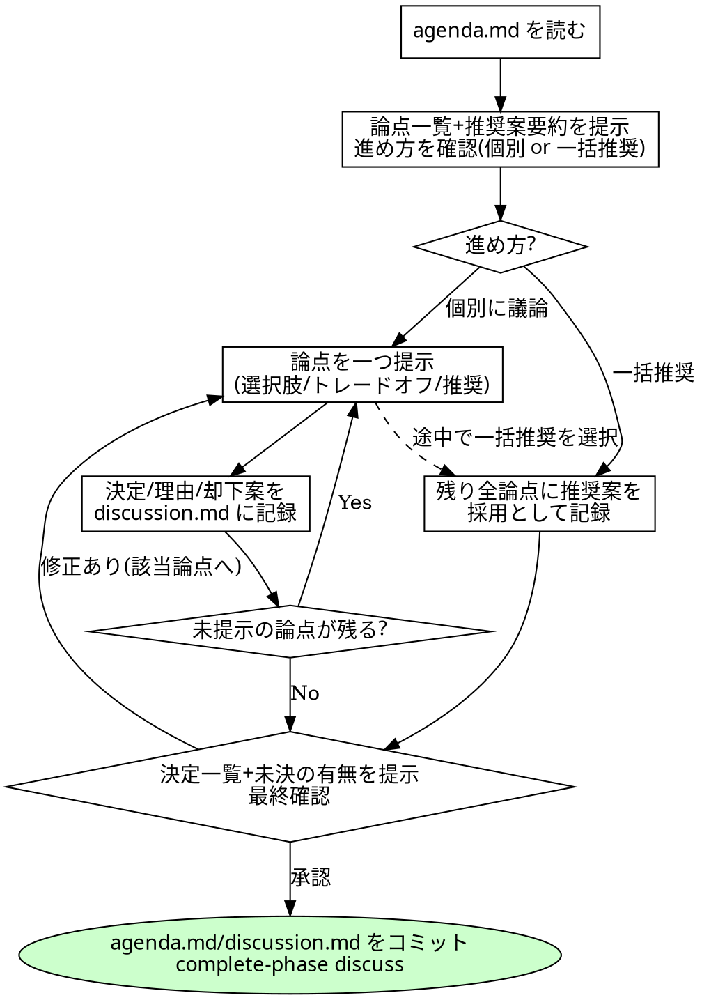

# ディスカッション進行規約

## 概要

オーケストレーターが discuss フェーズの後半(ディスカッションの進行と記録)と、design フェーズの
ウォークスルーで使うスキル。設計の思考(論点抽出・案の比較)は architect(agenda.md)が、
決定はユーザーが、進行と記録はオーケストレーターが担う三権分立を守る。

`discussion.md` は**ユーザーの決定の記録**であり、`review-<n>.md` と同じ「進行管理としての記録」に
分類される。これを書くことは orchestrating-runs の HARD-GATE(オーケストレーターは自分で
設計しない)に抵触しない。逆に、記録の名を借りてオーケストレーター自身の設計判断を
書き込むことは HARD-GATE 違反である。

## チェックリスト(discuss フェーズ)

1. `agenda.md` を読み、論点の一覧と各推奨案の 1 行要約をユーザーに提示する。
2. 進め方を確認する: 「論点ごとに議論する」か「すべて推奨案で進める」かを最初に選んでもらう
   (AskUserQuestion)。後者が選ばれたら 5 へ。
3. 論点を一つずつ提示する。選択肢・トレードオフ・推奨案を agenda.md の記載のまま添える。
   AskUserQuestion を基本とし、選択肢に収まらない議論をユーザーが求めたら通常の対話に切り替える。
   各論点の提示には「残りの論点をすべて推奨案で進める」選択肢も含める。
4. 論点ごとに、決定・理由・却下案を `discussion.md` に記録する(書式は下記)。
   ユーザーが保留した論点は「状態: 未決」のまま残す。
5. 「すべて推奨案で進める」が選ばれた場合は、残りの全論点に推奨案を採用として記録する
   (理由: 「ユーザーが推奨案の一括採用を選択」)。
6. 全論点の記録後、決定の一覧と未決の有無を要約してユーザーに提示し、最終確認を取る。
   修正があれば該当論点の提示に戻る。
7. 未決論点が残る場合は「この論点は未決のまま design に進む(architect は未決を前提に設計し、
   ウォークスルーで再提示される)」ことを明示し、ユーザーの了解を得る。
8. `agenda.md` と `discussion.md` をコミットし、フェーズを完了する:

   ```
   git add <try-dir>/agenda.md <try-dir>/discussion.md
   git commit -m "codiel(discuss): 設計ディスカッションの合意を記録 (issue-N try-M)"
   node <plugin-root>/scripts/codiel-state.mjs complete-phase discuss --issue N
   ```

## discussion.md の書式

design フェーズ(writing-design-docs)と reviewer-doc がこの書式のまま読む。項目名を変更しない。

```markdown
# discussion: <issue タイトル>

## 論点 1: <agenda.md と同じ論点名>

- 状態: 決定 | 未決
- 決定: <ユーザーが選んだ内容。未決なら「-」>
- 理由: <ユーザーの発言に基づく理由>
- 却下案: <却下された選択肢と却下理由。なければ「なし」>
```

## 設計ウォークスルー(design フェーズ)

architect が design.md を書き終えて報告したら、raguel-gating の design ゲート
(`evaluate_design`)を呼ぶ**前に**、必ず次を行う:

1. design.md の要点(方針・変更対象・影響 unit・リスク)をユーザーに提示する。
   discussion.md の各決定がどこに反映されたかの対応を添える。architect が「合意との衝突・
   再協議事項」を報告している場合は、それを最初に提示する。
2. 修正要望があれば、要望を**解釈を加えずそのまま**ディスパッチプロンプトに含めて architect を
   再ディスパッチし、完了後に再度ウォークスルーする。往復に試行上限は設けない(人間がループ内に
   いるため暴走リスクがない。record-attempt も不要)。要望が discussion.md の決定の変更を含む
   場合は、該当論点の記録を更新してから再ディスパッチする。
3. ユーザーの承認が得られたら、raguel-gating の design ゲートへ進む。

## 中断再開(discuss フェーズ)

- `agenda.md` が無い → アジェンダ作成(architect のディスパッチ)から
- `agenda.md` があり、`discussion.md` が無い/「状態: 未決」の論点が残る → 未決論点の提示から再開
- 全論点が決定済み → 最終確認から再開

## 待機と Stop フック

ユーザーの回答を待つ間、run は active のまま停止してよい(stop-guard はその旨を明示した停止を
正当として扱う)。回答待ちで停止する際は「discuss フェーズ: 論点 <N> の回答待ち」
「design フェーズ: ウォークスルーの確認待ち」のように待機理由を最終メッセージで明示する。

<HARD-GATE>
- **合意の捏造禁止**: ユーザーが明示に選択・発言していない内容を「決定」として記録しない。
  回答が曖昧なら決定にせず、確認し直すか「未決」として残す。
- **アジェンダの改変禁止**: agenda.md の選択肢・トレードオフ・推奨案を、提示の際に要約で歪めない。
  オーケストレーター自身の意見で選択を誘導しない(推奨の出所は常に agenda.md)。
- **discussion.md 以外の成果物を書かない**: agenda.md・design.md・コードをオーケストレーターが
  書くことは orchestrating-runs の HARD-GATE どおり禁止。
</HARD-GATE>

## Red Flags(合理化への反論)

| 思考 | 現実 |
|---|---|
| 「ユーザーの回答は明らかなので聞かずに進める」 | discuss フェーズの存在意義は決定をユーザーに返すこと。「明らか」は Raguel が排除している自己承認の入口と同じ思考。 |
| 「未決が残ると格好悪いので仮決定で埋める」 | 仮決定は捏造。未決は正当な状態であり、design は未決を前提に進み、ウォークスルーで再提示される。 |
| 「ウォークスルーは evaluate_design が通れば省略していい」 | Raguel は discussion.md との整合は検査できるが、ユーザーの新たな気づきは拾えない。ウォークスルーは design フェーズの必須手順であり、順序は「ウォークスルー → ゲート」。 |
| 「議論が長引いたので勝手に要約して打ち切る」 | 打ち切り(残りを推奨案で)の判断もユーザーのもの。ショートカットを提示して選んでもらう。 |

## プロセスフローチャート


