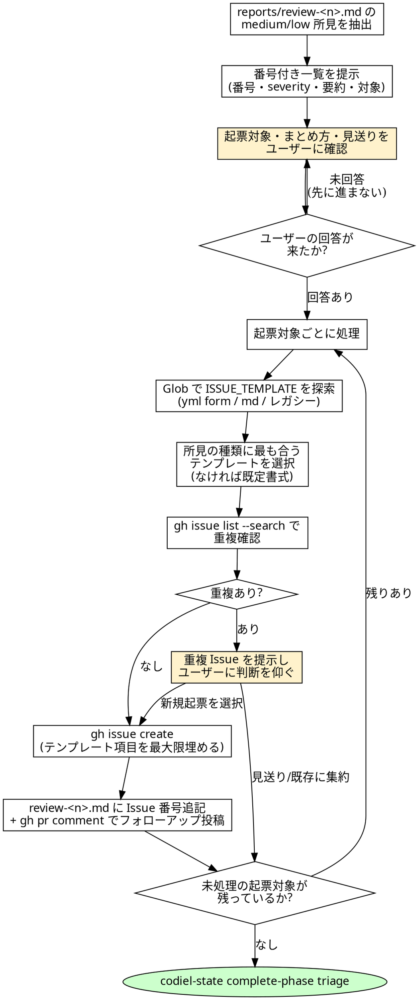

# triage フェーズ運転規約

## 概要

`orchestrating-runs` の [9] triage フェーズで**オーケストレーター自身**が使うスキルである。
`fixing-review-findings` と同様にオーケストレーターの進行規約であり、サブエージェントへの
ディスパッチは発生しない(起票作業そのものをオーケストレーターが行う)。

triage は `init / design / … / fix-loop` と異なり **非 GATED フェーズ**であり、Raguel の
`evaluate_*` を経ない。その代わりに `codiel-state complete-phase triage` の前提として
**人間の明示的な指示**を必須とする(DESIGN.md §1「人間の承認ゲート」の唯一の例外)。

入力は `reports/review-<n>.md` の所見のうち **medium / low のみ**。critical/high は本スキルの
対象外であり、`fixing-review-findings` が fix-loop で必ず処理し終えているはずである
(`reviewing-diffs` の severity 定義表のとおり下流の扱いが分かれる)。`fixing-review-findings`
が記録する「反論済み一覧」は critical/high 専用の記録であり、medium/low を扱う本スキルとは
**対象が別物**である。反論済み所見を triage で拾い直す必要はない(scope が重ならない)。

## プラグインルート参照規約

このスキル起動時に通知される「Base directory for this skill」は
`<plugin-root>/skills/filing-followup-issues` である。**`<plugin-root>` はそのベースディレクトリの
2 階層上**。`codiel-state` は対象プロジェクトのルートで次の形で呼ぶ:

```
node <plugin-root>/scripts/codiel-state.mjs <command> [引数...] --issue <番号>
```

## チェックリスト

1. 最新の `reports/review-<n>.md` を読み、medium/low の所見だけを抽出する(critical/high は
   すでに fix-loop で処理済みのはずであり、対象に含めない)。**既に「フォローアップ: #N」の
   注記が付いている所見は起票済みなので除外する**(triage 途中でセッションが切れて再開した場合の
   二重提示・二重起票の防止。`gh issue list --search` の重複確認はキーワード一致頼みで
   フェイルセーフにならないため、この除外が一次防壁)。
2. 抽出した所見を**番号付き一覧**(番号・severity・要約・対象 `src/...:42`)にしてユーザーに提示する。
3. **起票対象の選択・複数所見のまとめ方・見送りをユーザーに確認する**(AskUserQuestion か平文で
   問いかける)。まとめる/見送るの裁量はユーザーにあり、オーケストレーターが勝手に判断しない。
   **回答が来るまで次の手順に進まない**(triage は非 GATED のため `mark-ask` は使わないが、
   「ユーザーの回答を待つ」という運転自体がこのフェーズの唯一のゲートである)。
4. ユーザーが起票対象を指示したら、対象ごとに以下を行う。
5. **ISSUE_TEMPLATE の探索**: Glob で次を探す。
   - `.github/ISSUE_TEMPLATE/*.yml` と `*.yaml`(GitHub フォーム形式)
   - `.github/ISSUE_TEMPLATE/*.md`(Markdown 形式、frontmatter 付き)
   - `.github/ISSUE_TEMPLATE.md`(レガシー単一テンプレート)
   複数ヒットする場合、指摘の種類(バグ/改善/タスク)に最も合うものを選ぶ(詳細は次節)。
   どれもヒットしなければ既定書式(下記)を使う。
6. **重複確認**: 起票前に `gh issue list --search "<要約のキーワード>"` で既存 Issue との重複を
   確認する。ヒットがあれば起票を保留し、該当 Issue へのリンクをユーザーに提示して
   「新規起票する/既存 Issue に集約する/見送る」の判断を仰ぐ(ここも自己判断しない)。
7. 選んだテンプレート(または既定書式)を最大限埋めた本文を組み立て、
   `gh issue create --title "<タイトル>" --body "<本文>" --label "<ラベル>"` で起票する
   (テンプレートの labels が複数ある場合は `--label` を複数回指定する)。
8. 起票後、Issue 番号を `reports/review-<n>.md` の該当所見の行に追記し、
   `gh pr comment <PR番号> --body "フォローアップ: #<Issue番号>"` で PR にコメントを投稿する。
9. 全対象(見送られたものを除く)の処理が終わったら
   `node <plugin-root>/scripts/codiel-state.mjs complete-phase triage --issue N` を呼び
   フェーズを完了させる。

## ISSUE_TEMPLATE の読み方とテンプレート選択

### フォーム形式(`.github/ISSUE_TEMPLATE/*.yml`)

`name`(選択メニュー表示名)・`description`(用途説明)・`labels`(既定ラベル)・`title`(タイトル
接頭辞)を読み、`body` 配列の各フィールド(`input` / `textarea` / `dropdown` / `checkboxes` 等)の
`label`(見出し文)・`description`(補足)・`required` を確認する。`description`/`name` に
「bug」「feature」「improvement」等の語があれば所見の種類と突き合わせる。

本文組み立て時、**各フィールドを `### <label>` の見出し + 回答の markdown に展開**する。例えば
フィールドが `label: "現象"` なら本文に `### 現象\n<所見の内容>` を差し込む。`required: true` の
フィールドは空にせず、所見から埋められる情報(症状・根拠・対象ファイル・severity・元 PR リンク)を
可能な限り割り当てる。埋められない項目があれば「(triage 起票のため情報なし)」等と明記し、
無言で空欄にしない。

### Markdown 形式(`.github/ISSUE_TEMPLATE/*.md` / `.github/ISSUE_TEMPLATE.md`)

先頭の frontmatter(`name` / `about` / `title` / `labels`)を読み、本文のセクション構造
(`## 見出し`等)をそのまま維持して各セクションに所見の情報を埋める。

### テンプレートがない場合の既定書式

```markdown
## 症状
<所見の要約>

## 根拠
<review-<n>.md に記録された根拠(design.md/spec.md との不整合、または起こりうる障害)>

## 対象ファイル
`src/...:42`

## 元 PR
#<PR番号>(フォローアップ)

## severity
medium|low
```

## 起票済み Issue の記録書式(`reports/review-<n>.md` への追記)

該当所見ブロック(`### [severity] <要約>` から始まる一連の箇条書き)の末尾に次の形式で追記する。

```markdown
→ フォローアップ: #<Issue番号>
```

<HARD-GATE>
- **ユーザーの指示なしに起票しない**。手順 2〜3 の提示と確認を経ず、あるいはユーザーの回答を
  待たずに `gh issue create` を実行することは禁止。起票対象・まとめ方・見送りは常にユーザーが
  決める。
- **critical/high をこのフェーズに持ち込まない**。critical/high は `fixing-review-findings` の
  fix-loop で必ず修正対象になっており、triage で「起票して終わり」にすることは fix-loop の職掌
  への越境であり行わない。
- **`gh issue create` の実行はこのフェーズでのみ許される**。`guard-bash`(hooks)は
  アクティブ run の現在フェーズが triage でなければ `gh issue create` を機械的に deny する
  (`docs/DESIGN.md` §8 / §2 [9])。本 HARD-GATE(手続き上の縛り)と hooks の deny は
  **二層防御**であり、片方が漏れても他方が起票を止める設計になっている。
</HARD-GATE>

## Red Flags(合理化への反論)

| 思考 | 現実 |
|---|---|
| 「medium/low は軽微だからまとめて勝手に起票してよい」 | 起票対象・まとめ方はユーザーの裁量であり、オーケストレーターの「軽微そう」という自己評価で代行してはならない。必ず一覧提示→回答待ちを経る。 |
| 「テンプレートを読むのが面倒なので自由書式で起票する」 | ISSUE_TEMPLATE はリポジトリのラベル運用・Definition of Done と紐づく。自由書式は起票後にラベル漏れ・トリアージ漏れを招く。手順 5 のとおり探索・選択を必ず行う。 |
| 「重複確認は面倒だから省略して起票する」 | 重複起票は Issue トラッカーを汚し、後続の対応を分散させる。`gh issue list --search` での確認を省略しない。 |
| 「ユーザーの返信を待たずに一部だけ先に起票しておこう」 | 「回答が来るまで起票しない」がこのフェーズ唯一のゲート。一部でも先行起票すれば、ユーザーが後から「その所見は見送りたかった」と言っても取り消せない。 |
| 「起票さえすれば review-<n>.md への追記や PR コメントは後回しでいい」 | 追記・コメントを怠ると Issue 番号と所見の対応が追跡不能になり、triage が行われたこと自体が記録に残らない。起票の都度、手順 8 を即時に行う。 |
| 「critical/high も一緒に起票してしまえば fix-loop を省略できる」 | critical/high の起票による先送りは fix-loop の職掌(必ず修正)を無効化する構造的な迂回であり禁止。 |

## プロセスフローチャート


