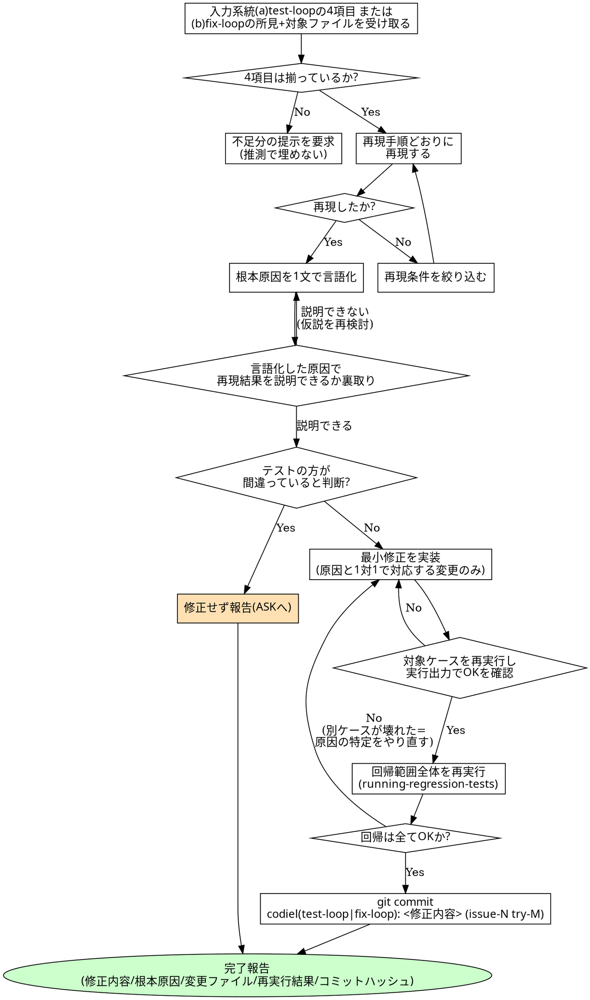

# NG ケース修正(systematic-debugging)規約

## 概要

`codiel-implementer-frontend` / `-backend` / `-data` が test-loop の (B) TDD 修正ループ、および
fix-loop フェーズで使うスキル。`implementing` スキルの修正モードが定める 2 系統の入力
(a) テスト NG 由来(test-loop): `running-regression-tests` から渡される「NG ケース ID・再現手順・
期待結果・実際の結果」の 4 項目 / (b) レビュー所見由来(fix-loop): `fixing-review-findings` から
渡される所見(severity・対象・内容・根拠・提案)+ 対象ファイル、のいずれを受け取った場合も
**再現 → 根本原因の特定 → 最小修正 → 対象ケース再実行 → 回帰(全件)再実行**の順で進める。
`implementing` スキルの修正モードから呼ばれ、「dev-plan にない変更をしない」「テスト資産を
書き換えない」という規律は `implementing` 側の責務のまま維持される。本スキルはその中の
**デバッグの進め方**そのものを定める。

「症状を消せば直った」という判断は最も危険な合理化である。原因を特定せずに直した修正は、
その場では NG が OK に変わって見えても、別の入力で同じ根本原因が再発する。本スキルの手順は
すべてこの罠を避けるための手段である。

## チェックリスト

1. 入力系統を確認する。(a) テスト NG 由来なら `running-regression-tests` / `scripting-tests` から
   渡された NG ケースの 4 項目(ケース ID・再現手順・期待結果・実際の結果)、(b) レビュー所見由来
   なら `fixing-review-findings` から渡された所見(severity・対象・内容・根拠・提案)+ 対象ファイル
   が揃っているか確認する。いずれかが欠けている場合、推測で埋めず、差し戻し元(オーケストレーター
   経由で tester または fixing-review-findings)に不足分の提示を求める。
2. **再現する**: (a) テスト NG 由来では渡された再現手順どおりに手を動かし(または既存のテスト
   スクリプトを実行し)、実際の結果が報告どおりに再現することを確認する。(b) レビュー所見由来では
   指摘された問題を該当ファイル・行で再現・確認する(`fixing-review-findings` で検証済みの根拠を
   引き継ぎ、ゼロから調べ直さない)。いずれの系統でも再現しない場合は、環境差・タイミング差・
   認識違いの可能性を疑い、再現条件を絞り込むまで根本原因の特定に進まない。
3. **根本原因を特定する**: コード・ログ・実行結果を読み、原因を**1 文で言語化**する
   (例:「`formatDate` がタイムゾーンを考慮せず UTC のまま表示している」)。
4. **裏取りする**: 3 で言語化した原因が正しければ再現手順の結果を説明できるはずである。
   実際にその原因が成立している箇所(該当コード・該当ログ)を指し示して確認する。
   説明できない場合は原因の仮説が誤りであり、2 に戻ってさらに調べる(先に進まない)。
5. **テストの方が間違っている**と判断した場合(期待結果が受け入れ基準と食い違う等)、
   `cases.md` やテストコードを自分で書き換えず、修正せずに報告する(ASK の材料にする)。
   `implementing` スキルの HARD-GATE と同じ扱い。
6. **最小修正を実装する**: 3〜4 で特定した原因を解消する最小限の変更のみを行う。
   原因と無関係な箇所の「ついでの修正」は行わない。
7. **対象ケースを再実行する**: 修正した NG ケースが OK になることを、実際の実行出力で確認する
   (見た目で「直ったはず」と判断しない)。
8. **回帰(全件)を再実行する**: 対象ケースの修正が既存の他ケースを壊していないか、
   `running-regression-tests` が定める回帰範囲全体で再確認する。対象ケースだけの再実行で
   完了としない。
9. 検証コマンド・回帰結果が揃ったら、`implementing` のコミット規約(`codiel(test-loop): <修正内容>
   (issue-N try-M)` または `codiel(fix-loop): <修正内容> (issue-N try-M)`。呼ばれたフェーズ名に
   合わせる)でコミットし、完了報告(修正内容・根本原因・変更ファイル・再実行結果・コミットハッシュ)
   を書く。

## 「最小修正」の判断基準

- 3〜4 で特定した根本原因と、変更したコードの行が **1 対 1 で対応している**ことを自分で説明できるか。
  説明できない変更(「念のため」「たぶん関係ある」)は最小修正ではない。
- 修正範囲は `dev-plan.md` に記載のステップ・ファイルの範囲内に収まっているか。範囲外への波及が
  必要だと判明した場合は `implementing` の HARD-GATE に従い無断で広げず報告する。

## HARD-GATE

<HARD-GATE>
- **原因が特定できていない状態で修正しない**。「1 文で言語化し、再現手順の結果で裏取りする」
  (手順 3〜4)を経ずに手当たり次第にコードを変更する行為は禁止。裏取りできない仮説のまま
  コードを変更してはならない。
- **テストスクリプト(`.codiel/specs/<unit-id>/scripts/`)・`cases.md` に触れない**。修正できるのは
  プロダクトコードのみ。「テストの方が間違っている」と思っても書き換えず、修正せずに報告する。
- **症状の隠蔽で緑にしない**。例外を `catch` して握り潰す、エラーを無視して処理を続行させる、
  タイムアウトを延長するだけで待機条件を直さない、といった「NG という表示だけを消す」修正は
  根本原因を放置したままの偽装グリーンであり、修正として認めない。
</HARD-GATE>

## Red Flags(合理化への反論)

| 思考 | 現実 |
|---|---|
| 「エラーメッセージを見た瞬間にどこが悪いか分かったので、すぐ直そう」 | 「分かった」という直感こそ検証されていない仮説。手順 3〜4 の言語化と裏取りを経ずに直すと、表面的に似た別原因を見誤ることがある。1 文で言語化できないなら、まだ特定できていない。 |
| 「catch して握り潰せばエラーが消えて NG が OK になる」 | エラーを消しても根本原因(なぜそのエラーが起きたか)は残ったまま。次に別の入力で同じ原因が別の形の不具合として再発する。症状ではなく原因を直す。 |
| 「タイムアウトを伸ばせばこの NG は通る」 | 通るようになったとしても、それは「たまたま今回は間に合った」だけで、決定論的な修正ではない。待機対象の状態を正しく待つ実装に直すのが唯一の恒久対策(`scripting-tests` の待機規約と同じ考え方)。 |
| 「このケースの期待値、実装の都合上ちょっと違う気がする。cases.md を直しておこう」 | `cases.md` は test-designer の専管であり implementer に書き込み権限はない。期待値がおかしいと思うなら修正せず報告し、判断は上流(ASK)に委ねる。 |
| 「対象ケースが OK になったので回帰は省略していい」 | 手順 8 は今回の修正が既存の他ケースを壊していないかを確認するためにある。対象ケース単体の成功は回帰全体の成功を保証しない。 |
| 「原因はだいたいこの辺りなので、関連しそうな箇所もついでに整理しておこう」 | 最小修正は原因と 1 対 1 で対応する変更に限る。関連範囲への「ついでの整理」は `implementing` の dev-plan 逸脱禁止(HARD-GATE)にも抵触する。 |

## プロセスフローチャート

