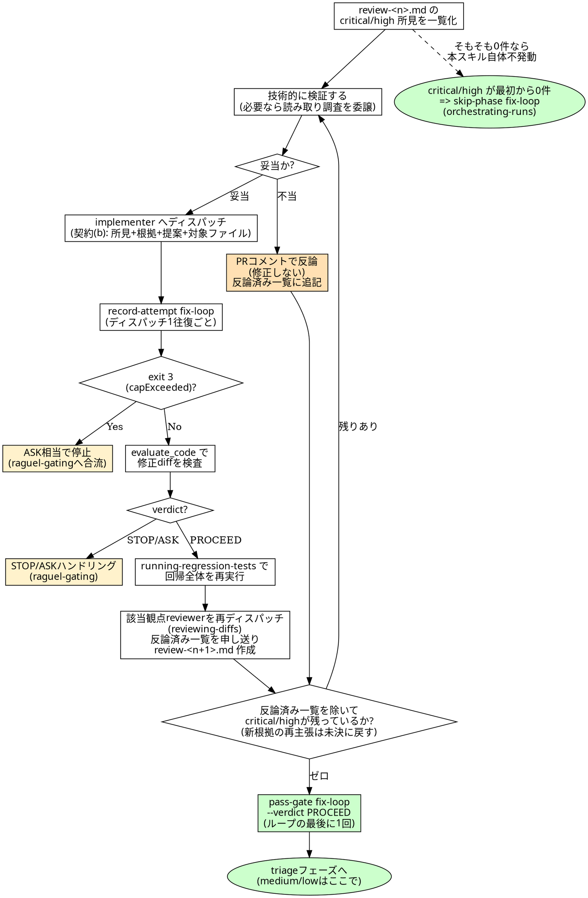

# fix-loop 運転規約

## 概要

`orchestrating-runs` の [7] fix-loop フェーズで**オーケストレーター自身**が使うスキルである。
`reviewing-diffs` / `implementing` など他のフェーズスキルの多くはサブエージェントが使うのに対し、
本スキルは `raguel-gating` と同様にオーケストレーターの進行規約であり、オーケストレーターが
自分でコードを直すことは許されない(HARD-GATE参照)。修正は常に該当ドメイン implementer への
**ディスパッチ**を経由する。

入力は `reports/review-<n>.md` の所見のうち **critical / high のみ**。medium/low は本スキルの
対象外であり、修正せず `triage` フェーズ(`filing-followup-issues`)へそのまま持ち越す
(`reviewing-diffs` の severity 定義表のとおり下流の扱いが分かれる)。

所見一件ごとに次の 3 分岐で処理する。

1. **技術的に検証する**: 指摘のとおり再現・確認できるか。`superpowers:receiving-code-review` と
   同じ精神で、「レビュアーは優秀だから」という理由での盲目的追従は禁止する。検証に読み取り調査
   (該当コードの精査・design.md/spec.md との突き合わせ・必要なら試験的な実行)が要る場合、
   オーケストレーターは Agent ツールで読み取り専用のサブエージェント(Explore 等)に調査を
   委譲してよい。ただし**修正の要否を最終判断するのはオーケストレーター自身**であり、
   調査結果を鵜呑みにするだけの委譲(判断の丸投げ)はしない。
2. **妥当と判断したら**、該当ドメインの implementer へ `implementing` スキルの修正モードの契約
   (b) レビュー所見由来(所見: severity・対象・内容・根拠・提案 + 対象ファイル)の形式で
   ディスパッチする(`orchestrating-runs` §3 のディスパッチテンプレートに準じる)。
3. **不当と判断したら修正せず**、根拠を添えて PR コメントで反論する。反論も「対応しない」という
   決定の一形態であり、**必ず PR 上に記録する**(黙って無視することは握り潰しと区別がつかない)。

反論した所見は「反論済み一覧」(所見の要約・反論根拠・PR コメント URL)として記録し、再レビュー
時の reviewer への申し送りと、残件数(critical/high ゼロ判定)の両方で参照する。ただし reviewer
が**新たな根拠**を伴って再主張した所見は反論済み扱いを解除し未決に戻す。

修正後は `running-regression-tests` で回帰を再実行し、`reviewing-diffs` の該当観点 reviewer を
再ディスパッチして再レビューする。critical/high がゼロになり、かつ回帰が green になるまでこの
サイクルを繰り返す。

review で critical/high が **一件もなかった場合、本スキルは発動しない**。その場合
`orchestrating-runs` §5「fix-loop のスキップ経路」に従い `codiel-state skip-phase fix-loop`
で明示的にスキップする(本スキルを空振りで起動しない)。

## プラグインルート参照規約

このスキル起動時に通知される「Base directory for this skill」は
`<plugin-root>/skills/fixing-review-findings` である。**`<plugin-root>` はそのベースディレクトリの
2 階層上**。`codiel-state` は対象プロジェクトのルートで次の形で呼ぶ:

```
node <plugin-root>/scripts/codiel-state.mjs <command> [引数...] --issue <番号>
```

## チェックリスト

1. 最新の `reports/review-<n>.md` を読み、critical/high の所見を一覧化する(medium/low は対象外
   として除外する。除外した件数も後で triage へ引き継ぐため覚えておく)。
2. 所見ごとに、対象ファイル・行・design.md/spec.md/issue.md の根拠を突き合わせて技術的に検証する。
   必要なら読み取り専用サブエージェントへ調査を委譲するが、妥当性の最終判断は自分で行う。
3. 妥当と判断した所見は、該当ドメインの implementer へ `implementing` の契約 (b) レビュー所見由来
   の形式(所見: severity・対象・内容・根拠・提案 + 対象ファイル)でディスパッチする(1 所見ずつ
   でも複数所見まとめてでもよいが、ドメインが混在する場合はドメインごとに分けてディスパッチする)。
4. 不当と判断した所見は、`reports/review-<n>.md` に記録された PR コメント URL への返信として、
   下記「PR 反論記録書式」に従い `gh api` で反論を投稿する(URL が未記録なら新規コメントでよい)。
   修正はしない。反論後は所見の要約・反論根拠・投稿した PR コメント URL を「反論済み一覧」に
   追記する。
5. ディスパッチ 1 往復(implementer への修正依頼 → 完了報告)ごとに
   `node <plugin-root>/scripts/codiel-state.mjs record-attempt fix-loop --issue N` を呼ぶ。
   exit code が `3`(`capExceeded`)なら、それ以上ディスパッチせず `raguel-gating` の ASK
   ハンドリングに合流する(「あと 1 回だけ」と自己判断で続行しない)。
6. implementer が返した修正 diff を `mcp__raguel__evaluate_code` に通す(`raguel-gating` の
   フェーズ→ツール対応表のとおり)。`STOP`/`ASK` が返れば `raguel-gating` の該当ハンドリングに
   従う(自己判断で握り潰さない)。
7. 修正が反映されたら `running-regression-tests` の手順で回帰全体(影響 unit + 既存全 unit +
   ARCHITECTURE.md のテストコマンド)を再実行する(修正対象のケースだけの再実行にしない)。
8. 回帰が green になったら、diff のドメインに応じた `codiel-reviewer-*`(+ 常時参加の
   doc/security)を再ディスパッチし、`reviewing-diffs` の手順で `review-<n+1>.md` を作る。
   ディスパッチ時の申し送りに「反論済み一覧」を含め、reviewer が新たな根拠なしに同一所見を
   再報告しないようにする。
9. `review-<n+1>.md` の critical/high 件数を確認する。件数からは「反論済み一覧」に載る所見を
   除外する(ただし reviewer が新たな根拠を伴って再主張したものは未決に戻し件数に含める)。
   除外後に 1 件でも残っていれば手順 2 に戻る。ゼロになったら手順 10 へ。
10. 最終の修正 diff に対する `evaluate_code` の verdict が `PROCEED` であることを確認し、
    `node <plugin-root>/scripts/codiel-state.mjs pass-gate fix-loop --issue N --evaluation-id <id>
    --verdict PROCEED` を呼んでフェーズを完了させる(`pass-gate` はループの最後に 1 回だけ呼ぶ。
    修正の度に呼ぶのは `record-attempt` と `evaluate_code` であり、`pass-gate` ではない)。

## 所見と PR コメントの対応付け

所見を PR へ投稿する(`reviewing-diffs` の「所見の統合と投稿」節、および再レビュー後)際、
オーケストレーターは投稿した各行コメントの URL(または ID)を `reports/review-<n>.md` の該当所見に
追記する。以降の「反論」「対応」の返信は常にこの URL に対して行う(所見テキストの一致だけで
コメントを探し直さない)。

## PR 反論記録書式

不当と判断した所見への反論は、元の所見コメントへの返信(なければ新規コメント)として次の形式で投稿する。

```markdown
反論: <なぜこの指摘は不当か。design.md/spec.md/issue.md のどこと整合しているか、
再現を試みた結果どうだったか、といった技術的根拠>
```

妥当と判断し修正が完了した所見には、修正を行った implementer のコミットハッシュを添えて次の形式で対応済みを記録する。

```markdown
対応: <commit hash>
```

「対応」も「反論」も**必ずどちらかを記録する**。所見に対して何も投稿しない状態を残さない。

## 対象範囲(critical/high のみ)

`reviewing-diffs` の severity 定義表のとおり、critical/high は fix-loop で必ず修正対象になり、
medium/low は triage フェーズでユーザーの指示のもと別 Issue 化される。本スキルの範囲は
前者のみであり、medium/low を「ついでに直す」ことは行わない(triage の職掌を侵さない)。

<HARD-GATE>
- **検証せずに指摘へ盲従しない**。所見の severity や書き方がどれだけ断定的でも、対象ファイル・
  design.md/spec.md/issue.md との突き合わせで技術的に検証するまでは、妥当と決めつけて
  implementer にディスパッチしない。
- **critical/high の握り潰し禁止**。不当と判断して修正しない場合も、必ず PR 上に反論を記録する
  (「対応」も「反論」もせず沈黙することは、指摘そのものが無かったことにするのと同じ)。
- **medium/low を本スキルの対象に含めない**。critical/high 以外を fix-loop で修正することは
  triage フェーズの職掌への越境であり行わない。
- **オーケストレーターは自分でコードを直さない**。`orchestrating-runs` の HARD-GATE と同じく、
  修正は必ず implementer へのディスパッチを経由する。
</HARD-GATE>

## Red Flags(合理化への反論)

| 思考 | 現実 |
|---|---|
| 「レビュアーは経験豊富そうだから指摘どおり直させよう」 | レビュアーの信頼度に応じて検証を省略してよい理由にはならない。手順 2 のとおり対象ファイルと根拠文書を自分で突き合わせて検証してから判断する。 |
| 「medium だけどこの所見も根が深そうだからついでに直させよう」 | fix-loop の対象は critical/high のみ。medium/low を混ぜて修正させることは triage フェーズの職掌(ユーザー指示のもとの別 Issue 化)を無効化する。 |
| 「不当だと思うので黙って対応しないでおこう」 | 反論しないまま放置すると、後で読む人には「見落とし」なのか「意図的に却下」なのか区別がつかない。不当と判断した場合こそ根拠を PR に記録する。 |
| 「今回の修正は小さいので evaluate_code は省略していい」 | `raguel-gating` の HARD-GATE と同じ理由で省略は禁止。「小さく見える」という判断自体が自己評価であり、Raguel が排除したい自己承認そのもの。 |
| 「対象ケースだけ再テストすれば十分、他は多分壊れていない」 | `running-regression-tests` が定める回帰範囲は影響 unit + 既存全 unit + ARCHITECTURE.md のテストコマンドの合算。修正の副作用は対象ケース単体の再実行では検出できない。 |
| 「record-attempt は面倒だからまとめて最後に 1 回呼ぼう」 | 試行上限は暴走的な修正ループを止めるための仕組み。ディスパッチのたびに呼ばないと実際の試行回数とずれ、上限超過の検知が機能しなくなる。 |

## プロセスフローチャート


