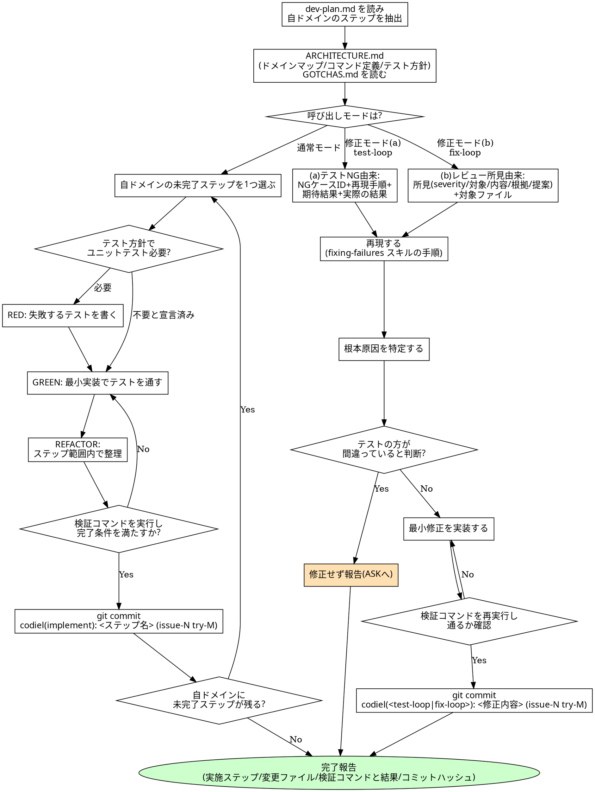

# 実装手順書 実行規約

## 概要

`codiel-implementer-frontend` / `-backend` / `-data` が implement フェーズおよび test-loop の (B)
TDD 修正ループ・fix-loop で使うスキル。`dev-plan.md` の**自ドメインの担当ステップのみ**を、
RED→GREEN→REFACTOR の TDD サイクルで実行し、プロダクトコードとユニットテストを産出する。

呼び出しには 2 つのモードがある。

- **通常モード(implement フェーズ)**: `dev-plan.md` を入力に、自ドメインの `[domain: ...]` タグが
  付いたステップを順に実施する。
- **修正モード(test-loop の (B) TDD 修正ループ / fix-loop)**: 入力は次の 2 系統のいずれか。
  (a) テスト NG 由来(test-loop): tester からの報告(NG ケース ID・再現手順・期待結果・実際の結果)
  の 4 項目。(b) レビュー所見由来(fix-loop): オーケストレーター(`fixing-review-findings`)から
  渡される所見(severity・対象・内容・根拠・提案)+ 対象ファイル。どちらの系統でも、詳細な
  debugging の手順(再現→根本原因特定→最小修正→回帰)は `fixing-failures` スキルに従う。本スキルは
  このモードでも「dev-plan にない変更をしない」「テスト資産を書き換えない」という規律を維持する
  責務を持つ。

ユニットテストの要否・フレームワーク・配置は `docs/ARCHITECTURE.md` の `## テスト方針` 宣言に従う。
そこで「ユニットテスト不要」と明記されている場合に限り RED を省略してよい。宣言がある限り、
実装者の裁量で省略しない。

本スキルの責務は「dev-plan.md の担当範囲を TDD で実装しコミットすること」にある。設計判断
(design.md にない機能追加)やテスト資産(`.codiel/specs/**`)の変更は職掌外。

## チェックリスト

1. `dev-plan.md` を読み、自ドメイン(`[domain: frontend/backend/data]` または縮退時 `generic`)の
   ステップのみを抽出する。他ドメインのステップは対象外として無視する。
2. `docs/ARCHITECTURE.md` の `## ドメインマップ` `## コマンド定義` `## テスト方針` を読む。
   自ドメインの書き込み許可パス(glob)をここで確認する。
3. `docs/GOTCHAS.md` を読み、関連する過去の落とし穴がないか確認する。
4. 呼び出しモードを判定する(通常の dev-plan 実行か、test-loop/fix-loop からの修正依頼か)。
5. **通常モード**: 自ドメインの未完了ステップを 1 つ選び、次を行う。
   1. RED: テスト方針が「必要」なら、まず失敗するユニットテストを書く。
   2. GREEN: そのテストを通す最小限の実装を書く。
   3. REFACTOR: そのステップの範囲内でのみ重複・可読性を整理する。
   4. ステップの「検証コマンド」を実行し、「完了条件」を満たすか確認する。満たさなければ 5-2 に戻る。
   5. 満たしたら、そのステップの変更のみを `git commit`(コミット規約は後述)する。
   6. 自ドメインの未完了ステップが残っていれば 5 に戻る。全て完了したら報告へ。
6. **修正モード**: 入力系統 (a) テスト NG 由来(NG ケース ID・再現手順・期待結果・実際の結果)または
   (b) レビュー所見由来(所見: severity・対象・内容・根拠・提案 + 対象ファイル)のいずれかを受け取り、
   どちらでも `fixing-failures` スキルの手順で再現→根本原因特定→最小修正→回帰を行う。修正後に
   検証コマンドを再実行し、コミットする。「テストの方が間違っている」と判断した場合は HARD-GATE に
   従い修正せず報告する。
7. 完了報告を書く(実施ステップ / 変更ファイル一覧 / 実行した検証コマンドと結果 / コミットハッシュ)。

## コミット責務

implementer は Bash を持つため、`codiel-planner` / `codiel-architect`(Bash なし・orchestrating-runs が
ゲート通過後にコミット)とは異なり、**自分の変更を自分でコミットする**。ステップ(または修正)が
検証コマンドで完了条件を満たした時点で都度 `git commit` する。1 ステップ = 1 コミットが原則で、
複数ステップの変更をまとめてコミットしない(diff のドメイン単位性を保ち、evaluate_code のレビュー対象を
明確にするため)。

コミットメッセージ規約:

```
codiel(implement): <ステップ名> (issue-N try-M)           # 通常モード
codiel(test-loop): <修正内容> (issue-N try-M)              # test-loop の修正モード
codiel(fix-loop): <修正内容> (issue-N try-M)               # fix-loop の修正モード
```

`issue-N try-M` は現在の runId/try(例: `issue-42 try-1`)をそのまま使う。この形式は
`orchestrating-runs` が diff を辿る際の識別子になるため変更しない。

## HARD-GATE

<HARD-GATE>
- `dev-plan.md` に記載のないファイルを変更しない。担当ステップの遂行に他ファイルの変更が
  必要だと判明した場合、無断で広げず、実施済み範囲までを報告し差し戻す。
- `.codiel/specs/**`(spec.md / cases.md / scripts/)には一切書き込まない。テストシナリオ・
  期待値・テストスクリプトは test-designer / tester の職掌であり、implementer の職掌ではない。
- テストを skip 化・削除して緑にしない。RED で書いた(あるいは既存の)テストは通すか、
  正当な理由があれば実装ではなくテスト自体の妥当性を報告するかのいずれかであり、
  握りつぶして通過を装うことは捏造である。
- 「このテストケースの方が間違っている」と判断した場合、cases.md やテストコードを自分で
  書き換えず、修正せずに報告する(ASK の材料にする)。期待値を書く者と直す者を分離する
  設計(docs/DESIGN.md §4)を implementer 側で崩さない。
</HARD-GATE>

## ドメイン規律

各 implementer は `docs/ARCHITECTURE.md` のドメインマップで自分のドメインに割り当てられた glob
配下にのみ書き込む。ドメインタグの付いた共有コードのステップ(`writing-dev-plans` が
「主たる利用側のドメインタグを 1 つ付ける」と定めたもの)は、そのタグが自分のドメインであれば
担当してよい ── 共有コード自体がどの glob に属すかではなく、ステップに付いたタグで判断する。
逆に自分のドメイン外のパスへは、たとえ 1 行でも書き込まない。hooks(guard-write)がフェーズ単位の
制御は行うがエージェント個体の識別はできないため、ドメイン単位の規律はこのスキルとエージェント定義が
担保する唯一の防線である。

## Red Flags(合理化への反論)

| 思考 | 現実 |
|---|---|
| 「ついでにこの汚いコードも直そう」 | dev-plan.md にないファイル・変更範囲への着手は HARD-GATE 違反。気になる場合はステップとして提案する報告に留め、自分で着手しない。 |
| 「このケースは仕様がおかしいので期待値を変えたい」 | cases.md は test-designer の成果物であり implementer には書き込み権限も職掌もない。修正せず報告し、判断は上流(ASK)に委ねる。 |
| 「skip すれば全部通る」 | skip 化・削除による見かけ上の green は `evaluate_code` の捏造検知対象であり、根本原因を隠すだけで何も解決しない。 |
| 「このステップは自分のドメインじゃないけど 1 行だけだから直接直した方が早い」 | ドメイン規律は「量」ではなく「境界」の問題。他ドメインの変更は担当 implementer にディスパッチされるべきであり、越境は hooks の ask 誤爆やレビュー時の責任所在の混乱を招く。 |
| 「急いでいるのでユニットテストは省略しよう」 | ARCHITECTURE.md のテスト方針が「必要」と宣言している限り省略は許されない。省略できるのは「不要」と明記された場合のみ。 |
| 「検証コマンドを流さなくても、コードを見れば通ることは分かる」 | 完了条件は検証コマンドの実行結果で機械的に確認する前提で設計されている。実行せずに次のステップへ進むと、後続ステップが誤った前提の上に積み上がる。 |
| 「まとめて最後に 1 回コミットすれば十分」 | 1 ステップ 1 コミットが diff とドメイン・完了条件の対応を保つ前提。まとめコミットは evaluate_code のレビュー単位を破壊し、どのステップでの変更か追跡できなくする。 |

## プロセスフローチャート


