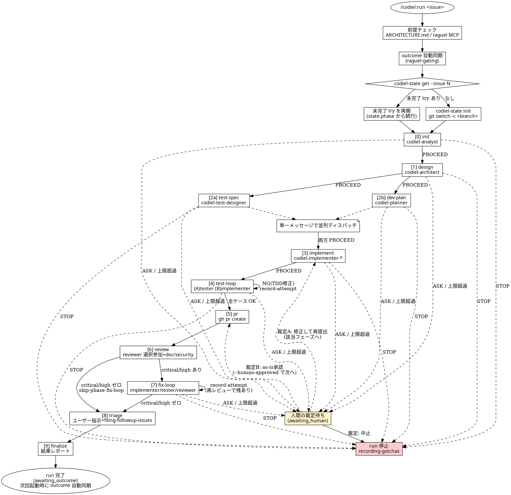

# Codiel run オーケストレーション

## 概要

`/codiel:run <issue番号>` はメインセッション自身がオーケストレーターとなり、Issue を起点に
init → design → test-spec/dev-plan → implement → test-loop → pr → review → fix-loop → triage → finalize
の全フェーズを進行させる。各フェーズの実作業(分析・設計・実装・テスト・レビュー)はすべて
専用サブエージェントにディスパッチし、成果物は Raguel MCP のゲートを経てのみ次フェーズへ進む。
オーケストレーター自身は「進行管理」のみを行い、コードも文書もレビューも自分では書かない。

Raguel ゲートの呼び出し規約(evaluate ツール対応・verdict 別ハンドリング・record_outcome の運用)は
すべて `raguel-gating` スキルに一元化されている。本スキルはそれを**参照する**だけで、手順を
再記述しない(二重記述は将来の矛盾源になるため)。

## プラグインルート参照規約

このスキル起動時に通知される「Base directory for this skill」は `<plugin-root>/skills/orchestrating-runs`
である。**`<plugin-root>` はそのベースディレクトリの 2 階層上**。`codiel-state` は対象プロジェクトの
ルートで次の形で呼ぶ:

```
node <plugin-root>/scripts/codiel-state.mjs <command> [引数...] --issue <番号>
```

## チェックリスト

- [ ] 0. **前提チェック**(下記)。満たさなければここで終了する
- [ ] 1. **outcome 自動同期**を行う(`raguel-gating` の「outcome の自動同期」節。起動時に 1 回のみ)
- [ ] 2. **run を解決する**: `codiel-state get --issue N` → 未完了 try があれば `state.phase` から再開。
      なければベースブランチを解決(ARCHITECTURE.md の「規約」→ なければ main)→
      `git switch <ベース> && git pull --ff-only` → `codiel-state init --issue N --base-branch <ベース>` →
      `git switch -c <state.branch>`(詳細は「1. run の解決」参照)
- [ ] 3. 現在フェーズから、フェーズ進行表の定型(start-phase → ディスパッチ → 成果物検証 → raguel-gating
      でゲート → pass-gate/complete-phase)を順に実行する
- [ ] 4. ASK / STOP が返ったフェーズは `raguel-gating` の手順に厳密に従う(自己判断しない)
- [ ] 5. 全フェーズ `passed` になったら `finalize` を実行し、結果レポートを出力して終了する

## 0. 前提チェック(フェイルクローズド)

run を開始する前に、必ず次を確認する。ひとつでも欠けていれば **run を開始しない**。

1. 対象プロジェクトルートに `docs/ARCHITECTURE.md` が存在するか確認する。
2. 存在する場合、` ```json codiel:domains ` フェンスブロック(ドメインマップ)が読めるか確認する。
3. **存在しない場合**: Claude 自身が Bash ツールで
   `bash <plugin-root>/scripts/install-harness.sh` を実行する(ユーザーに実行させない)。
   `docs/ARCHITECTURE.md` / `docs/GOTCHAS.md` / `CLAUDE.md` のひな形が生成されたことを確認し、
   ユーザーに「ドメインマップ・コマンド定義・テスト方針を記入してください」と依頼して、
   **この run はここで終了する**(未記入のまま先へ進まない)。
4. `mcp__raguel__*` ツール群(`evaluate_decision` 等)が利用可能であることを確認する。
   利用できなければ run を開始しない。

## 1. run の解決

```
node <plugin-root>/scripts/codiel-state.mjs get --issue N
```

- run が存在し `status` が終端(`stopped` / `awaiting_outcome` / `completed` / `rejected`)でなければ、
  その `state.phase` から再開する(「再開手順」参照)。
- **run が存在しない場合、`codiel-state get` は非ゼロ終了し stderr にエラーメッセージを出す。
  これは異常ではなく「新規 init に進め」という合図である。** run 未存在をエラーとして扱って
  ここで停止しない。
- run が存在しない、または既存 run が終端状態なら、**init の前に**次の手順でベースブランチを
  解決してから新しい try を作る:
  1. `docs/ARCHITECTURE.md` の「規約」節(ブランチ/PR 規約)からベースブランチ名を読む。
     記載がなければ `main` を既定値とする。
  2. `git switch <ベースブランチ>` した上で `git pull --ff-only` を実行し、ベースブランチを
     最新化する。`pull --ff-only` が失敗した場合(ネットワーク不通・fast-forward 不可な競合など)は、
     **その旨を人間に確認してから続行する**(黙って force する・スキップするなどの自己判断は禁止)。
  3. 上記が完了したら:
     ```
     node <plugin-root>/scripts/codiel-state.mjs init --issue N --base-branch <ベースブランチ>
     git switch -c <init の結果で返る state.branch>
     ```

## 2. フェーズ進行表

各フェーズは共通の定型で進行する: `start-phase` → サブエージェントをディスパッチ → 成果物ファイルの
存在を検証 → `raguel-gating` でゲート → `pass-gate`(GATED フェーズ)または `complete-phase`
(非 GATED フェーズ)。GATED フェーズは `init / design / test-spec / dev-plan / implement / test-loop / fix-loop`
の 7 つで、Raguel の evaluate を経ないと `passed` にできない。`pr / review / triage / finalize` は
Raguel ゲートを経ず `complete-phase` で完了する。

| フェーズ | 担当エージェント | 参照スキル | 入力ファイル | 出力ファイル | ゲート種別 | コミット担当 |
|---|---|---|---|---|---|---|
| [0] init | codiel-analyst | analyzing-issues | Issue(`gh issue view`)、docs/ARCHITECTURE.md、docs/GOTCHAS.md | `issue.md` | pass-gate(`evaluate_decision`) | オーケストレーター(ゲート通過直後) |
| [1] design | codiel-architect | writing-design-docs | `issue.md`、docs/ARCHITECTURE.md、docs/GOTCHAS.md | `design.md` | pass-gate(`evaluate_design`) | オーケストレーター(ゲート通過直後) |
| [2a] test-spec | codiel-test-designer | writing-test-specs | `design.md`(影響 unit 一覧)、既存 `.codiel/specs/<unit-id>/spec.md`(あれば) | `.codiel/specs/<unit-id>/spec.md` / `cases.md`(新規 or 更新) | pass-gate(`evaluate_plan`。dev-plan とは独立) | オーケストレーター(ゲート通過直後) |
| [2b] dev-plan | codiel-planner | writing-dev-plans | `design.md` | `dev-plan.md`(ステップ毎にドメインタグ) | pass-gate(`evaluate_plan`。test-spec とは独立) | オーケストレーター(ゲート通過直後) |
| [3] implement | codiel-implementer-{frontend,backend,data}(ステップのドメインタグで選択) | implementing | `dev-plan.md`(該当ステップ)、docs/ARCHITECTURE.md、docs/GOTCHAS.md | コード diff + ユニットテスト | pass-gate(`evaluate_code`) | 担当 implementer(自分の変更を自分でコミット) |
| [4A] test-loop(スクリプト安定化) | codiel-tester | scripting-tests, running-regression-tests | `.codiel/specs/<unit-id>/cases.md` | `.codiel/specs/<unit-id>/scripts/`、`reports/test-run-<n>.md` | pass-gate(`evaluate_code`。スクリプト diff) | codiel-tester(自分の変更を自分でコミット) |
| [4B] test-loop(TDD 修正) | codiel-implementer-{該当ドメイン} | fixing-failures | NG ケース ID + 再現手順 + 期待結果 + 実際の結果 | コード修正 diff | pass-gate(`evaluate_code`) | 担当 implementer(自分の変更を自分でコミット) |
| [5] pr | オーケストレーター本体(ディスパッチなし) | — | `design.md`、`dev-plan.md`、`cases.md`、diff | PR(`git push -u origin <state.branch>` してから `gh pr create`。未 push ブランチでは PR 作成が失敗する) | complete-phase(`--pr-url` 必須) | ―(開始前に `git status --short` で未コミット差分がないことを確認) |
| [6] review | codiel-reviewer-{frontend,backend,data}(diff のドメインで選択参加)+ codiel-reviewer-doc/-security(常時参加) | reviewing-diffs | diff、`design.md`、`issue.md`、`.codiel/specs/**` | `reports/review-<n>.md` + PR コメント | complete-phase | ―(reviewer は Edit/Write を持たず変更しない) |
| [7] fix-loop | codiel-implementer-{該当ドメイン}(修正)+ codiel-tester(回帰再実行)+ reviewer 陣(再レビュー) | fixing-review-findings, running-regression-tests, reviewing-diffs | `reports/review-<n>.md` の critical/high | コード修正 diff、`test-run-<n+1>.md`、`review-<n+1>.md` | pass-gate(`evaluate_code`。修正の度) | 担当 implementer / codiel-tester(自分の変更を自分でコミット) |
| [8] triage | オーケストレーター本体(ユーザーの指示のもと) | filing-followup-issues | `reports/review-<n>.md` の medium/low | 起票された Issue 番号(`review-<n>.md` と PR コメントに追記) | complete-phase(Raguel ゲートなし。§2 [8] の運用) | ―(コード変更なし) |
| [9] finalize | オーケストレーター本体 | recording-gotchas(STOP/incident 発生時のみ起動) | 全フェーズの成果物 | 結果レポート | complete-phase(`status` を `awaiting_outcome` へ) | ―(コード変更なし) |

- **test-spec と dev-plan は単一メッセージで 2 体並列ディスパッチする**(Task ツールの呼び出しを 1 回の
  応答の中に 2 件含める)。片方が `ASK`/`STOP` でももう片方の結果には影響しない(raguel-gating 参照)。
- ドメインマップが `generic` のみの場合の縮退運用は「ドメインディスパッチ」節を参照。
- critical/high が review でゼロだった場合、fix-loop は実作業なしで
  `node <plugin-root>/scripts/codiel-state.mjs skip-phase fix-loop --issue N --reason "<理由>"`
  でスキップする(詳細は「5. ループ運転」節)。

### 2.1 成果物コミット規約

`codiel-architect` / `codiel-test-designer` / `codiel-planner` は Bash を持たず、自分の成果物を
自分でコミットできない(§7 の権限設計どおり)。したがって成果物のコミット責務はフェーズの種類で分かれる。

- **文書系フェーズ(init / design / test-spec / dev-plan)**: 成果物(`issue.md` / `design.md` /
  `spec.md`・`cases.md` / `dev-plan.md`)は、**ゲート通過直後にオーケストレーター自身が**
  ```
  git add <成果物パス>
  git commit -m "codiel(<phase>): <要約> (issue-N try-M)"
  ```
  でコミットする。これは「実装行為」ではなく**進行管理としてのコミット**であり、HARD-GATE の
  「オーケストレーターは自分で実装・レビュー・テスト作成をしない」には抵触しない
  (オーケストレーターは成果物の中身を一切書いていない。サブエージェントが書いた成果物をそのまま
  記録するだけである)。
- **コード系フェーズ(implement / test-loop / fix-loop)**: 担当サブエージェント(implementer /
  codiel-tester。いずれも Bash を保持)が**自分の変更を自分でコミットする**。オーケストレーターは
  これらのフェーズではコミットしない。
- **確認義務**: オーケストレーターは `pr` フェーズを開始する前に `git status --short` を実行し、
  未コミットの変更がないことを確認する。残っていれば `pr` を開始せず、該当フェーズのサブエージェントに
  「変更をコミットしてください」と差し戻す(未コミット差分を抱えたまま PR を作成しない)。

## 3. ディスパッチプロンプトの規約

サブエージェントのディスパッチは **Task ツール**(Claude Code の Agent/Task 機構)で、
`subagent_type` にフェーズ担当のエージェント名(`codiel-analyst` 等)を指定して行う。
プロンプトは次のテンプレートを満たす(担当スキル名・入出力ファイルパス・ARCHITECTURE/GOTCHAS
必読・前フェーズ findings 要約・報告形式のすべてを含めること):

```
あなたは <エージェント名> として、codiel プラグインの <スキル名> スキルを
Skill ツールで起動し、その手順に厳密に従って作業してください。

## 入力ファイル
- <入力ファイルパス1>
- <入力ファイルパス2(あれば)>

## 出力ファイル
- <出力ファイルパス>

## 前提
作業前に必ず docs/ARCHITECTURE.md と docs/GOTCHAS.md を読んでください。
ドメインマップ・コーディング規約・過去の落とし穴を踏まえて作業すること。

## 前フェーズの申し送り(findings)
<前フェーズの EvaluationResult.findings を ruleId + message の箇条書きで要約したもの。
なければ「なし」>

## 完了条件
完了したら、成果物のファイルパスのみを報告してください。
diff の中身やファイル内容を会話に貼り付けないこと。
```

ディスパッチ後、成果物ファイルが実際に存在し空でないことを確認してから raguel-gating の
ゲート手順に進む(サブエージェントの報告を鵜呑みにしない)。

## 4. ドメインディスパッチ

- `dev-plan.md` の各ステップにはドメインタグ(`frontend` / `backend` / `data`)が付く。
  ARCHITECTURE.md の ` ```json codiel:domains ` ブロックと突き合わせ、タグに応じて
  `codiel-implementer-frontend` / `-backend` / `-data` にディスパッチする。
  review フェーズも同様に、diff が触れたドメインに応じて `codiel-reviewer-frontend` /
  `-backend` / `-data` を選択参加させ、`codiel-reviewer-doc` / `-security` は常時参加させる。
- **generic 縮退**: ドメインマップが `{ "generic": ["**"] }` のみの場合、implementer は
  `codiel-implementer-backend` を汎用実装者として使う。reviewer は `codiel-reviewer-doc` +
  `codiel-reviewer-security` + `codiel-reviewer-backend`(汎用担当)の 3 体で回す。

## 5. ループ運転(test-loop / fix-loop)

test-loop の内部運転(スクリプト安定化 → TDD 修正の二段構え)は `running-regression-tests` /
`fixing-failures` に、fix-loop の指摘対応は `fixing-review-findings` に定める。オーケストレーターの
役割は次の 2 点のみ:

1. 修正のたびに `node <plugin-root>/scripts/codiel-state.mjs record-attempt <phase> --issue N` を呼ぶ。
2. exit code が `3`(試行上限超過・`capExceeded`)なら、**raguel-gating の ASK と同じ扱い**にする
   (`awaiting_human` は `record-attempt` 内部で既にセットされている。findings 相当の情報を人間に
   提示し裁定を待つ。自分で「あと1回だけ」と続行してはならない)。

### fix-loop のスキップ経路

review フェーズの所見に critical / high が **一件もなければ**、fix-loop で実施することは何もない。
この場合、fix-loop を `start-phase` してから空振りで `complete-phase`/`pass-gate` しようとせず、
次のコマンドで明示的にスキップする:

```
node <plugin-root>/scripts/codiel-state.mjs skip-phase fix-loop --issue N --reason "review で critical/high 0 件"
```

- `skip-phase` は `fix-loop` にしか使えない(他フェーズはフェイルクローズドで拒否される)。
- 前提として review までの全フェーズが `passed` である必要がある。
- 成功すると `fix-loop` は `status: passed` / `verdict: SKIPPED` になり、`attempts` はリセットされずに
  維持される。以降 `triage` を通常どおり `start-phase` できる。
- **review に critical/high が 1 件でも残っている場合は skip-phase を使わない**。通常どおり
  implementer にディスパッチして修正させる。

## 6. 再開手順

1. `node <plugin-root>/scripts/codiel-state.mjs get --issue N` で `state.json` を取得する。
2. `git switch <state.branch>` で run のブランチに切り替える(カレントブランチが別 run や
   ベースブランチのままだと、成果物コミットが誤ったブランチに乗る)。
3. `state.phase` から続行する(すでに `passed` のフェーズはやり直さない。フェーズ進行表の定型に
   従い、`in_progress` のフェーズから再開する)。
4. `state.status` が `awaiting_human` なら、該当フェーズの `evaluationId` / `note` を手がかりに
   直近の findings を再提示し、raguel-gating の ASK ハンドリング(裁定 A / 裁定 B / 中止)に従って
   人間の裁定を待つ。**再開できると思って勝手に続行しない**。

<HARD-GATE>
- **オーケストレーターは自分で実装・レビュー・テスト作成をしない**。すべてサブエージェントへの
  ディスパッチを経由する。コード・design.md・review コメント等をオーケストレーター自身が書くことは
  一切禁止。
- **Raguel ゲートの省略禁止**。GATED フェーズを `evaluate_*` なしに `passed` にしようとする行為
  (`pass-gate` の `--evaluation-id` を捏造する、evaluate を呼ばずに次フェーズへ進むなど)は
  raguel-gating の HARD-GATE と同様に禁止。
- **state.json を直接編集しない**。フェーズ遷移は `codiel-state` スクリプト経由のみ。Edit/Write で
  `.codiel/runs/**/state.json` を書き換えようとする行為は hooks が deny する前提であり、
  それを回避しようとすること自体が禁止。
</HARD-GATE>

## Red Flags(合理化への反論)

| 思考 | 現実 |
|---|---|
| 「小さい Issue だからフェーズを飛ばしていい」 | `codiel-state start-phase` はステージ順序を機械的に強制する。小ささの判断自体がAIの自己評価であり、飛ばしていい理由にはならない。 |
| 「サブエージェントより自分でやった方が速い」 | 権限を最小化したサブエージェントに任せることが「暴走できない」構造の前提。オーケストレーターが自分でコードを書けば hooks・Raguel の役割分離が意味を失う。 |
| 「テストは明らかに通るので test-loop 省略」 | 「明らか」という判断こそ偽装グリーンのリスク源。スクリプトを実際に実行して出力を見るまで合否は不明。 |
| 「state は手で直した方が早い」 | state.json への Edit/Write は hooks が deny する前提。手直しは「ゲート偽装」「フェーズ飛ばし」の温床であり、codiel-state の遷移検証を迂回する。 |
| 「ASK だが自明なので自分で判断して続行」 | raguel-gating が明確に禁止する自己承認そのもの。ASK は人間の裁定を要求する合図であり、AI の代理判断はその意味を無効化する。 |
| 「review/triage/finalize は Raguel ゲートがないから雑に流していい」 | ゲートがないのは「人間やhooksが別の形で検査するから」であり手抜きの許可ではない。pr/review は hooks が state を検証し、triage は人間の明示指示が必須。 |

## プロセスフローチャート


