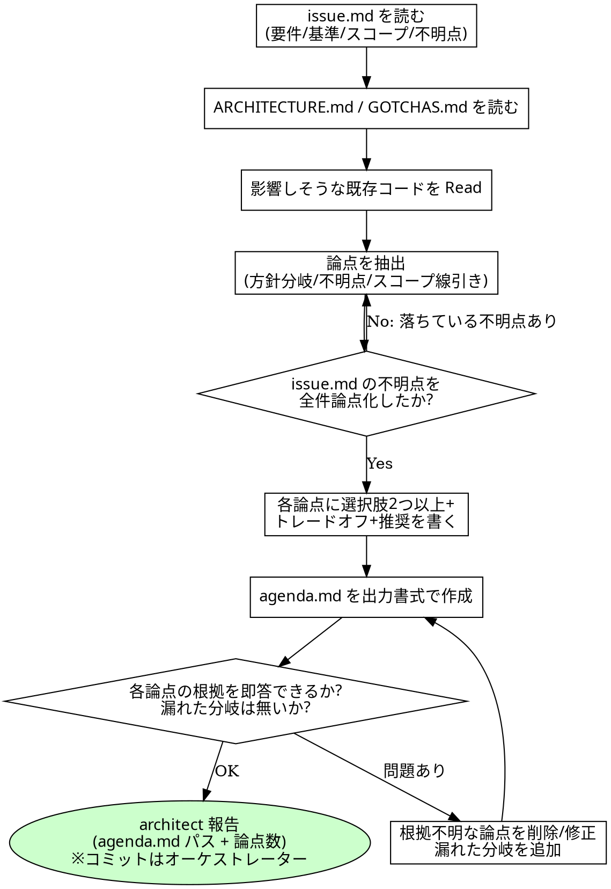

# ディスカッション・アジェンダ作成規約

## 概要

`codiel-architect` が discuss フェーズの前半で使うスキル。`issue.md`・`docs/ARCHITECTURE.md`・
`docs/GOTCHAS.md`・既存コードの調査結果を入力に、ユーザーとのディスカッションで扱う論点を
`agenda.md` に構造化する。ここで挙げた論点がそのままディスカッションの議題になり、合意結果
(discussion.md)は design フェーズの設計を拘束する。論点を漏らすと、その分岐はユーザーに
諮られないまま architect の独断で設計されることになる。

本スキルの責務は「設計に入る前に人間と合意すべき分岐点をすべて可視化すること」にある。
設計そのもの(design.md)を書くことではない。

## チェックリスト

1. `issue.md` の `## 要件` `## 受け入れ基準` `## スコープ` `## 非スコープ` `## 不明点` を読む。
2. `docs/ARCHITECTURE.md`(ドメインマップ・技術スタック)と `docs/GOTCHAS.md`(既知の落とし穴)を読む。
3. 影響しそうな既存コードを Read / Grep / Glob で調査する。選択肢とトレードオフは既存実装の
   現実に基づいて書く(想像で書かない)。
4. 論点を抽出する。少なくとも次の 3 種を検討する:
   - **方針の分岐**: 実現方法が複数あり、選択によって設計が大きく変わるもの
   - **不明点**: `issue.md` の `## 不明点` は**全件を必ず論点化する**(1 件も落とさない)
   - **スコープの線引き**: 今回の run でやるか後続 Issue に回すかが割れうるもの
5. 各論点に「背景 / 選択肢(2 つ以上)/ 各選択肢のトレードオフ / 推奨案と理由」を書く。
6. 出力書式(下記)どおりに `agenda.md` を作成する。
7. 自己チェック: 各論点について「issue.md / ARCHITECTURE.md / 既存コードのどれが根拠か」を
   即答できるか確認する。答えられない論点は削るか根拠を書き直す。逆に、design.md を書く際に
   選択を迫られるのに agenda に無い分岐が残っていないかも確認する。

## 出力書式

facilitating-design-discussions(オーケストレーター)がこの書式のまま論点を提示する。
見出し名・項目名を変更しない。

```markdown
# agenda: <issue タイトル>

## 論点 1: <論点名>

- 背景: <なぜこれが分岐点か。issue.md / ARCHITECTURE.md / 既存コードの根拠>
- 選択肢A: <概要> — トレードオフ: <...>
- 選択肢B: <概要> — トレードオフ: <...>
- 推奨: <A or B>。理由: <...>

## 論点 2: <issue.md の不明点由来の論点>

- 背景: issue.md の不明点「<原文>」
- 選択肢A: ...
```

## 論点の粒度

- ユーザーが選択できる形(選択肢の比較)まで落とす。「どう思いますか」だけの、答えの形が定まらない開いた問いにしない。
- 設計・スコープ・振る舞いに影響する分岐だけを論点にする。自明な実装詳細(変数名・
  ファイル配置など既存規約から一意に決まるもの)は論点にしない。

## コミット責務

`codiel-architect` は Bash を持たないため `agenda.md` を自らコミットできない。
`orchestrating-runs` の成果物コミット規約により、オーケストレーターがコミットする。

<HARD-GATE>
- コードを書かない・変更しない。成果物は `agenda.md` のみ。
- `issue.md` の「## 不明点」を agenda から落とさない。不明点を自分の推測で解消して論点から
  外すことは、analyst に禁じられた「推測で埋める」行為を discuss フェーズで再演することと同じ。
</HARD-GATE>

## Red Flags(合理化への反論)

| 思考 | 現実 |
|---|---|
| 「論点が多いとユーザーが面倒なので絞ろう」 | 絞られた論点は architect の独断で決まる。テンポの調整は facilitating 側の「すべて推奨案で進める」ショートカットが担う。アジェンダ側で間引かない。 |
| 「推奨案だけ書けば十分、比較は冗長」 | 比較のない推奨は誘導になる。ユーザーは選択肢とトレードオフを見て初めて推奨に乗るかどうかを判断できる。 |
| 「この不明点は些細なので論点にしなくていい」 | 些細かどうかを決めるのはユーザー。ゼロコストで選べる形(推奨案つき選択肢)にして出せば、些細なら一瞬で決まる。 |
| 「既存コードを読まなくても選択肢は書ける」 | 現実の実装と乖離した選択肢は議論そのものを無駄にする。writing-design-docs が Read を要求するのと同じ理由で、agenda も Read に基づく。 |

## プロセスフローチャート


