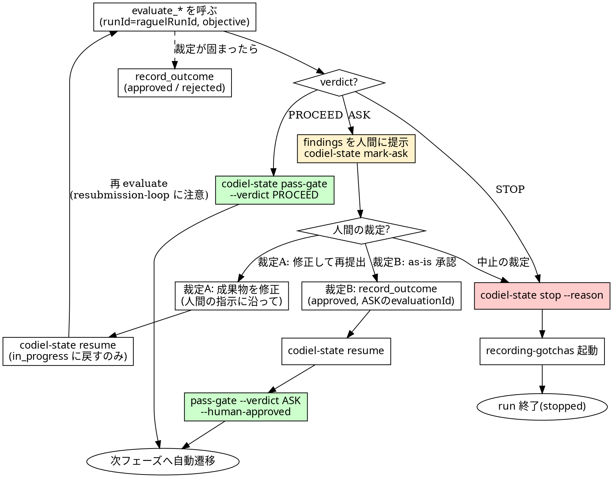

# Raguel ゲート運用規約

## 概要

Codiel オーケストレーターは各フェーズの成果物(判断・設計・計画・コード)を Raguel MCP に検査させ、
返ってきた `verdict`(`PROCEED` / `ASK` / `STOP`)に従ってのみ `state.json` を遷移させる。
これは「フェーズ飛ばし」「偽装グリーン」「AI による自己承認」を構造的に防ぐ Codiel のハーネスの中核であり、
本スキルはその**呼び出し規約そのもの**を定める。他の全フェーズ用スキル・`orchestrating-runs` は
「Raguel ゲートは raguel-gating に従う」とだけ参照し、詳細はここに一元化する。

verdict の握り潰しは一切許されない。`PROCEED` が返るまでは推測で先に進まず、`ASK`/`STOP` が返れば
どれだけ「明らかに大丈夫」に見えても必ず停止する。判定の決定論性・フェイルクローズド性は Raguel 側の
責務だが、それを無効化する経路(evaluate を呼ばない、verdict を偽装する)を作らないのが本スキルの責務である。

## プラグインルート参照規約

このスキル起動時に通知される「Base directory for this skill」は `<plugin-root>/skills/raguel-gating` である。
**`<plugin-root>` はそのベースディレクトリの 2 階層上**。`codiel-state` は以下の形で呼ぶ(対象プロジェクトの
ルートで実行する):

```
node <plugin-root>/scripts/codiel-state.mjs <command> [引数...] --issue <番号>
```

## チェックリスト

### コマンド起動時(1 回)

`/codiel:run` / `/codiel:test` などの codiel コマンドが起動したら、フェーズ処理に入る前に:

1. **outcome 自動同期を行う**(「outcome の自動同期」参照)。ゲートのたびに行うものではなく、
   コマンド起動の冒頭で 1 回だけ行う。

### ゲートを 1 回通すたびに

1. **state を読む**: `codiel-state get --issue N` で現在の `state.json` を取得し、
   `raguelRunId`(`issue-123-try-N` 形式)を確認する。これが Raguel へ渡す `runId` になる。
2. **objective を用意する**: `issue.md` の要件・受け入れ基準から 1〜2 文で objective を書く。
   フェーズが変わっても run を通じて一貫した文言にする(objective がブレると crosscheck パネルの
   整合性判定が弱くなる)。
3. **フェーズ→ツール対応表(下記)に従い evaluate ツールを呼ぶ**。`runId` と `objective` は全呼び出し必須。
4. **verdict で分岐する**(下記「verdict 別ハンドリング」)。
5. **PROCEED なら次フェーズのディスパッチプロンプトに前フェーズの findings 要約を含める**
  (「findings の引き継ぎ」参照)。

## フェーズ→ツール対応表

| フェーズ | 呼び出すツール | 成果物として渡すもの |
|---|---|---|
| init | `mcp__raguel__evaluate_decision` | `decision`=「この解釈・スコープで進む」という判断文 |
| design | `mcp__raguel__evaluate_design` | `design`= design.md の内容 |
| test-spec | `mcp__raguel__evaluate_plan` | `plan`= 該当 unit の spec.md/cases.md 更新内容(dev-plan とは独立にゲート) |
| dev-plan | `mcp__raguel__evaluate_plan` | `plan`= dev-plan.md の内容(test-spec とは独立にゲート) |
| implement / test-loop / fix-loop の各修正 | `mcp__raguel__evaluate_code` | `diff` または `files[]` + `testResults`(あれば) |

- 全呼び出し共通の必須引数: `runId`(= `state.raguelRunId`)、`objective`(issue.md の要件から 1〜2 文)。
- test-spec と dev-plan は並列実行されるフェーズだが、Raguel へは**それぞれ独立に** `evaluate_plan` を呼ぶ。
  片方が PROCEED でももう片方の結果には影響しない。
- 同一 runId で呼び続けるからこそ `common/resubmission-loop`(暴走的な再提出の検知)が効く。
  フェーズが変わっても try が同じなら `raguelRunId` は変えない。

## verdict 別ハンドリング

### PROCEED

1. `node <plugin-root>/scripts/codiel-state.mjs pass-gate <phase> --issue N --evaluation-id <evaluationId> --verdict PROCEED`
2. state の `phases.<phase>.status` が `passed` になったことを確認し、次フェーズへ自動遷移する。

### ASK

1. `EvaluationResult.findings`(ruleId + severity + message)を人間可読な形で提示する
   (何がどう引っかかったかが伝わる要約。`casePath` の場所も添える)。
2. `node <plugin-root>/scripts/codiel-state.mjs mark-ask <phase> --issue N --evaluation-id <evaluationId>`
   で run を `awaiting_human` にして停止する。
3. 人間の裁定を待つ。裁定は次の 2 つのいずれかに分岐する。**AI が「多分大丈夫」で代理判断すること
   (どちらの分岐かを勝手に選ぶこと)は禁止**(Red Flags 参照)。裁定が「中止」なら STOP と同じ手順
   (下記)で終了させる。

#### 裁定 A: 修正して再提出

1. 人間の指示に沿って成果物を修正する。
2. `node <plugin-root>/scripts/codiel-state.mjs resume --issue N` で再開する。
   **`resume` はフェーズを `in_progress` に戻すだけで `passed` にはしない**。
3. 修正済みの成果物で **再度 evaluate を呼び直す**。`PROCEED` が返って初めて
   `pass-gate --verdict PROCEED` する通常の再ゲート手順を通る(次フェーズへの遷移はここでは経由しない。
   pass-gate 後にあらためて「PROCEED」の手順に合流する)。
4. 再 evaluate の結果が `resubmission-loop` 等により再度 `ASK` になることがある。その場合も
   握り潰さず、もう一度人間の裁定を仰ぐ(3 に戻る。AI が自己判断で通してはならない)。`STOP` が
   返れば STOP の手順に従う。
5. 最終的な裁定が固まったら `mcp__raguel__record_outcome` で結末を記録する(承認なら `approved`、
   差し戻し・却下なら `rejected`。`evaluationId` は最初に ASK を出した evaluate 呼び出しの
   evaluationId = mark-ask で `state.phases[<phase>].evaluationId` に記録済みの値)。判例として
   次回以降の判定に還流する。

#### 裁定 B: このまま承認(as-is)

成果物は修正せず、ASK の指摘を踏まえた上でそのまま先へ進めてよいと人間が判断した場合。
**このケースでは再 evaluate を呼ばない**。同一 `runId` に対して無変更(または近似)の成果物を
再提出すると、sealed な `common/resubmission-loop` ルールが内容類似度で「暴走的な再提出」として検知し、判定が
フェイルクローズドに固定されて先に進めなくなる(ライブロック)。そのためこの分岐だけは evaluate を
経由せず、`--human-approved` によってゲートを通過させる。これがこのゲートで唯一の正規の
迂回路であり、他のケースに転用してはならない。

1. `mcp__raguel__record_outcome`(`outcome: "approved"`、`evaluationId` は ASK を出した evaluate 呼び出しの
   evaluationId)で「人間が as-is 承認した」という裁定を判例化する。**この記録を飛ばして次に進まない**。
2. `node <plugin-root>/scripts/codiel-state.mjs resume --issue N` で `in_progress` に戻す。
3. `node <plugin-root>/scripts/codiel-state.mjs pass-gate <phase> --issue N --evaluation-id <ASK の evaluationId> --verdict ASK --human-approved`
   でゲートを通過させる。`state.phases[<phase>].verdict` は `"ASK"` のまま、`humanApproved: true` が
   記録されるため、「Raguel は ASK を返したが人間が as-is 承認して通過した」という事実が監査ログとして
   正直に残る(verdict を `PROCEED` に書き換えて隠すことはしない)。

### STOP

1. `node <plugin-root>/scripts/codiel-state.mjs stop --issue N --reason "<理由>"` で run を停止する。
2. 続けて `recording-gotchas` スキルを起動し、失敗の内容を GOTCHAS.md に記録させる
  (STOP は最も学習価値の高い失敗)。
3. STOP はルール層の専権であり、パネル・meta がどれだけ良いスコアを出していても昇格しない
  (Raguel 側の不変条件)。Codiel 側でこれを覆す操作は一切行わない。

### ループ上限超過

- `codiel-state record-attempt` が上限超過(exit 3)を返した場合は ASK と同じ扱いにする
  (`awaiting_human` は `record-attempt` 内部で既にセットされるため、findings 提示 → 人間裁定 → resume/stop の
  流れに合流する)。

## findings の引き継ぎ

次フェーズのサブエージェントをディスパッチする際、前フェーズの `EvaluationResult.findings` のうち
残っているもの(severity: info 含む)を `ruleId` + `message` の短い箇条書きで渡す。
これにより、たとえば design フェーズで指摘された懸念を implement フェーズの implementer が
無視せず踏まえられる。findings の全文(evidence.excerpt 等)は転記しない
(`casePath` を渡し、必要なら読みに行かせる)。

**裁定 B(as-is 承認)で通過した場合は必ず引き継ぐ**: verdict が ASK のまま進んだフェーズの findings は
「人間が承知の上で受け入れたリスク」であり、次フェーズの実行者に「承認済みだが未解消の指摘」として
明示的に渡す(PROCEED 通過時よりも引き継ぎの価値が高い)。

## outcome の自動同期

`/codiel:run` / `/codiel:test` などすべての codiel コマンドは、**起動時に 1 回**以下を行う。

1. `node <plugin-root>/scripts/codiel-state.mjs get --active` を実行する。この実装は
   `active` / `awaiting_human` / `awaiting_outcome` の run を **すべて** `runs` に含めて返す。
   同期対象はそのうち **`state.status === "awaiting_outcome"` かつ `state.pr.url` が null でないもの**
   だけに絞り込む(それ以外の run はここでは何もしない)。
2. 絞り込んだ各 run について `gh pr view <state.pr.url> --json state,mergedAt` で PR の現況を確認する。
3. 結果に応じて分岐する:
   - **マージ済み(`mergedAt` が非 null)** → `mcp__raguel__record_outcome`(`outcome: "approved"`、
     `evaluationId` は下記の選定順)を呼び、続けて
     `node <plugin-root>/scripts/codiel-state.mjs record-outcome --issue N --outcome approved`。
   - **マージされずクローズ(`state: "CLOSED"` かつ `mergedAt` が null)** → 同様に `outcome: "rejected"`
     (`evaluationId` は下記の選定順)で両方を記録する。
   - **オープンのまま(`state: "OPEN"`)** → 何もしない。次回の起動時にまた確認する。
4. **incident(PROCEED したのに実害が出た)は自動検知できない**。人間が明示的に申告したときのみ、
   `mcp__raguel__record_outcome`(`outcome: "incident"`、`evaluationId` は下記の選定順)+
   `codiel-state record-outcome --outcome incident` を記録する。最も価値の高い失敗判例なので、
   申告を勝手に補ったり省略したりしない。

run 全体の結末(`approved` / `rejected` / `incident`)を記録する際の `evaluationId` は、
**「最後にコードを検査した evaluate」の evaluationId** を使う。優先順は次のとおり:
`state.phases["fix-loop"].evaluationId` → なければ `state.phases["test-loop"].evaluationId` →
なければ `state.phases["implement"].evaluationId`。

<HARD-GATE>
- **実在しない `evaluationId` での `pass-gate` は禁止。`evaluationId` の捏造は絶対禁止**。
  Raguel からその場で返ってきた本物の `evaluationId` 以外を渡すことは、ゲートそのものの無効化であり許されない。
  **`--human-approved` はこの原則の唯一の正規の例外**であり、`mcp__raguel__record_outcome`
  (`outcome: "approved"`)を記録済みの、実在する ASK の `evaluationId` に対してのみ許される
  (裁定 B の手順を参照)。record_outcome を経ていない `evaluationId` や、AI が自己判断で作った
  `evaluationId` に `--human-approved` を付けて通すことは、捏造と同じくゲートの無効化である。
- **STOP / ASK の握り潰し禁止**。verdict が `ASK` または `STOP` なのに `PROCEED` として扱う、
  findings を人間に見せずに進める、STOP 後に別の evaluate を呼び直して verdict を上書きしようとする、
  ASK に対して人間の裁定(裁定 A / 裁定 B)を経ずに AI が独断で `--human-approved` を付与する、
  のいずれも禁止。
</HARD-GATE>

## Red Flags(合理化への反論)

| 思考 | 現実 |
|---|---|
| 「この判断は明らかに PROCEED だから evaluate は省略していい」 | 「明らか」という判断こそ AI の自己評価であり、Raguel が排除したい自己承認そのもの。evaluate を呼ばない限り `evaluationId` は存在せず `pass-gate` 自体が失敗する。 |
| 「前回 PROCEED だったから今回も呼ばなくていい」 | フェーズが変われば成果物も objective も別物。`resubmission-loop` 検知も呼び出しの継続があって初めて機能する。呼ばない run は判例としても蓄積されない。 |
| 「軽微な diff だから evaluate_code は過剰」 | 重さ判定(weight tier)は Raguel 側の決定論ロジックが行う。「軽く見える危険な変更」を人間・AI の目で先に篩い落とす行為自体が、Raguel が対策している攻撃パターン。呼び出しコストを気にして省略していい理由にはならない。 |
| 「ASK だが人間は多分承認するので進めてよい」 | 「多分」は推測であり ASK の意味そのものを無効化する。ASK は人間の判断を要求している合図であり、AI が代理で承認したことにするのは自己承認の別形態。必ず停止して裁定を待つ。 |
| 「as-is 承認だから自分の判断で `--human-approved` を使ってよい」 | `--human-approved` は人間の明示裁定(裁定 B)と `mcp__raguel__record_outcome`(`approved`)記録の後にのみ使える唯一の正規経路。AI が自己判断で先回りして付与するのは `evaluationId` 捏造と同じ「ゲートの自己無効化」であり、STOP/ASK の握り潰しと同様に禁止。 |

## プロセスフローチャート


