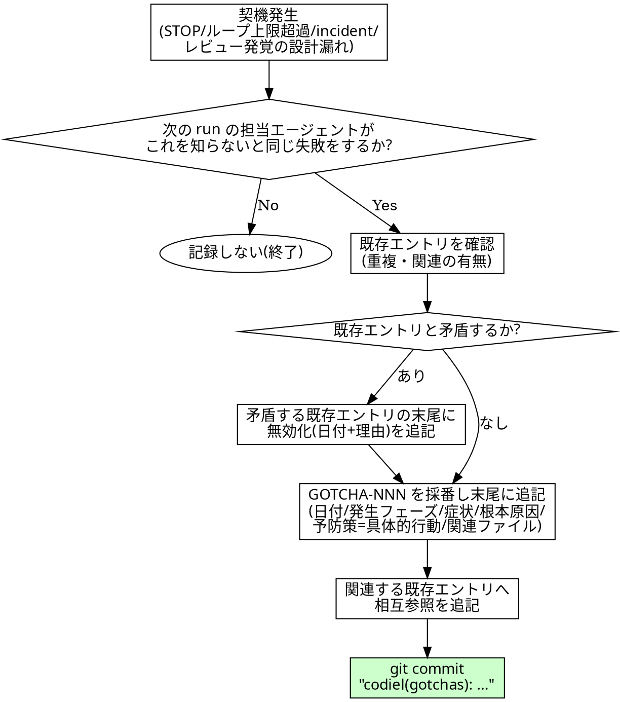

# GOTCHAS 追記運用規約

## 概要

Codiel は 2 つの記憶で「プロジェクト毎に賢くなる」。Raguel の判例ストアは**判定側の記憶**(次の
evaluate をどう判定するか)を、`docs/GOTCHAS.md` は**生成側の記憶**(次の実装・設計をどう書くか)を
賢くする。本スキルは後者、失敗を資産化して GOTCHAS.md に追記する手順を定める。実行者は
オーケストレーター本体であり、サブエージェントへのディスパッチは発生しない。

GOTCHAS.md は全フェーズのサブエージェントが作業前に必読する共有資産である。記録を怠れば同じ
プロジェクト固有の罠に次の run が再度落ちる。逆に何でも書けば台帳が肥大化しシグナルが埋もれる。
だからこそ次節の判断フローで「書くべきか」を厳密に絞る。

## 記録基準の判断フロー

判断は 1 問だけ。「次の run の担当エージェントがこれを知らないと同じ失敗をするか?」が **Yes の
ときのみ記録する**。No なら書かない。一般的な AI の失敗パターン(判例ストアの領分)や、その場限りの
凡ミスは対象外。

**記録する例:**

- 「このプロジェクトの ORM は `softDelete()` を持たず、実際は `deletedAt` カラムへの `update` で
  論理削除する」→ プロジェクト固有のスキーマ知識であり、次に論理削除を実装するエージェントは
  同じ幻覚 API を書く可能性が高い。
- 「E2E ケースが `TZ=Asia/Tokyo` 前提で書かれており、CI の UTC 実行だと日付境界がずれる」→
  このプロジェクトのテスト実行環境に固有の落とし穴で、次に日時を扱うケースを書くエージェントが
  再び踏む。
- 「design.md でマルチテナント分離の要件が漏れており、実装後のレビューで発覚した」→
  このプロジェクトの要件定義プロセスに再発しうる欠落パターン。

**記録しない例:**

- 「実装エージェントが一般的なタイポで変数名を間違えた」→ プロジェクト固有性がなく、次回も
  発生しうる保証がない一過性の凡ミス。TDD の RED フェーズで機械的に検出できる。
- 「AI がテストを書かずに実装だけ進めようとした」→ Codiel のハーネス自体(TDD 強制・Raguel ゲート)
  が対処すべき一般的な AI の失敗傾向であり、Raguel の判例ストア(`common/*` ルール)の領分。
**境界例(一般的失敗とプロジェクト固有情報が混ざるケース):**

- 「型を確認せず存在しないメソッドを呼んだ」という失敗**そのもの**は一般的な AI の失敗傾向であり
  記録しない。しかし「**このプロジェクトの ORM のこのバージョンには**そのメソッドが存在しない」
  という事実はプロジェクト固有情報であり、その部分だけを切り出して記録する(GOTCHAS.example.md の
  GOTCHA-001 が同型の実例)。判断が割れる場合は「次回同じプロジェクトファイルを触るエージェントへの
  手がかりになるか」で判定する。

## チェックリスト

1. 起点イベントの種別を確認する(次節「記録の契機と担当」)。
2. `docs/GOTCHAS.md` の既存エントリを読み、上記の判断フローで「記録する」に該当するか判定する。
   該当しなければここで終了し、追記しない(判断結果は run の記録に残してよいが GOTCHAS.md へは
   書かない)。
3. 既存エントリの最大 `GOTCHA-NNN` を確認し、連番を +1 して採番する。
4. エントリ書式(`docs/GOTCHAS.example.md` 冒頭の定義に準拠)で末尾に追記する。

```markdown
## GOTCHA-NNN: <一行要約>
- **日付**: <YYYY-MM-DD>
- **発生フェーズ**: <init/design/.../fix-loop のいずれか、または incident 申告時は `outcome`>
- **症状**: <何が起きたか>
- **根本原因**: <なぜ起きたか>
- **予防策**: <次回どうすれば防げるか(具体的な手順・チェック)>
- **関連ファイル**: `src/...`
```

**予防策は「気をつける」のような精神論を禁止し、次のエージェントがそのまま実行できる行動に
落とす**。

- 悪い例: 「Prisma の API 名に注意する」
- 良い例: 「実装前に `node_modules/.prisma/client/index.d.ts` を Read し、実在するメソッド名で
  あることを確認してから実装する」

5. 既存エントリに関連するものがあれば、新エントリの末尾に相互参照(`関連: GOTCHA-00X`)を追記する。
6. 新エントリが既存の古いエントリと矛盾する場合(例: 以前の予防策がもう有効でない設計変更が
   入った)、古いエントリは削除・書き換えせず、その末尾に無効化の追記を行う。

```markdown
- **無効化(2026-07-08)**: <理由>。GOTCHA-0NN を参照。
```

7. `docs/GOTCHAS.md` を `git add` し、`codiel(gotchas): <一行要約> (issue-N try-M)` の形式で
   コミットする(他フェーズのコミット規約と同じく runId/try サフィックスを付け、どの run で
   得た教訓かを追跡可能にする。run 外の incident 申告時など run が特定できない場合のみ省略可)。

## 記録の契機と担当

| 契機 | 担当 |
|---|---|
| Raguel が `STOP` verdict を出した | `raguel-gating` の STOP 手順から本スキルが起動され、オーケストレーターが直接追記する(最も学習価値が高い失敗)。 |
| test-loop / fix-loop がループ上限超過(`record-attempt` exit 3)で `ASK` に倒れた | 人間の裁定(中止)が確定した時点でオーケストレーターが本スキルを起動する。 |
| `mcp__raguel__record_outcome(outcome: "incident")` が記録された | incident 記録と同時にオーケストレーターが本スキルで追記する(発生フェーズは `outcome`)。 |
| レビューで設計時に想定していなかった仕様漏れ・考慮漏れが発覚した | fix-loop 完了時にオーケストレーターが「これは次回も再発しうるプロジェクト固有の漏れか」を判定し、該当すれば追記する。 |

<HARD-GATE>
- **エントリの削除・改変禁止(追記のみ)**。既存の `GOTCHA-NNN` ブロックの本文を書き換える、
  または削除することは一切禁止。矛盾が判明した場合も「無効化」の追記で対応し、履歴は必ず残す。
</HARD-GATE>

## Red Flags(合理化への反論)

| 思考 | 現実 |
|---|---|
| 「恥ずかしい失敗なので記録したくない」 | GOTCHAS.md は次の run のための資産であり、恥の有無は記録可否と無関係。記録しなければ次の run が同じ失敗を再演する。 |
| 「たぶん二度と起きない」 | 「たぶん」は判断フローの Yes/No 判定を回避する推測。プロジェクト固有の罠は担当エージェントが変わっても環境・スキーマ・慣習が変わらない限り再発しうる。 |
| 「STOP の原因は自分の判断ミスだから記録は不要」 | STOP は最も学習価値の高い失敗であり、原因が判断ミスであっても「次回同じ判断をしないための手がかり」として記録する契機に該当する。 |
| 「一般的な AI の失敗だから書いておけば安全」 | 一般則は Raguel の判例ストアの領分。プロジェクト固有性のない教訓を書き足すと台帳が肥大化し、本当に固有のシグナルが埋もれる。判断フローの 1 問に必ず立ち返る。 |
| 「予防策は『注意する』でも書けば形式は満たせる」 | 精神論の予防策は次のエージェントが実行できる手順にならず、再発防止効果がない。「〜する前に〜を確認する」の形に必ず落とす。 |
| 「矛盾する古いエントリは消して書き直した方が読みやすい」 | 削除・改変は禁止(HARD-GATE)。矛盾は「無効化」の追記で扱い、判断の変遷自体を履歴として残す。 |

## プロセスフローチャート


