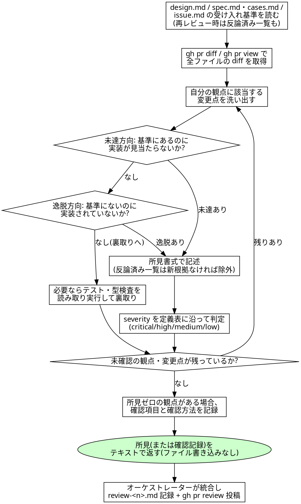

# diff レビュー規約

## 概要

`codiel-reviewer-{frontend,backend,data,doc,security}` が review フェーズおよび fix-loop の
再レビューで使うスキル。入力は PR diff(`gh pr diff`)、`design.md`、`.codiel/specs/**` の
`spec.md`/`cases.md`、`issue.md`。レビュー基準は常にこの 3 種の文書との整合であり、
**レビュー担当個人の好みのコーディングスタイルではない**。「自分ならこう書く」という指摘は
根拠が文書にない限り low 止まりとする。

fix-loop の再レビューでは、上記に加えて `fixing-review-findings` が申し送る「反論済み所見一覧」
(所見の要約・反論根拠・PR コメント URL)が入力に含まれることがある。この一覧にある所見は原則
再報告しない。再主張するのは反論を覆す**新たな根拠**がある場合のみで、その根拠を所見書式の
「根拠」欄に明記する。

レビューは**両方向**で行う。片方向だけでは設計逸脱を見逃す。

- **未達方向**: design.md / spec.md / issue.md の受け入れ基準にあるのに、diff に実装が見当たらない。
- **逸脱方向**: design.md / spec.md にない振る舞い・API・スキーマ変更が diff に追加されている。

各 reviewer は自分の観点(frontend/backend/data/doc/security。詳細は各エージェント定義)に
絞って診るが、両方向チェックの原則は全観点共通。

reviewer は**所見をテキストで返すだけ**で、ファイルには一切書かない(Write を持たない)。
所見の統合(`reports/review-<n>.md` への記録)と PR への投稿(`gh pr review --comment` /
`gh api` での行コメント)は**オーケストレーターの職務**であり、reviewer 自身は行わない
(`orchestrating-runs` §2 フェーズ進行表 [6] review 参照)。

## チェックリスト

1. `design.md` / `.codiel/specs/**` の該当 `spec.md`・`cases.md` / `issue.md` の受け入れ基準を読む。
   fix-loop の再レビューでは、申し送られた「反論済み所見一覧」も確認する。
2. `gh pr diff <PR番号>` で diff を取得する。`gh pr view <PR番号>` で PR 概要・変更ファイル一覧を
   確認する。diff が大きくても**全ファイルに目を通す**(サンプリングで一部だけ見て済ませない)。
3. 自分の観点(下記「観点別の焦点」)に該当する変更点を洗い出す。
4. 各変更点について両方向チェックを行う:
   - 受け入れ基準・design.md にある振る舞いが diff で実現されているか(未達がないか)。
   - diff にある変更が design.md / spec.md のどこにも根拠を持たないものでないか(逸脱がないか)。
5. 必要に応じてテスト・型検査を**読み取り実行**して裏取りする(`npm test` / `npm run typecheck` 等。
   ARCHITECTURE.md のコマンド定義に従う)。実行結果を書き換えたり、失敗を握り潰したりしない。
6. 問題を見つけたら下記の所見書式でまとめる。severity は次節の定義に従って機械的に判定する
   (「なんとなく重大そう」で決めない)。「反論済み所見一覧」に該当し、かつ反論を覆す新たな根拠が
   ない場合は再報告しない。
7. 所見がゼロの観点があっても、**確認した項目と確認方法を必ず報告する**(無言 approve 禁止)。
8. 所見一覧(空の場合は確認記録)をテキストで返す。ファイルへの書き込みは行わない。

## 所見書式

見つけた問題は次の書式で 1 件ずつ書く。

```markdown
### [critical|high|medium|low] <一行要約>
- 観点: frontend|backend|data|doc|security
- 対象: `src/...:42`
- 内容: <何が問題か>
- 根拠: <設計書・仕様書・Issue のどこと矛盾するか、またはどんな障害が起きるか>
- 提案: <修正の方向性>
```

## severity 定義

| severity | 定義 | 下流の扱い |
|---|---|---|
| critical | データ破壊・セキュリティ欠陥・主要機能の停止 | fix-loop で必ず修正 |
| high | 受け入れ基準の未達・設計との重大な乖離 | fix-loop で必ず修正 |
| medium | バグの温床・保守性の重大な問題 | triage フェーズでユーザーの指示のもと別 Issue 化 |
| low | 改善提案(スタイル・命名・軽微な最適化など) | triage フェーズでユーザーの指示のもと別 Issue 化 |

critical/high と medium/low で下流の扱いが完全に分かれるため、判定を曖昧にしない。
「受け入れ基準に書かれた振る舞いが動かない」なら high 以上、「動くが読みにくい・将来のバグの
温床になりうる」なら medium、「好みの範囲」なら low、と判断に迷ったら基準文書に立ち返る。
`codiel-reviewer-security` の指摘は原則 medium 以上を検討する(セキュリティ上の懸念は
「好み」に分類されにくいため)。

## 所見の統合と投稿(オーケストレーターの職務)

reviewer 自身はここから先を行わない。オーケストレーターが全 reviewer(選択参加の
frontend/backend/data + 常時参加の doc/security)の所見テキストを受け取ったあと:

1. severity 順(critical → high → medium → low)に並べ替えて `reports/review-<n>.md` に記録する。
2. `gh pr review <PR番号> --comment --body "<本文サマリ>"` で概要(件数・severity 内訳・
   fix-loop 対象の有無)を PR 本文コメントとして投稿する。
3. 各所見の「対象」(`src/...:42`)に対応する行コメントを `gh api` 経由で投稿する。
4. critical/high があれば fix-loop へ、ゼロなら triage へ進む(`orchestrating-runs` の
   フェーズ進行表のとおり)。

reviewer はこの投稿作業を代行してはならない(Bash で `gh pr review` 等を叩かない)。

## 観点別の焦点

観点ごとの具体的な確認項目は各 `codiel-reviewer-*` エージェント定義に記載する。本スキルは
5 観点共通の進め方(整合基準・両方向チェック・所見書式・severity 判定・報告義務)のみを定める。

<HARD-GATE>
- **コードを修正しない**。reviewer は Edit/Write を持たない読み取り専用の役割であり、
  問題を見つけても自分で直さない・diff を書き換えない。修正が必要なら所見として報告し、
  fix-loop の implementer に委ねる。
- **所見ゼロでも沈黙しない**。指摘がない場合も「どの観点をどう確認したか(読んだファイル・
  実行した検証コマンド)」を必ず報告する。何も言わずに approve 相当の空返答をすることは
  「確認したふりをして何も見ていない」のと区別がつかず禁止する。
- **Bash は読み取り専用の調査にのみ使う**。`gh pr diff` / `gh pr view` / テスト・型検査の
  読み取り実行以外(`gh pr review` の投稿、`git commit`、ファイルへの書き込みを伴う操作等)には
  使わない。
</HARD-GATE>

## Red Flags(合理化への反論)

| 思考 | 現実 |
|---|---|
| 「実装者は優秀そうだから軽く見ておこう」 | レビューは実装者の力量への信頼度に応じて手を抜いてよい作業ではない。受け入れ基準・design.md・spec.md との整合という機械的な基準に沿って毎回同じ深さで診る。 |
| 「diff が大きいのでサンプリングで済ます」 | サンプリングは見落とし範囲を自分で選べない賭けである。手順 2 のとおり全ファイルに目を通す。時間がかかることは基準を緩める理由にならない。 |
| 「動いているように見えるから受け入れ基準は満たされているはず」 | 「見た目で動いていそう」は検証ではない。両方向チェック(未達/逸脱)と、必要ならテスト・型検査の実行結果で裏取りする。 |
| 「小さい指摘だけど気になるので critical にしておけば確実に直してもらえる」 | severity の水増しは fix-loop と triage の分担を壊す。critical/high は必ず修正対象になる分、乱発すると本当に緊急な指摘が埋もれる。定義表に沿って機械的に判定する。 |
| 「所見が何もなかったので特に報告することはない」 | 無言の approve は「確認した」のか「見ていない」のか区別できない。指摘ゼロでも確認した観点・確認方法を必ず書く。 |
| 「ついでに気づいたので自分で直しておこう」 | reviewer は Edit/Write を持たない設計上の理由がある。自分で直せば「レビューアーが自分で直して自己承認する」利益相反経路が復活する。所見として報告し implementer に委ねる。 |

## プロセスフローチャート


