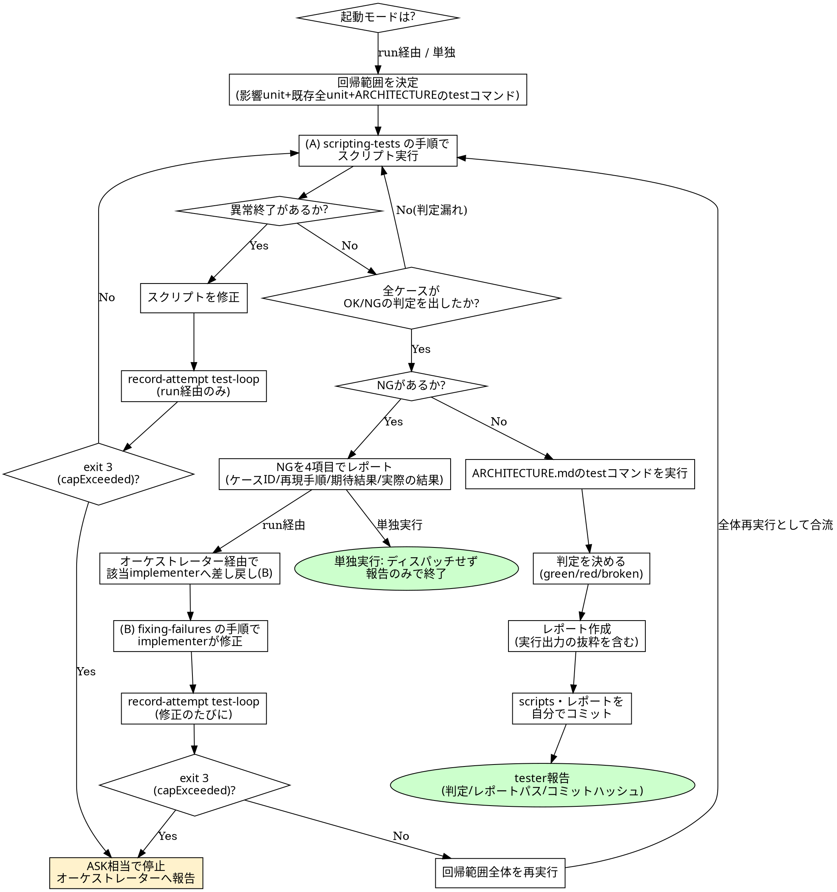

# 回帰テスト運転規約

## 概要

`codiel-tester` が test-loop フェーズおよび `/codiel:test`(単独実行)で使うスキル。
`docs/DESIGN.md` §5 が定める二段ループ ── (A) スクリプト安定化ループ(`scripting-tests` が
詳細を定める)と (B) TDD 修正ループ(`fixing-failures` が詳細を定める)── の**運転規約**
(回帰範囲の決定・試行回数の記録・レポート書式・(A)→(B) の切り替えタイミング)を定める。
個別の作業手順は `scripting-tests` / `fixing-failures` に委譲し、二重記述はしない。

## プラグインルート参照規約

このスキル起動時に通知される「Base directory for this skill」は
`<plugin-root>/skills/running-regression-tests` である。**`<plugin-root>` はそのベース
ディレクトリの 2 階層上**。`codiel-state` は対象プロジェクトのルートで次の形で呼ぶ:

```
node <plugin-root>/scripts/codiel-state.mjs <command> [引数...] --issue <番号>
```

## 2 つの起動モード

- **run 経由(test-loop フェーズ)**: `orchestrating-runs` からディスパッチ。state 遷移・
  `record-attempt`・NG のディスパッチ差し戻しをすべて行う。
- **単独実行モード(`/codiel:test`)**: run の有無に関係なく実行できる。**state 遷移・
  `record-attempt` は行わない**。NG があってもディスパッチせず報告のみ。レポート先は
  `.codiel/reports/test-run-<ISO日時>.md`(run 経由は `runs/<runId>/reports/test-run-<n>.md`)。

以降のチェックリストは run 経由を基準に書く。単独実行モードとの差分は都度注記する。

## 回帰範囲の決定

回帰テストの対象は次の 3 つの合算(単独実行で unit-id 指定があればその unit のみに絞る)。
「今回変更した unit だけで十分」という自己判断での絞り込みは行わない
(既存資産は run を重ねるたびに厚くなる。`docs/DESIGN.md` §4)。

1. design.md が列挙した**影響 unit**の E2E ケース全件(`.codiel/specs/<unit-id>/cases.md`)。
2. `.codiel/specs/` 配下に既に存在する**既存全 unit**の E2E ケース全件。
3. `docs/ARCHITECTURE.md` の「コマンド定義」節に列挙された test コマンド(ユニットテスト等)。

## チェックリスト

1. 起動モード(run 経由 / 単独実行)を確認し、対象 unit(影響 unit + 既存全 unit、単独実行で
   引数指定があればその unit のみ)を確定する。
2. `docs/ARCHITECTURE.md` の「コマンド定義」節を読み、ユニットテスト等の実行コマンドを確認する。
3. **(A) スクリプト安定化ループ**: `scripting-tests` の手順に従い、対象 unit すべてのスクリプトを
   実行する。異常終了(判定が出ないケース)があればスクリプトを修正して再実行する。
   run 経由の場合、**修正して再実行するたびに** 実行者自身の Bash で
   `node <plugin-root>/scripts/codiel-state.mjs record-attempt test-loop --issue N` を呼ぶ。
   `exit code 3`(`capExceeded: true`)なら、それ以上の修正を続けず ASK 相当としてその場で止まり
   raguel-gating の ASK ハンドリングに合流させるためオーケストレーターへ報告する(「あと 1 回だけ」と
   自己判断で続行しない)。単独実行モードでは `record-attempt` を呼ばない。
4. 対象 unit の全ケースが OK/NG いずれかの判定を出すまで 3 を繰り返す。
5. 全ケースが判定を出したら NG の有無を確認する。NG がなければ手順 7 へ。
   **NG があれば (B) TDD 修正ループへ**: NG ケースごとに「ケース ID・再現手順・期待結果
   (`cases.md` の記載)・実際の結果(実行出力の抜粋)」の 4 項目でレポートする(`scripting-tests`
   が定める入力契約)。run 経由ならオーケストレーター経由で該当ドメインの implementer へ差し戻す。
   **単独実行モードではディスパッチせず、NG のまま報告して終了する**。
6. (run 経由のみ)implementer が `fixing-failures` の手順で修正し返してきたら、**回帰範囲全体
   (手順 1 の対象 unit すべて)を再実行する**(修正対象の unit だけを再実行しない)。実行者自身の
   Bash で修正のたびに `record-attempt test-loop --issue N` を呼び、`exit 3` なら手順 3 と同様に
   ASK 相当として止める。全ケース OK になるまで手順 3〜6 を繰り返す。
7. `docs/ARCHITECTURE.md` の「コマンド定義」節のユニットテストコマンドを実行し、結果(pass/fail の
   件数、失敗があれば出力抜粋)を控える。
8. 判定(`green` / `red` / `broken`)を決める(下記「判定基準」)。
9. レポート(下記書式)を作成し実際の実行出力の抜粋を転記する。run 経由なら
   `runs/<runId>/reports/test-run-<n>.md`、単独実行なら `.codiel/reports/test-run-<ISO日時>.md`。
10. 自分の変更(scripts・レポート)を `scripting-tests` のコミット規約に従いコミットする。

## 判定基準

- **green**: 全ケース OK かつ、ARCHITECTURE.md のユニットテストコマンドも全て成功。
- **red**: 全ケースが OK/NG いずれかの判定を出しており(= (A) は完了している)、1 件以上 NG が残っている、
  またはユニットテストに失敗がある。
- **broken**: 判定が出ないケース(異常終了)が 1 件でも残っている状態。green/red のいずれとも判定できない。

## レポート書式(`test-run-<n>.md` / `test-run-<ISO日時>.md`)

```markdown
## サマリ

- OK: <件数> / NG: <件数> / 異常終了(broken): <件数>
- ユニットテスト: <pass 件数> pass / <fail 件数> fail

## ケース別結果

### <ケース ID>: <判定 OK|NG|broken>

<OK の場合は実行出力の抜粋のみ。NG の場合は次の 4 項目を必須で書く>
- 再現手順: <手順>
- 期待結果: <cases.md の記載>
- 実際の結果: <実行出力の抜粋>

<broken の場合は「判定不能(ASK)」とその理由を書く>

## ユニットテスト結果

<ARCHITECTURE.md のコマンド定義に列挙された test コマンドの実行結果。失敗があれば出力抜粋>

## 判定

<green | red | broken>
```

## HARD-GATE

<HARD-GATE>
- **出力を見ずに合格を主張しない**。レポートの各ケースには実際の実行出力の抜粋を必ず含める。
  「全部通ったはず」という推測でレポートを書くことは捏造と同じであり許されない。
- **異常終了(broken)と NG(red)を混同しない**。判定が出ない(broken)ケースを「NG 扱いで報告して
  終わり」にしたり、逆に NG を「スクリプトの問題」として broken に押し込めて実装修正を回避したり
  してはならない。判断がつかない場合は `scripting-tests` に従い ASK として報告する。
- 単独実行モードでは NG があってもコード修正をディスパッチしない。報告のみで終了する。
</HARD-GATE>

## Red Flags(合理化への反論)

| 思考 | 現実 |
|---|---|
| 「今回変更した unit だけ実行すれば十分、既存 unit は多分壊れていない」 | 「多分」は回帰テストが排除したい推測そのもの。既存 unit のスクリプトが資産として残っているのは、まさにこの手の劣化を検出するためであり、範囲を自己判断で狭めてはならない。 |
| 「flaky なので 2 回目で通ったら OK 扱いにしよう」 | 2 回目にたまたま通った結果を採用するのはフレークの隠蔽。`scripting-tests` の安定化とは毎回同じ判定が出る状態を作ることであり、都合の良い 1 回の採用ではない。 |
| 「ユニットテストは implement フェーズで通したから回帰では省略していい」 | 回帰範囲は「影響 unit + 既存全 unit の E2E + ARCHITECTURE.md の test コマンド」の合算であり、直近で通したことは省略の理由にならない。デグレは今回の変更が既存機能に及ぼした副作用を検出するためにこそ存在する。 |
| 「NG は 1 件だけだしレポートの 4 項目のうち再現手順は省略していいだろう」 | 4 項目は implementer への入力契約(`scripting-tests`)であり、1 つでも欠けると再現できず修正がディスパッチできない。件数の多寡は簡略化の理由にならない。 |
| 「record-attempt は面倒だから修正をまとめてから 1 回だけ呼ぼう」 | 試行上限は暴走的な無限修正ループを止めるための仕組み。まとめて呼ぶと実際の試行回数と記録がずれ、上限超過の検知が機能しなくなる。修正のたびに呼ぶ。 |
| 「broken か NG か迷うが、たぶん NG だろうから implementer に投げよう」 | 判断がつかないものを NG として投げると implementer は再現できないバグ修正を強いられ、逆にスクリプトの欠陥を implementer が誤ってコード側で「回避」してしまう危険がある。迷ったら ASK として報告する。 |

## プロセスフローチャート


