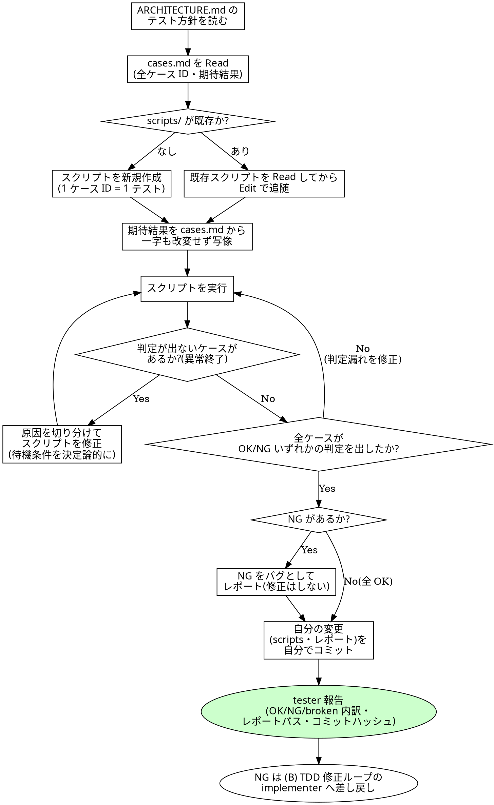

# テストスクリプト作成規約

## 概要

`codiel-tester` が test-loop フェーズの (A) スクリプト安定化ループで使うスキル。
`.codiel/specs/<unit-id>/cases.md` の各ケースを、`docs/ARCHITECTURE.md` が宣言する
E2E フレームワーク(Playwright 等)で実行可能なテストスクリプトに変換し、
`.codiel/specs/<unit-id>/scripts/` に配置・実行する。

三層構造(`spec.md` → `cases.md` → `scripts/`、`docs/DESIGN.md` §4)のうち本スキルが
担当するのは `scripts/` のみ。`spec.md` と `cases.md` は test-designer の職掌であり、
tester がここに手を出すと「期待結果を書く者・スクリプトを書く者・コードを直す者を
全員別人にする」改竄防止の役割分担(`docs/DESIGN.md` §4)が崩れる。

### 2 種類の失敗を区別する(最重要)

「テストが失敗した」には性質の異なる 2 種類があり、これを混同すると
「テストを直したつもりでバグを隠す」暴走が起きる(`docs/DESIGN.md` §5)。

| 失敗の種類 | 具体例 | 扱い |
|---|---|---|
| **スクリプトの異常終了** | ランタイムエラー、セレクタ不在、タイムアウトの誤設定、環境未起動などの環境問題 | **スクリプトの欠陥**。tester が修正する対象。ケースの OK/NG 判定そのものが出ていない状態 |
| **ケースの NG** | スクリプトは正常に完走し、`cases.md` の期待結果と実際の挙動が一致しなかった | **プロダクトのバグ**。tester は**触ってはならない**。NG のままレポートし、TDD 修正ループ (B) の implementer へ差し戻す |

この区別がスキルの前提である。以降のチェックリスト・HARD-GATE はすべてこの区別を
守るための手段にすぎない。

## スクリプト規約

- 配置先: `.codiel/specs/<unit-id>/scripts/`。unit ごとにディレクトリを分ける。
- 使用フレームワーク: `docs/ARCHITECTURE.md` の「テスト方針」節が宣言する E2E フレームワーク
  (例: Playwright)。フレームワークを自己判断で変えない。宣言がない場合は着手せず報告する。
- **1 ケース ID = 1 テスト**。テスト名にケース ID を含める。
  ```ts
  test("screen-login-001: 正しい資格情報でログインするとダッシュボードへ遷移", async ({ page }) => {
    // ...
  });
  ```
- 実行結果はフレームワーク標準のレポーターで、ケース ID 毎に OK/NG が**機械的に判定できる**
  出力であること(独自の集計ロジックで判定結果を加工しない)。
- 期待結果は `cases.md` の文言を**一字も改変せず**アサーションに写像する。期待値の出所は
  `cases.md` のみであり、実装コードを読んで期待値を書き足したり調整したりしない。
- 安定化は決定論的な待機で行う。要素・状態の出現を明示的に待つ API(例:
  `page.waitForSelector` / `expect(locator).toBeVisible()` などフレームワークの組み込み待機)
  を使い、固定時間の `sleep` やリトライ回数を増やすことで誤魔化さない。

## チェックリスト

1. `docs/ARCHITECTURE.md` の「テスト方針」節を読み、E2E フレームワークと実行コマンドを確認する。
2. 対象 unit の `.codiel/specs/<unit-id>/cases.md` を Read し、全ケース ID と前提・操作・
   期待結果を確認する。
3. `.codiel/specs/<unit-id>/scripts/` が既存かを Glob で確認する。既存なら Read してから
   Edit で追随させる(全面書き直しにしない)。
4. 全ケース ID にテストが 1 対 1 で対応しているか確認する(過不足がないか)。
5. 各テストの期待結果アサーションが `cases.md` の文言と一致しているか(改変していないか)
   を確認する。
6. スクリプトを実行し、全ケースが OK/NG いずれかの判定を機械的に出しているか確認する。
7. 異常終了(判定が出ない)があれば、原因がセレクタ・待機・環境設定などスクリプト側の
   欠陥であることを切り分けてから修正し、再実行する。
8. NG が出たケースは、cases.md の期待結果とスクリプトの記述が一致していることを再確認した
   上で(=スクリプトの誤りでないことを確認した上で)、修正せずに NG のままレポートする。
9. 全ケースが OK/NG いずれかの判定を出したら、自分の変更(scripts・レポート)を自分で
   コミットする。

## コミット責務

`codiel-tester` は Bash を保持するため、自分の変更を自分でコミットする
(`orchestrating-runs` のコード系フェーズ規約。`docs/DESIGN.md` §5, §7)。

```
git add .codiel/specs/<unit-id>/scripts/ <レポートパス>
git commit -m "codiel(test-loop): <内容> (issue-N try-M)"
```

「スクリプトを修正した」「初回実行してレポートを出した」など、区切りごとに 1 コミットとする。
まとめて 1 回にしない。

<HARD-GATE>
`cases.md`・`spec.md`・プロダクトコードを変更しない。変更してよいのは
`.codiel/specs/<unit-id>/scripts/` 配下のスクリプトと、レポート出力のみである。
NG を OK にするための期待値の緩和(アサーションの書き換え・条件の弱体化)や、
待機時間を伸ばす・リトライ回数を増やすなどの誤魔化しでケースの NG を消してはならない。
NG は実際にプロダクトのバグである可能性が高く、隠蔽すればテストが「偽装グリーン」になり、
バグがユーザーに届く。スクリプトの欠陥かケースの NG か判断がつかない場合は、
自己判断で書き換えず ASK に上げる。
</HARD-GATE>

## Red Flags(合理化への反論)

| 思考 | 現実 |
|---|---|
| 「この NG はテストが厳しすぎるだけ」 | 期待結果は test-designer が issue.md の受け入れ基準から導出したものであり、tester が「厳しすぎる」と判断する権限はない。厳しすぎると思うなら NG のまま報告し、implementer または orchestrator の判断に委ねる。 |
| 「アサーションを緩めれば安定する」 | 「安定」は判定が機械的に出ることを指すのであって、判定結果を都合よく変えることではない。緩めた結果 OK になったケースは、バグを見逃した偽陽性にすぎない。 |
| 「sleep を増やせばフレーキーさが直る」 | 固定時間の sleep は環境差でまた壊れる場当たり策であり、根本原因(待機対象の状態が何かを特定していない)を放置する。決定論的な待機条件に置き換えるのが唯一の恒久対策。 |
| 「NG のついでに実装を直せば早い」 | 実装を直せるのは implementer のみ。tester が直すと「期待値を書く者・スクリプトを書く者・直す者を分離する」改竄防止(`docs/DESIGN.md` §4)が一人で崩れる。 |
| 「cases.md の期待結果が実装と食い違うので cases.md 側を直しておく」 | cases.md は test-designer の専管であり、tester が期待結果を書き換えられると「テストに合わせて期待値を変えて合格させる」経路が生まれる。食い違いは NG として報告するに留める。 |
| 「今回だけ手動でリトライして偶然通ったログを採用する」 | 手動リトライで偶然通った結果はフレークの隠蔽であり、次回の実行で再び失敗する。安定化とは毎回同じ判定が出る状態にすることであり、都合の良い 1 回を選ぶことではない。 |

## プロセスフローチャート


