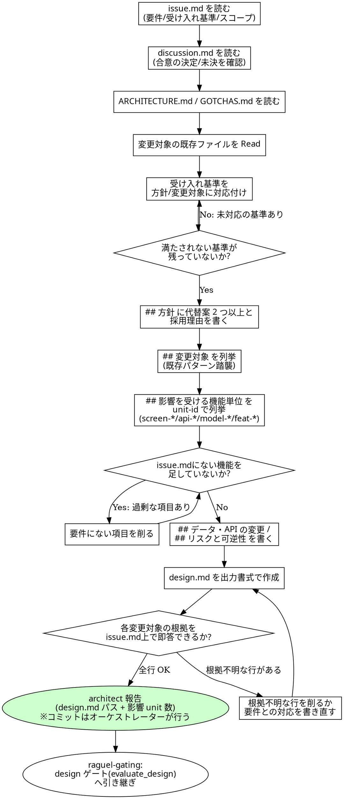

# 設計書執筆規約

## 概要

`codiel-architect` が design フェーズで使うスキル。`issue.md`(要件・受け入れ基準・スコープ)と
`discussion.md`(discuss フェーズでユーザーと合意した決定の記録)、
`docs/ARCHITECTURE.md`・`docs/GOTCHAS.md` を入力に、変更方針・変更対象・影響を受ける機能単位を
`design.md` として構造化する。

`design.md` は test-spec / dev-plan の両フェーズが**並列で読む唯一の設計スナップショット**であり、
とりわけ「## 影響を受ける機能単位」は test-spec フェーズがこのリストを読んで
`.codiel/specs/<unit-id>/` を新規作成・更新する際の入力になる。ここで設計を誤ったり影響 unit を
漏らすと、その誤りはテスト仕様書の漏れ・実装漏れとしてそのまま後続フェーズに伝播する。

本スキルの責務は「issue.md の要件を過不足なく設計に反映すること」と「既存コードのパターンを
踏襲すること」にある。コードを書くことではない。

## チェックリスト

1. `issue.md` の `## 要件` `## 受け入れ基準` `## スコープ` `## 非スコープ` を読む。
2. `discussion.md` の各論点(状態・決定・理由)を読む。**「状態: 決定」の論点は設計を拘束する**。
   「状態: 未決」の論点は、どの選択肢でも破綻しにくい設計を選び、その旨を `## 方針` に明記する。
3. `docs/ARCHITECTURE.md`(ドメインマップ・技術スタック)と `docs/GOTCHAS.md`(既知の落とし穴)を読む。
4. `## 変更対象` に挙げる既存ファイルは、設計を書く前に **Read で中身を確認する**(既存パターン踏襲)。
   読まずに「たぶんこう実装されているはず」で設計しない。
5. 受け入れ基準を一つずつ辿り、それぞれが `## 方針` `## 変更対象` のどの記述で満たされるかを
   対応付ける。満たされない基準が残っていないか確認する。
6. `## 方針` には代替案を**最低 2 つ**書き、採用理由・却下理由を明記する。単一案の正当化ではなく
   比較によって採用根拠を示す。採用案が `discussion.md` の決定に対応する場合は「discussion.md
   論点 N の決定に基づく」と出所を明記する。
7. `## 影響を受ける機能単位` に unit-id を列挙する。命名規則(`screen-*`/`api-*`/`model-*`/`feat-*`)
   の正式な定義は `writing-test-specs` スキルにある(本スキルはそれを前提に一覧を作るのみ)。
   この一覧は test-spec フェーズが `.codiel/specs/<unit-id>/` を作成・更新する入力になるため、
   既存 unit の流用か新規 unit かを判別できる粒度で書く。
8. YAGNI: `issue.md` に書かれていない要件・受け入れ基準にない機能を設計に追加しない。
   「ついでに直せる」「将来役立つ」は追加理由にならない。
9. 出力書式(下記)どおりに `design.md` を作成する。
10. 自己チェック: `## 変更対象` の各行について「issue.md のどの要件が根拠か」を即答できるか
    確認する。答えられない行は YAGNI 違反の疑いがあるため設計から外す。

## 出力書式

後続フェーズ全員が読む書式。見出し名・順序を変更せず、以下をそのまま使う。

```markdown
# design: <issue タイトル>

## 目的

<issue.md の要件から導出した、この変更が達成すべきこと>

## 方針

- 案A: <概要> — 採用/却下。理由: <...>
- 案B: <概要> — 採用/却下。理由: <...>

採用案: <A or B> 。理由: <比較に基づく採用根拠>

## 変更対象

- `<既存/新規ファイルパス>` — <変更内容の概要>

## 影響を受ける機能単位

- `screen-xxx` — <影響内容>
- `api-xxx` — <影響内容>

## データ・API の変更

- <スキーマ変更・エンドポイント変更・後方互換性への影響。なければ「なし」>

## リスクと可逆性

- <想定リスクと、問題が起きた場合に元に戻せるか・どう戻すか>
```

## 既存パターン踏襲

`## 変更対象` に挙げるファイルは、変更前の状態を Read で確認してから設計する。既存の命名規則・
レイヤー分け・エラーハンドリング方式を無視した設計は、implementer に「設計書どおりに実装したら
既存コードと様式が食い違う」という板挟みを生む。既存パターンと衝突する設計を出す場合は、
なぜ既存パターンから逸脱するのかを `## 方針` に明記する。

## unit-id と test-spec フェーズへの接続

`## 影響を受ける機能単位` は一覧を作って終わりではない。test-spec フェーズはこのリストを
そのまま走査し、各 unit-id について `.codiel/specs/<unit-id>/spec.md` を新規作成または更新する。
ここで unit を一つでも漏らすと、その機能単位は spec.md が更新されないまま実装が進み、
回帰テストの対象からも漏れる。既存の `.codiel/specs/` にある unit と重複しないか、
新規 unit なら命名規則(正式な定義は `writing-test-specs` スキル)に沿っているかを
列挙時に確認する。

## コミット責務

`codiel-architect` は Bash を持たないため `design.md` を自らコミットする手段がない。
`orchestrating-runs` の成果物コミット規約により、design フェーズの成果物は Raguel の
`evaluate_design` ゲート通過直後にオーケストレーター自身がコミットする。architect は
`design.md` を書いて報告するところまでが職務。

<HARD-GATE>
コードを書かない・変更しない。`design.md` のみが成果物である。`codiel-architect` には Edit も
Bash も与えられておらず、これは権限設計上の裏付けであって偶然の制約ではない
(`docs/DESIGN.md` §7 参照)。ツールに Edit や Bash が見えたとしても、それは他フェーズ用の
定義を誤って読んでいる可能性が高く、design フェーズで使ってはならない。
`discussion.md` の「状態: 決定」の論点を黙って覆さない。合意から逸脱する必要があると
判断した場合は、逸脱した設計を書かず、`## 方針` に「discussion.md 論点 N の決定と衝突する
事実と理由」を再協議事項として明記し、報告時にその旨を伝える(ウォークスルーで
オーケストレーターがユーザーに再提示する)。
</HARD-GATE>

## Red Flags(合理化への反論)

| 思考 | 現実 |
|---|---|
| 「変更対象のファイルは名前から中身が想像つくので Read しなくてよい」 | 想像は既存の命名規則・実装パターンを裏切ることが多い。Read せずに設計すると、implementer が設計書どおりに書いた結果、既存コードと様式が食い違う手戻りが発生する。 |
| 「代替案は 1 つで十分、これが明らかに正解」 | 「明らかに正解」は architect 個人の判断であり、比較の記録がなければ Raguel の `evaluate_design` も人間のレビューも採用根拠を検証できない。案が 1 つしかないなら、なぜ他の選択肢を検討しなかったかを書く。 |
| 「影響 unit は多めに書いておけば安全」 | 過剰な unit 列挙は test-spec フェーズに無関係な spec.md 更新を強い、issue.md にない範囲まで検証対象を広げてしまう。YAGNI は unit の列挙にも適用される。 |
| 「小さい修正くらいコード側も直しておいた方が早い」 | architect には Edit も Bash もない。コードに触れられる権限がないことは制約ではなく設計であり、design フェーズでコードを直せば implementer との責務分離(§7)が崩れ、レビュー・Raguel ゲートの前提が狂う。 |
| 「不明点があるが issue.md に書かれていないので推測で埋めて設計を進める」 | 推測は analyst が禁じたのと同じ理由で architect にも禁じられる。issue.md の `## 不明点` に残っている論点は、init ゲートで人間が裁定済みか、まだ裁定中かのいずれかであり、architect が代理で解消してはならない。 |
| 「合意は古い、コードを見たら別の設計が正しいと分かった」 | その発見はユーザーに返す情報であって architect が代理決定してよい理由ではない。`## 方針` に再協議事項として明記すれば、ウォークスルーが必ずユーザーに届ける。黙って覆すと discussion.md が監査記録として機能しなくなる。 |

## プロセスフローチャート


