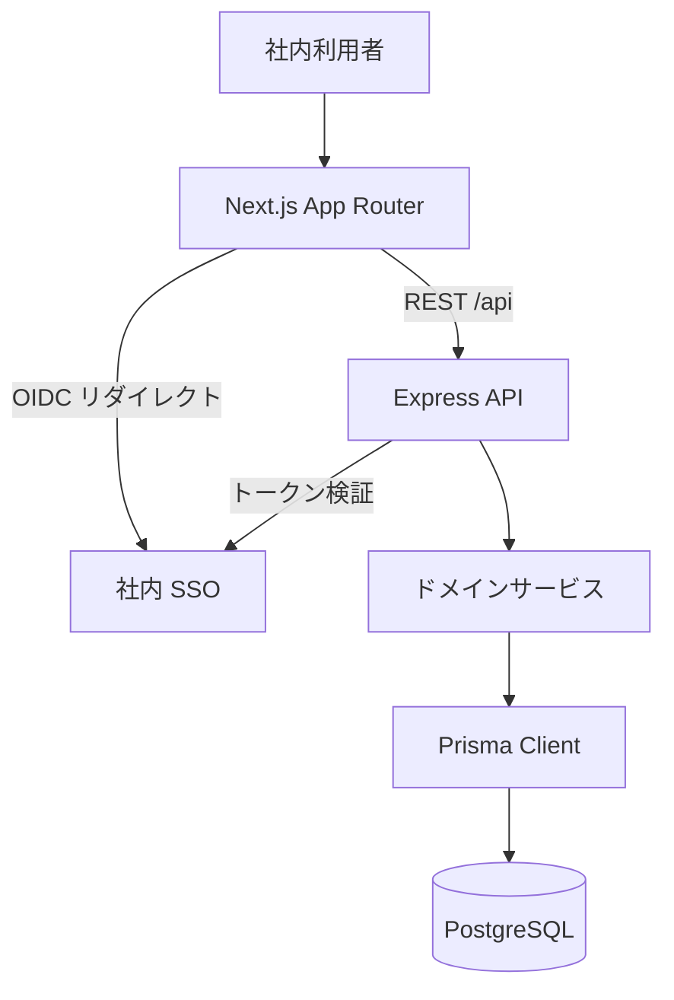

# ARCHITECTURE

## システム概要

<!-- 記入ガイド
このファイルは記入例である。内容は自分のプロジェクトの実態に置き換える。
見出しの名前と順序は固定されている。追加・改名・並べ替えを行わない。欠けているセクションがあってもよい。
この節には、プロジェクトの目的・利用者・主要な技術的制約を散文 1 段落で書く。
続けて全体アーキテクチャ図を Mermaid で置く。載せるのは全体像の把握に要る要素だけとし、
個々のクラス・関数・テーブルは載せない。図の構文は検証されない。
-->

社内チーム向けのタスク管理 Web アプリケーション「Tsukuyomi」。利用者は自社の従業員に限られ、
外部には公開しない。認証は社内 SSO(OIDC)に委ね、パスワードを自前で保持しない。
単一リポジトリで frontend / backend / data をディレクトリで分離しており、monorepo ツールは使わない。



## 技術スタック

<!-- 記入ガイド
言語・フレームワーク・主要ライブラリを表で並べ、各行にバージョン方針を書く。
併用を禁じるツールがあるときは、代わりに使うものを同じ行に併記する。
-->

| 区分 | 採用技術 | バージョン方針 |
| --- | --- | --- |
| 言語 | TypeScript | 5.x。`strict` を有効にする |
| フロントエンド | Next.js (App Router) | 14.x。メジャー更新は手動でのみ行う |
| バックエンド | Express | 4.x |
| ORM / データ層 | Prisma | 5.x。スキーマ変更は `prisma migrate` で行い、SQL を直接当てない |
| パッケージマネージャ | pnpm | 9.x。`npm` / `yarn` を併用せず、依存の追加も pnpm で行う |
| 主要ライブラリ | React 18 / Zod / TanStack Query | 追加するライブラリは `## 規約` の依存追加の条件を満たすこと |

## レイヤー構造

<!-- 記入ガイド
レイヤーを上から下へ列挙し、各レイヤーの責務を 1 行で書く。
依存の許される方向と禁止される方向の両方を書く。書かれていない方向を読み手に推測させない。
禁止は「〜しない」で終えず、代わりに取る手段を併記する。
-->

上から順に 4 層とする。

1. **UI 層**(`src/app` / `src/components`): 画面の描画とユーザー入力の受け取りを担う。
2. **API 層**(`src/api`): HTTP の受け口。入力の検証と、ドメインの返り値の DTO への詰め替えを担う。
3. **ドメイン層**(`src/server`): 業務ルールの実装を担う。HTTP と永続化の詳細を持たない。
4. **データアクセス層**(`prisma` / `db`): 永続化とスキーマ定義を担う。

**許される依存方向**: 上の層は 1 つ下の層だけを参照する。`src/lib` はどの層からも参照してよい。

**禁止される依存方向**

- UI 層は Prisma Client を直接呼ばない。データが要るときは API 層にエンドポイントを追加し、そこを経由する。
- ドメイン層は Express の `Request` / `Response` を参照しない。リクエスト固有の値が要るときは、API 層が引数として渡す。
- データアクセス層は UI 層の型を参照しない。画面都合の形が要るときは、API 層で DTO に詰め替える。
- 同じ層の中で循環参照を作らない。共有したい処理があるときは `src/lib` へ切り出す。

## ディレクトリ構成と責務

<!-- 記入ガイド
主要ディレクトリをツリーで示し、各領域の責務を 1 行で書く。
ツリーのパスを `## ドメインマップ` の glob と矛盾させない。
置き場を迷うディレクトリに絞り、全ディレクトリを網羅しない。
-->

```
src/
  app/           # 画面(ページ・レイアウト)
  components/    # 再利用する UI コンポーネント
  api/           # HTTP ハンドラと入力検証
  server/        # ドメインサービスと業務ルール
  lib/           # 層をまたいで共有するユーティリティ
prisma/
  schema.prisma  # スキーマ定義
  migrations/    # マイグレーション履歴
db/
  seed.ts        # 開発用シードデータ
tests/
  e2e/           # ブラウザ経由の E2E テスト
```

## ドメインマップ

<!-- 記入ガイド
ドメイン名から、そのドメインに属するパスの glob への写像を書く。
開始行の info string は `json metatron:domains` に固定する。ブロック内は有効な JSON だけを置く(コメント不可)。
分割が馴染まないプロジェクトは `{ "generic": ["**"] }` に縮退させる。
このブロックを機械的に読むのは、metatron の CLI と hook、codiel の `initializing-harness` と
`orchestrating-runs`、sandalphon の `check-intent-env` である。codiel の `guard-write` hook は読まない。
書き込みの禁止をこのブロックに期待せず、触ってほしくないパスは `## 保護パス` に書く。
-->

```json metatron:domains
{
  "frontend": ["src/app/**", "src/components/**"],
  "backend": ["src/server/**", "src/api/**"],
  "data": ["prisma/**", "db/**"]
}
```

`src/lib` はどのドメインにも属さない。ここを変更するときは、参照している全ドメインのテストを通す。

## コマンド定義

<!-- 記入ガイド
実行できる形そのままで書く。省略形・別名を書かない。
前提(依存のインストール、環境変数)が要るコマンドは、その前提を同じ行に書く。
-->

| 用途 | コマンド | 前提 |
| --- | --- | --- |
| test | `pnpm test` | なし |
| e2e | `pnpm exec playwright test` | `pnpm exec playwright install chromium` を 1 度実行しておく |
| lint | `pnpm lint` | なし |
| typecheck | `pnpm typecheck` | なし |
| build | `pnpm build` | `.env` に `DATABASE_URL` があること |

## テスト方針

<!-- 記入ガイド
ユニットテストと E2E の役割分担、テストファイルの配置規約と命名規約を書く。
新規テストをどこへ足すかが、読んだだけで決まる粒度にする。
-->

- **ユニットテスト**: Vitest を使う。テスト対象と同じディレクトリに `<対象>.test.ts` として置く
  (`src/server/task-service.ts` なら `src/server/task-service.test.ts`)。
  分岐を持つ関数には異常系のケースを 1 件以上書く。
- **E2E**: Playwright を使う。`tests/e2e/<画面名>.spec.ts` に置く。対象ブラウザは Chromium だけとする。
- カバレッジの数値目標は設けない。

## 保護パス

<!-- 記入ガイド
触らないパスと、変更に慎重を要するパスを分けて書く。
触らないパスには、変更が必要になったときに取る手順を併記する。
慎重を要するパスには、変更してよい条件(何を確認し、どのテストを通すか)を書く。
-->

**触らない**

- `prisma/migrations/**`: 適用済みのマイグレーションを書き換えない。変更が要るときは新しいマイグレーションを追加する。
- `.github/workflows/**`: CI 定義は変更しない。変更が要るときは人間に確認する。

**慎重を要する**

- `src/server/auth/**`: 認証・認可の実装。変更したら `pnpm test src/server/auth` を通し、権限の境界のケースが増えていることを確認する。
- `src/lib/**`: 全ドメインから参照される。変更したら `pnpm test` を全件実行する。

## 規約

<!-- 記入ガイド
コーディング規約・ブランチ運用・完了条件を書く。
言語やフォーマッタの既定と同じ内容は書かない。
禁止事項には代わりに取る手段を併記する。
-->

- **コーディング**: Biome のフォーマットに従う。`any` を使わない。型が定まらないときは `unknown` で受け、絞り込んでから使う。
- **依存追加**: 追加するライブラリは `## 技術スタック` に行を足してから使う。
- **ブランチ**: `main` を基底とする。作業ブランチは `feat/<要約>` または `fix/<要約>`。
- **PR**: タイトルは `[#<issue 番号>] <要約>`。本文に実行した検証コマンドとその結果を書く。
- **完了条件**: 対象 issue の受け入れ基準を満たす / `pnpm test`・`pnpm lint`・`pnpm typecheck`・`pnpm build` が通る / 変更した層の E2E が通る。

## ADR 一覧

<!-- 記入ガイド
覆すコストが大きく、選択肢が実在し、理由が自明でない判断だけを書く。
ライブラリの版の選定・命名規約・ディレクトリの分け方はここに書かない。他のセクションに属する。
この節は直接編集せず、追加と状態変更を `stage-adr` で行う。エントリを削除しない。
覆した判断は `廃止` の状態で残し、末尾に `- 状態変更(YYYY-MM-DD): 採用 → 廃止。<理由>` を追記する。
-->

### ADR-001: テナント分離を行レベル(`tenantId`)で行う

- 状態: 採用
- 決定日: 2026-05-12
- 決定者: プラットフォームチーム

#### 背景

導入部署ごとにデータを分離する要件が出た。すでに本番データがあり、後から分離方式を変えると全テーブルの移行を伴う。

#### 検討した選択肢

1. 行レベル分離(全テーブルに `tenantId` を持たせる): 既存スキーマの拡張で済む / 絞り込みを書き漏らすと他部署のデータが見える
2. スキーマ分離(部署ごとに PostgreSQL スキーマを分ける): 漏れが構造的に起きない / 接続プールとマイグレーションを部署数だけ管理する
3. データベース分離(部署ごとにインスタンスを分ける): 分離が最も強い / 小規模な部署にも 1 インスタンスを要し、費用が見合わない

#### 採用した結論

行レベル分離を採る。`tenantId` を全テーブルに持たせ、PostgreSQL の行レベルセキュリティ(RLS)で絞り込みを強制する。

#### 理由

唯一の弱点である絞り込みの漏れを RLS で塞げるため。アプリケーション側のクエリで絞り込みを書き忘れても、データベースが行を返さない。
選択肢 2 と 3 は分離自体は強いが、部署が増えるたびに運用作業が増え、想定している 20 部署規模では見合わない。

#### 影響範囲

`prisma/schema.prisma` の全モデル、`src/server/**` のクエリ、RLS ポリシーを設定するマイグレーション。

- 状態変更(2026-06-02): 提案 → 採用。RLS のポリシー漏れを検出する統合テストを書けることをプロトタイプで確認したため。
